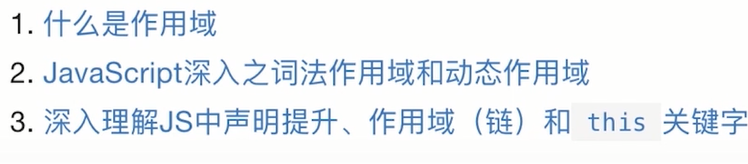
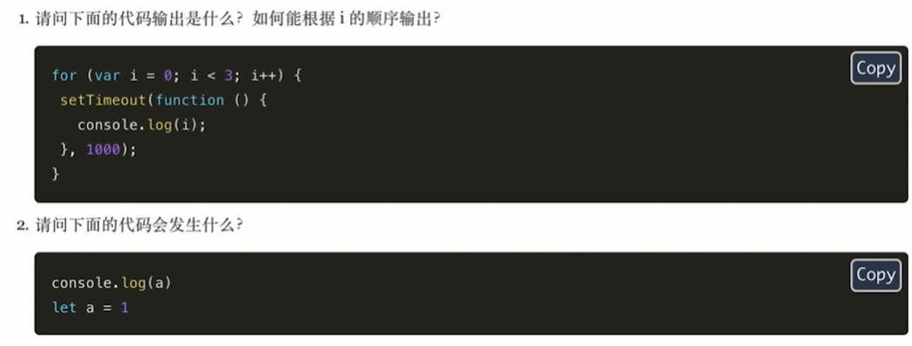

### 1、作用域知识补充

##### 全局变量的2种方式

全局变量有两种方式,经过var声明的，和没有经过var声明

```js
var global_var = 1;
global_novar = 2;   // 不推荐
```

区别：

经过var声明的不能删除

没有经过var声明的，是作为了全局对象window的一个属性，可以删除

```js
// 删除变量
delete global_var;    // false
delete global_novar;    // true
```

> 疑问：global_var也是window的属性呀，不然为什么可以通过window.global_var来访问

##### 几种作用域

- 全局作用域
- 函数作用域: 函数
- 块级作用域：{}
- 动态作用域：this,同一函数执行的结果不同，是根据this的指向来决定。


### 2、let和const(待补充)

##### let和var的区别

- let有自己的作用域

  ```js
  {
  let a = 1
  }
  console.log(a); //Uncaught ReferenceError: a is not defined
  ```

- let不能重复定义一个变量

  ```js
  //es5
  var a = 1
  var a = 2
  console.log(a) //2
  
  //es6
  let a = 1
  let a = 2
  // VM131:1 Uncaught SyntaxError: Identifier 'a' has already been declared
  // at <anonymous>:1:1
  ```

- let不能进行变量提升

  ```js
  function test () {
  console.log(a)
  var a = 1
  }
  test() //undefined
  ```

  

- let不会作为一个属性挂载在window对象，通过window.不能访问

  ```js
  //es5
  var a = 1
  console.log(window.a); //1
  
  //es6
  let a = 1
  console.log(window.a); // undefined
  ```

##### const和var的区别

- 上面的注意事项都有
- 不能重新赋值

### 额外补充学习（this,作用域链）待学习





### 3、数组相关

#### 1、es5中数组遍历方法

for

##### forEach

```js
//forEach与for相比，不支持break和continue
//可以用return来跳出本次循环
```

##### every

```js
/**
arr.every(callback[, thisArg]),thisArg:回调函数this的指向
@desc: 方法测试一个数组内的所有元素是否都能通过某个指定函数的测试。它返回一个布尔值。
@return: 如果回调函数的每一次返回都为 truthy 值，返回 true ，否则返回 false。
*/


//fevery与for相比，不支持break和continue
const arr = [1,2,3,4,5];
arr.every(function(item){
  console.log(item) 
})
//上面代码只输出1，只有返回true才会继续执行

const arr = [1,2,3,4,5];
arr.every(function(item){
  console.log(item) 
    return true
})
//上面代码只输出1，2,3,4,5


想当元素等于2，退出循环，也就是要break效果,这里return false就是这个效果了
const arr = [1,2,3,4,5];
arr.every(function(item){
    if (item === 2) {
        return false
    }
  console.log(item) 
})
```

##### for in

```js
//for in,用来遍历对象的，但是支持遍历数组，数组也是对象
const arr = [1,2,3,4,5];
arr.a = 8
for (let index in arr) {
 	console.log(arr[index]) //1,2,3,4,5,8
}

//for in 支持break和continue
const arr = [1,2,3,4,5];
arr.a = 8
for (let index in arr) {
    //注意index是字符串
    if (+index === 2) {
       break;
    }
 	console.log(arr[index]) //1,2,3,4,5,8
}
```


#### 2、es6数组遍历方法

##### for of

```

```


#### 3、Array.from将伪数组转换为数组

##### 什么是伪数组

- 具备length属性
- 有索引

```js
let arr = {0: 'a', 1: 'b', length: 2};
Array.from(arr) //[a,b]
```

伪数组不能调用数组的方法，比如不能用forEach

伪数组有哪些：arguments(es6废弃使用),NOdeList

```js
//es5
let args = [].slice.call(arguments);

//es6
let args = Array.from(arguments)
let imgs = Array.from(document.querySelectorAll('img'))

```

##### Array.from基本语法

```js
Array.from(arrayLike[, mapFunction[, thisArg]])
arrayLike：必传参数，想要转换成数组的伪数组对象或可迭代对象。
mapFunction：可选参数，mapFunction(item，index){…} 是在集合中的每个项目上调用的函数。返回的值将插入到新集合中。
thisArg：可选参数，执行回调函数 mapFunction 时 this 对象。这个参数很少使用。
```


`Array.from`还可以接受第二个参数，作用类似于数组的`map`方法，用来对每个元素进行处理，将处理后的值放入返回的数组。

```js
Array.from([1, 2, 3], (x) => x * x)
// [1, 4, 9]
```

#### 4、Array.of创建新数组

主要是弥补Array创建数组的差异性

```js
//es5
Array() // []
Array(3) // [, , ,]
Array(3, 11, 8) // [3, 11, 8]

//es6
Array.of(3, 11, 8) // [3,11,8]
Array.of(3) // [3]
Array.of(3).length // 1
```

#### 5、Array.fill填充

填充空数组比较好，可以填充数组的某一段，第二个参数是开始下标。第三个是结束下标

```js
['a', 'b', 'c'].fill(7) // [7, 7, 7]
let array = Array(5).fill(7) //[7,7,7,7,7]

//场景：把3,4换成8
let arr = [1,2,3,4,5]
arr.fill(8,2,4)//第一个是替换成的数，第二个开始下标，第三个参数结束下标（不包含）
```


#### 6、es5数组查找

##### filter

> @return
>
> 所有满足条件的元素，找到返回新数组(回调函数return true)
>
> 没有则返回[]
>
> filter() 不会改变原始数组。


filter() 方法创建一个新的数组，新数组中的元素是通过检查指定数组中符合条件的所有元素。

简而言之，所有满足条件的元素，找到返回新数组，没有就返回[]

```js
var ages = [32, 33, 16, 40];

function checkAdult(age) {
    return age >= 18;
}
//[32,33,40]
```


#### 7、Array.find(关注是否有这个元素)

> @return 
>
>   找到则返回找到的第一个元素
>
>   没找到则返回undefined

数组实例的`find`方法，用于找出第一个符合条件的数组成员。它的参数是一个回调函数，所有数组成员依次执行该回调函数，直到找出第一个返回值为`true`的成员，然后返回该成员。如果没有符合条件的成员，则返回`undefined`。

```js
[1, 5, 10, 15].find(function(value, index, arr) {
  return value > 9;
}) // 10
```

接收第二个参数this

```js
function f(v){
  return v > this.age;
}
let person = {name: 'John', age: 20};
[10, 12, 26, 15].find(f, person);    // 26
```


#### 8、Array.findIndex

>@return 
>
>  找到则返回找到的第一个元素下标
>
>  没找到则返回-1

数组实例的`findIndex`方法的用法与`find`方法非常类似，返回第一个符合条件的数组成员的位置，如果所有成员都不符合条件，则返回`-1`。

```js
[1, 5, 10, 15].findIndex(function(value, index, arr) {
  return value > 9;
}) // 2
```

#### 9、Array.includes(es7)

语法

```js
arr.includes(valueToFind[, fromIndex])
/*
 @params: valueToFind 需要查找的元素值。
 @params: fromIndex:从fromIndex 索引处开始查找 valueToFind。如果为负值，则按升序从 array.length + fromIndex 的索引开始搜 （即使从末尾开始往前跳 fromIndex 的绝对值个索引，然后往后搜寻）。默认为 0。
 @return boolean,找到true,没找到false
*/
```

```js
[1,2,3,4,5].includes(3) //true
[1,2,3,4,5].includes(6) //false
```


### 4、class的基本语法

#### 1、es5类的声明

```js
let Animal = function(type) {
	this.type = type;
}
Animal.prototype.eat = function(){}
let dog = new Animal('dog');
let monkey = new Animal('monkey');
```

#### 2、es6基本用法

ES6 的`class`可以看作只是一个语法糖，跟上面的效果一样

```js
class Aminal {
    constructor(type) {
		this.type = type
    }
    eat() {
     console.log('i am eat food')
    }
}

let dog = new Animal('dog');
let monkey = new Animal('monkey');
```

#### 3、取值函数（getter）和存值函数（setter）

场景：把age保护起来，不让变化

```js
class Animal {
    constructor(type) {
		this.type = type
    }
    get age() {
        return this.rage
    }
    //不能为 this.age  
    set age(value) {
        this.rage = value
    }
}

let dog = new Animal('dog');
console.log(dog.age) //4
dog.age = 5;
```

#### 4、类的静态方法

##### 实例方法和静态方法的使用场景

方法内部有用到实例相关属性，就用实例方法

其他就用静态方法，拿不到实例对象属性

##### **es5**

```js
let Animal = function(type) {
	this.type = type;
    
}
//实例方法
Animal.prototype.eat = function(){
    Animal.walk ();
    console.log("我要吃")
}
//静态方法
Animal.walk = function() { //静态方法
    console.log('i am walking')
}
let dog = new Animal('dog');
dog.eat()
```

##### **es6**

```js
class Aminal {
    constructor(type) {
		this.type = type
    }
    eat() {
     //使用静态方法
     Aminal.walk();
     console.log('i am eat food')
    }
    //静态方法
    static walk() {
     console.log('i am walking')
    }
}
let dog = new Animal('dog');
dog.eat()
```

#### 5、如何继承一个类

##### es5

```js
let Animal = function(type) {
	this.type = type;
    
}
//实例方法
Animal.prototype.eat = function(){
    Animal.walk ();
    console.log("我要吃")
}
//静态方法
Animal.walk = function() { //静态方法
    console.log('i am walking')
}
let Dog = function() {
    //实现继承
    Animal.call(this, 'dog')
    this.run = function() {}
}
Dog.prototype = Animal.prototype;
let dog = new Animal('dog');
dog.eat()
```


##### es6

```js
class Aminal {
    constructor(type) {
		this.type = type
    }
    eat() {
     Aminal.walk();
     console.log('i am eat food')
    }
    static walk() {
     console.log('i am walking')
    }
}
/*
可以省略，如果没有额外的属性的话
class Dog extends Animal {
    constructor(type) {
        super(type)
    }
}
省略为
class Dog extends Animal {}
*/
//有额外属性必须写
class Dog extends Animal {
    constructor(type) {
        //super必须是构造函数的第一行
        super(type)
        this.age = 2;
    }
}
let dog = new Animal('dog');
dog.eat()
```


### 5、函数相关

#### 1、参数默认值

好处是：你可以很清晰的看出来哪些是必填，哪些是选填的

> 参数变量是默认声明的，所以不能用`let`或`const`再次声明。

```js
function f(x, y = 2, z = 3) {
  return x+y+z
}
f(1) //6
```

如果我只想传1,3个呢，第二个不传

```js
f(1, undefined, 3) //直接传underfined，就会用默认值
```

**参数可以是表达式**

```js
function f(x,y=7,z=x+y) {
  return x*10 + z
}
console.log(f(1, undefined, 2)) //12  传了值所以没运行
```

```js
function f(x,y=7,z=x+y) {
  return x*10 + z
}
console.log(f(1) //18  传了值所以没运行
f.length
```


#### 2、函数参数长度,处理不确定参数

##### es5

```js
function sum() {
    let num = 0;
    Array.from(arguments).forEach(function (item) {
        num += item*1//主要把item转换为数字类型
    })
    return num
}
```

注意：函数名.length 获取到没有默认值的参数个数

```js
function f(x,y=7,z=x+y) {
  return x*10 + z
}
console.log(f.length) //1  获取到没有默认值的参数个数
```

##### es6

获取所以函数参数 求和

```js
function sum(...nums) {
	let num = 0;
	nums.forEach(function(item){
	  num+= item*1
	})
    return num
}

sum(1,2,3,4) //10
```

第一个参数乘以2，后面的参数加起来

```js
function sum(base, ...nums) {
	let num = 0;
	nums.forEach(function(item){
	  num+= item*1
	})
    return base*2 + num
}

sum(10,2,3,4) //29
```

#### 3、箭头函数

练习：

如何用箭头函数来实现一个数组排序的问题

箭头函数对this的处理还有什么妙用


### 5、Set

#### 1、创建

```js
let s = new Set();
let s2 = new Set({1,2,3,4})
```


#### 2、添加

会把重复的去掉

```js
let s = new Set();
s.add("hello");
s.add("hello").add('world') //Set(2) {"hello", "world"}
```

对象可以添加一样的

```js

let n = new Set();
n.add({name:'wangling'}).add({age: 13}).add({name: 'wangling'}) 
n.length //3
```

#### 3、删除

delete

```js
let s = new Set();
s.add("hello").add('world') 
s.delete('hello') //true
s // Set(1) {"world"}
```

clear

```js
let s = new Set();
s.add("hello").add('world') 
s.clear() //true
s //Set(0) {}
```

#### 4、遍历

- `Set.prototype.keys()`：返回键名的遍历器
- `Set.prototype.values()`：返回键值的遍历器
- `Set.prototype.entries()`：返回键值对的遍历器
- `Set.prototype.forEach()`：使用回调函数遍历每个成员
- for-of
- ...  转换为数组
- Array.from //转换为数组

```js
let s = new Set();
s.add("hello").add('world') 
s.keys() //SetIterator {"hello", "world"}
s.values() //SetIterator {"hello", "world"}
s.entries() //SetIterator {"hello" => "hello", "world" => "world"}

s.forEach(item=> {console.log(item)}) //hello,world 更遍历数组一样

for(let item of s) {
    console.log(item)
}

let arr = [...s] // ["hello", "world"]
let arr = Array.from(s) // ["hello", "world"]
```


#### 5、查找

has

```js
let s = new Set();
s.add("hello").add('world') 
s.has("hello")
```

#### 6、长度

size

```
let s = new Set();
s.add("hello").add('world') 
s.size
```


#### 7、应用

去重

```js
let arr = [3, 5, 2, 2, 5, 5];
let unique = [...new Set(arr)]; // [3, 5, 2]
```


### 6、map

#### 1、创建

new Map([[a,b]]) 这个a不能重复，后面的值会覆盖前面的值

```js
let map = new Map([[1,2], [3,4]])
console.log(map)  //Map(2) {1 => 2, 3 => 4}
```

#### 2、添加set

除了添加还有修改

```js
let map = new Map([[1,2], [3,4]])
map.set(1,2)
map.set(3,2)
console.log(map) //Map(2) {1 => 2, 3 => 2}

let map = new Map([[1,2], [3,4]])
map.set(1,1)
map.set(1,1)
console.log(map) //Map(2)  {1 => 1, 3 => 4}
```

#### 3、删除delete

删除索引

```
let map = new Map()
map.set(1,2)
map.set(3,2)
map.delete(1)
console.log(map) //Map(1) {3 => 2}
```

全部删除

```
let map = new Map()
map.set(1,2)
map.set(3,2)
map.clear()
console.log(map) //Map(0) {}
```

#### 4、长度size

size

```js
let map = new Map()
map.set(1,2)
map.set(3,2)
console.log(map.size) //2
```

#### 5、查询

##### has

查的索引值

```js
let map = new Map()
map.set(1,2)
map.set(3,2)
console.log(map.has(3)) //true
```

##### get

```js
let map = new Map()
map.set(1,2)
map.set(3,2)
console.log(map.get(3)) //2
```

##### keys,values,entries

```js
let map = new Map()
map.set(1,2)
map.set(3,2)
console.log(map.keys(3)) //MapIterator {1, 3}
console.log(map.values(3)) //MapIterator {2, 2}
console.log(map.entries(3)) //MapIterator {1 => 2, 3 => 2} 可遍历对象
```

##### forEach

注意value和key的顺序

```
let map = new Map()
map.set(1,2)
map.set(3,2)

map.forEach((value,key)=> {
console.log(value,key) //2 1, 2 3
})
```

##### for of

注意value和key的顺序

```js
let map = new Map()
map.set(1,2)
map.set(3,2)
for(let [key, value] of map) {
console.log(value,key) //2 1, 2 3
}
```


### 7、Object扩展

```js
//es5
let name = "wangling"
let obj = {
    x: x，
    fun: function(){}
}
obj[name] = "person"


//es6
let name = "wangling"
let obj = {
    x, //相同的可以省略
    [name]: 'person', //动态的变量可以直接写在里面
    fun() {}, //省略function
    * hello() {} //可以添加异步的函数
}
```

#### 1、Object.assign(对象拷贝)

把一个对象复制到另一个对象

语法：

```js
Object.assign(target, ...sources)
/*
@return: 新数组
@desc: 如果目标对象中的属性具有相同的键，则属性将被源对象中的属性覆盖。后面的源对象的属性将类似地覆盖前面的源对象的属性。
*/
```

```js
//案列1
const a = {n: 1};
const b = {m: 1};
const c = Object.assign({}, a, b);  //{n: 1, m: 1}

//案列2:目标对象自身也会改变
const target = { a: 1, b: 2 };
const source = { b: 4, c: 5 };
const returnedTarget = Object.assign(target, source);
console.log(target);// expected output: Object { a: 1, b: 4, c: 5 }
console.log(returnedTarget);// expected output: Object { a: 1, b: 4, c: 5 }

//合并具有相同属性的对象
const o1 = { a: 1, b: 1, c: 1 };
const o2 = { b: 2, c: 2 };
const o3 = { c: 3 };

const obj = Object.assign({}, o1, o2, o3);
console.log(obj); // { a: 1, b: 2, c: 3 }

//里面是浅拷贝，是浅拷贝的漏洞，数据
const o1 = {a: 1, b: {c: 1}};
const target = {a: 1, b: {c: 2, d: 3}};
Object.assign(target, o1); 
console.log(target) //{a: 1, b: {c: 1}};
```

##### Object.assign是深拷贝还是浅拷贝

```js
let obj1 = {a: 1, b: {c: 2}}
let obj2 = Object.assign({}, obj1);
console.log(obj2.b.c) //2
obj1.b.c = 3;
console.log(obj2.b.c) //3,这里可以看出来是浅拷贝
```

##### 思考题

> 思考1、如果目标对象传入的是undefined和null将会怎样呢？


> 思考2、如如果原对象的参数是undefined和null将会怎样呢？


> 思考3、如果目标对象是个嵌套的对象，子对象的属性会被覆盖吗？


#### 2、Object.defineProperty（es5,后面看vue源码再来研究）

##### 语法

```js
Object.defineProperty(obj, prop, descriptor)
/*
@params: obj 要定义属性的对象。(边界化，目前尝试了数组和对象可以，其他比如说数字会报错)
@params:prop 要定义或修改的属性的名称或 Symbol 。
@params:descriptor 要定义或修改的属性描述符。
@retrun 被传递给函数的对象。
*/
```

##### 传入第一个参数不是对象

报错

```js
//数字，undefined一样的结果
const object1 = 123;

Object.defineProperty(object1, 'property1', {
  value: 42,
  writable: false
});

//VM401:3 Uncaught TypeError: Object.defineProperty called on non-object

//数组
const object1 = [1,2]

Object.defineProperty(object1, 'property1', {
  value: 42,
  writable: false
}); //[1, 2, property1: 42]
```


### 8、String扩展

#### 标签模板

[https://es6.ruanyifeng.com/#docs/string#%E6%A8%A1%E6%9D%BF%E5%AD%97%E7%AC%A6%E4%B8%B2](https://es6.ruanyifeng.com/#docs/string#模板字符串)

### 9、变量的解构赋值

#### 1、数组的结构赋值

不仅可以赋值变量，也可以是对象的属性

```js
let arr = ['hello', 'world'];
let [firstName, lastName] = arr; //firstName = hello  lastName = world

//如果数组有4项，我想取第一项和最后一项呢,怎么跳过呢？
let namelist = ['wangling', 'zhangdong', 'zhangziheng', 'haha'];
let [name,,,desc] = namelist; //name = wangling  desc=haha

```

##### 批量给对象修改值

```js
let user = {name: 's', surname: 't'}; //必须加分号
[user.name, user.surname] = [1, 2];
console.log(user) //{name: 1, surname: 2}
```

##### 遍历对象，可以取到任何属性和值

```js
let user = {name: 's', surname: 't'};
console.log(Object.entries(user)) //[["name", "s"],["surname","t"]]
for(let [key, value] of Object.entries(user)){
    console.log(key, value) //name s ,surname t
}
```

##### 余下参数数组接收

```js
//保存剩余的参数，注意有个细节会丢失数据，，，中间一个2是没有保留下来的，数据量不够的话 last为[]
let arr = [1,2,3,4,5,6,7,8];
let [x,,y,...last] = arr;//x=1 y=3 last=[4, 5, 6, 7, 8]
```

##### 解构不成功，变量的值就等于undefined。

```js
let [x, y, ...z] = ['a'];
x // "a"
y // undefined
z // []
```

##### 报错

如果等号的右边不是数组（或者严格地说，不是可遍历的结构，参见《Iterator》一章），那么将会报错。

```js
// 报错
let [foo] = 1;
let [foo] = false;
let [foo] = NaN;
let [foo] = undefined;
let [foo] = null;
let [foo] = {};
```

##### set也可以解构赋值

```js
let [x, y, z] = new Set(['a', 'b', 'c']);
x // "a"
```

##### 解构赋值默认值

> 注意如果解构的值是undefined，就用默认值

解构赋值允许指定默认值。如果解构不成功，返回默认值

```js
let [foo = true] = [];
foo // true

let [x, y = 'b'] = ['a']; // x='a', y='b'
let [x, y = 'b'] = ['a', undefined]; // x='a', y='b'

let [x = 1] = [undefined];
x // 1

let [x = 1] = [null];
x // null
```

#### 2、对象的解构赋值

> 注意
>
> 跟数组的区别：这里是花括号
>
> 解构的时候需要跟对象的属性一样

```js
let option = {
title: 'menu',
width: 100,
height: 200
}
let {title, width, height} = option; //title='menu' width=100 height=200
```

##### 解构变量重命名

现在需要解构title,变量名不叫title

就不能简写了

```js
let option = {
    title: "哥伦布"
}

let {title: title2} = option 
console.log(title2) //"哥伦布"
console.log(title) //title is not defined
```

##### 设置默认值

```js
let option = {
    title: "哥伦布"
}

//找到option.name,如果option.name = undefined ,就设置100的默认值
let {title: title2, name :userName= 100} = option 
console.log(title2) //"哥伦布
console.log(userName) //100
```

##### 余下变量

```js
let option = {
title: 'menu',
width: 100,
height: 200
}
let {title, ...last} = option; 
console.log(title, last) //menu {width: 100, height: 200}
```

##### 多层嵌套取值

注意：取Cake值时，是解构数组的

```js
let option = {
 size: {
  width: 100,
  height: 200
 },
 items: ['Cake', 'Dount'],
 extra: true
}
let { size: {width: width2, height},items:[item1]} = option
console.log(width2,height,item1) //100 200 "Cake"

```

##### 数组使用对象的方法解构

```js
let arr = [1, 2, 3];
let {0 : first, [arr.length - 1] : last} = arr;
first // 1
last // 3
```

##### 注意事项

```js
// 错误的写法
let x;
{x} = {x: 1};
// SyntaxError: syntax error

// 正确的写法
let x;
({x} = {x: 1});
```

#### 3、函数的解构赋值

函数的参数也可以使用解构赋值。

看着就是数组的解构赋值

```js
function add([x, y]){
  return x + y;
}

add([1, 2]); // 3
```

#### 4、用途

##### 交换变量的值

```js
let x = 1;
let y = 2;

[x, y] = [y, x];
console.log(x,y) //2,1
```

##### 从函数中返回多个值

```js
// 返回一个数组

function example() {
  return [1, 2, 3];
}
let [a, b, c] = example();

// 返回一个对象

function example() {
  return {
    foo: 1,
    bar: 2
  };
}
let { foo, bar } = example();
```

##### **函数参数的定义**

```js
// 参数是一组有次序的值
function f([x, y, z]) { ... }
f([1, 2, 3]);

// 参数是一组无次序的值
function f({x, y, z}) { ... }
f({z: 3, y: 2, x: 1});
```

##### 提取JSON数据

```js
let jsonData = {
  id: 42,
  status: "OK",
  data: [867, 5309]
};

let { id, status, data: number } = jsonData;

console.log(id, status, number);
// 42, "OK", [867, 5309]
```

##### **输入模块的指定方法**

```js
const { SourceMapConsumer, SourceNode } = require("source-map");
```

### [10、promise详解和async和await](../js/promise.md)

### 11、Reflece(反射机制暂时不看)


### 12、proxy(后面重新整理)

##### 基本使用

代理->中介

```js
let o = {
 name: 'xiaoming',
 price: 190
}

let d = new Proxy(o, {
  get(target, key) {
      if(key === 'price' ) {
        retrun target[key]+20
      }else {
        return target[key]
      }
  }
})
console.log(d.price) //210
```

##### 使用场景1（只读场景）

只读不能修改

从服务端拿到数据进行排序，这个时候我想访问原数组改怎么办？

```js
//es5
let o = {
 name: 'xiaoming',
 price: 190
}

for(let [key] of Object.edtries(o)) {
    Object.defineProperty(o, key, {
        writable: false
    })
}
d.price = 300;
console.log(d.price, d.name) //190 "xiaoming"

//es6
let o = {
 name: 'xiaoming',
 price: 190
}

let d = new Proxy(o, {
  get(target, key) {
     return target[key]
  },
  set(target, key, value) {
      return false
  }
})

d.price = 300;
console.log(d.price, d.name) //190 "xiaoming"
```

##### 使用场景2(检验)

- 拦截无效的属性
- 价格大于300拦截

```js
let o = {
 name: 'xiaoming',
 price: 190
}
let d = new Proxy(o, {
    get(target, key) {
        return target[key] || ''
    },
    set(target, key, value) {
        if (Reflect.has(target,key)) {
            if(value > 300) {
                return fasle
            }else {
                target[key] = value
            }
        }
    }
})
```

监听错误

```js
window.addEventListener('error', (e) => {
console.log(e.message)
 report('./')
},true)
let o = {
 name: 'xiaoming',
 price: 190
}
let d = new Proxy(o, {
    get(target, key) {
        return target[key] || ''
    },
    set(target, key, value) {
        if (Reflect.has(target,key)) {
            if(value > 300) {
                throw new TypeError('price exceed 300')
            }else {
                target[key] = value
            }
        }
    }
})
```


### [13、Symbol](../js/symbol基础知识.md)

- 概述
- Symbol基本使用
- Symbol的常用技巧
- 属性名的遍历
  - `Object.getOwnPropertySymbols()`：返回该对象所有属性名为Symbols的数组
  - `Reflect.ownKeys()`：返回对象的所有属性，包括Symbols
- `Symbol.for()`：使用Symbol.for会在系统中将Symbol登记
- `Symbol.keyFor()`：根据使用`Symbol.for`登记的Symbol返回描述，如果找不到返回undefined 


