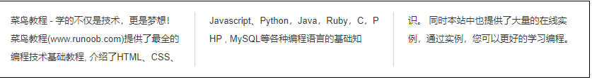
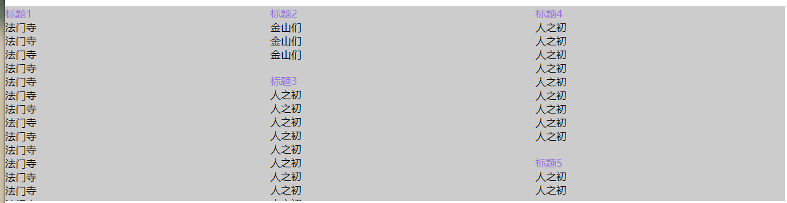
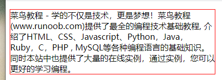
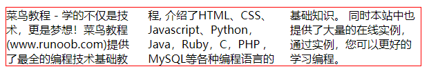
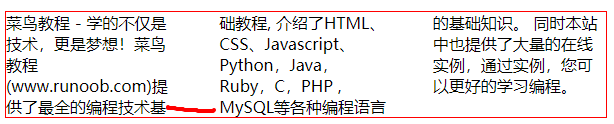
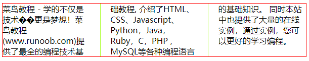

## css多列布局

### 1、主要用途

可以将文本内容设计成像报纸一样的多列布局



也可以设置为这种布局，不用js去计算哪列高度最少，就往哪列添加，用css也能实现




### 2、主要属性介绍

- `column-count`
- `column-gap`
- `column-rule-style`
- `column-rule-width`
- `column-rule-color`
- `column-rule`
- `column-span`
- `column-width`


```html
.newspaper {
	width: 600px;
    border: 1px solid red;
}
<p class="newspaper">
 菜鸟教程 - 学的不仅是技术，更是梦想！菜鸟教程(www.runoob.com)提供了最全的编程技术基础教程, 介绍了HTML、CSS、Javascript、Python，Java，Ruby，C，PHP , MySQL等各种编程语言的基础知识。 同时本站中也提供了大量的在线实例，通过实例，您可以更好的学习编程。
</p>
```



在上面的前提下执行

#### 2.1、column-count

`column-count` 属性指定了需要分割的列数

```
.newspaper {
  column-count： 3;
}
```




### 2.2、column-gap

`column-gap` 属性指定了列与列间的间隙。

默认值为： 1em

```
.newspaper {
  column-gap: 40px;
}
```




### 2.3、column-rule

`column-rule` 属性是 column-rule-* 所有属性的简写。

以下实例设置了列直接的边框的厚度，样式及颜色：



下面两个我就不举例了

### 2.4、column-span

指定元素跨越多少列

```
h2 {
    column-span: all;
}
```

### 2.5、column-width

`column-width` 属性指定了列的宽度。

```
div {
    column-width: 100px;
}
```


## 3、例子

这是项目中遇到的需求，在这里纪录下


```html
<!DOCTYPE html>
<html>
	<head>
		<meta charset="utf-8" />
		<meta name="viewport" content="width=device-width, initial-scale=1">
		<title></title>
		<style type="text/css">
			* {
				margin: 0;
				padding: 0;
			}
			.wrap {
				max-height: 300px;
				overflow: auto;
			}
			.wrap::-webkit-scrollbar{
				display:none
			} 
			.container {
				width: 1200px;
				background: #ccc;
				column-count: 3;
				column-gap: 24px;
			}
			li {
				list-style: none;
			}
			li:hover {
				background: papayawhip;
			}
			.container > .child  {
				margin-bottom: 20px;
				break-inside: avoid;
			}
			.container > .child > div {
				color: mediumpurple;
			}
		</style>
	</head>
	<body>
	<div class="wrap">
		<div class="container">
			<div class="child">
				<div>标题1</div>
				<ul>
					<li>法门寺</li>
					<li>法门寺</li>
					<li>法门寺</li>
					<li>法门寺</li>
					<li>法门寺</li>
					<li>法门寺</li>
					<li>法门寺</li>
					<li>法门寺</li>
					<li>法门寺</li>
					<li>法门寺</li>
					<li>法门寺</li>
					<li>法门寺</li>
					<li>法门寺</li>
					<li>法门寺</li>
					<li>法门寺</li>
					<li>法门寺</li>
					<li>法门寺</li>
					<li>法门寺</li>
					<li>法门寺</li>
					<li>法门寺</li>
				</ul>
			</div>
			<div class="child">
				<div>标题2</div>
				<ul>
					<li>金山们</li>
					<li>金山们</li>
					<li>金山们</li>
				</ul>
			</div>
			<div class="child">
				<div>标题3</div>
				<ul>
					<li>人之初</li>
					<li>人之初</li>
					<li>人之初</li>
					<li>人之初</li>
					<li>人之初</li>
					<li>人之初</li>
					<li>人之初</li>
					<li>人之初</li>
					<li>人之初</li>
				</ul>
			</div>
			<div class="child">
				<div>标题4</div>
				<ul>
					<li>人之初</li>
					<li>人之初</li>
					<li>人之初</li>
					<li>人之初</li>
					<li>人之初</li>
					<li>人之初</li>
					<li>人之初</li>
					<li>人之初</li>
					<li>人之初</li>
				</ul>
			</div>
			<div class="child">
				<div>标题5</div>
				<ul>
					<li>人之初</li>
					<li>人之初</li>
				</ul>
			</div>
			<div class="child">
				<div>标题6</div>
				<ul>
					<li>人之初</li>
					<li>人之初</li>
					<li>人之初</li>
					<li>人之初</li>
					<li>人之初</li>
					<li>人之初</li>
				</ul>
			</div>
		</div>
	</div>
	</body>
</html>
```

