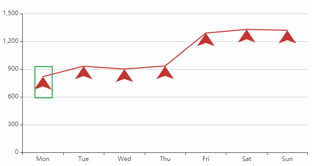
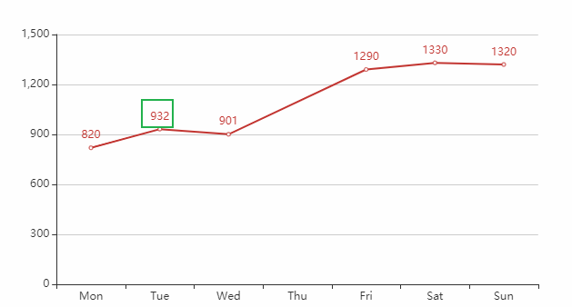
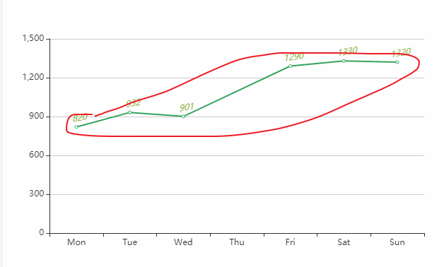
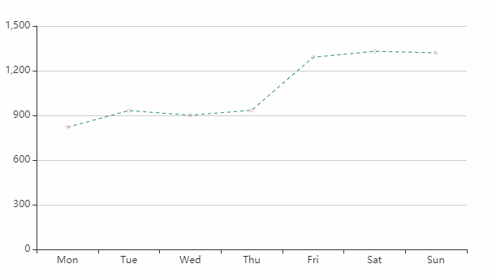
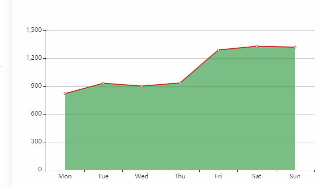

# series

### 总览

1. #### [legendHoverLink](https://echarts.apache.org/zh/option.html#series-bar.legendHoverLink) : 是否启用[图例](https://echarts.apache.org/zh/option.html#legend) hover 时的联动高亮

### 自定义柱状图里面数字(文字)


### 标记类型

ECharts 提供的标记类型包括 `'circle'`, `'rect'`, `'roundRect'`, `'triangle'`, `'diamond'`, `'pin'`, `'arrow'`, `'none'`



> #### [showSymbol](https://echarts.apache.org/zh/option.html#series-line.showSymbol)：true 是否显示这个标记图标
>
> #### [symbol](https://echarts.apache.org/zh/option.html#series-line.symbol) : "arrow",  //形状
>
> #### [symbolSize](https://echarts.apache.org/zh/option.html#series-line.symbolSize) : 26   //大小
>
> #### [symbolRotate](https://echarts.apache.org/zh/option.html#series-line.symbolRotate)：标记的旋转角度
>
> #### [symbolOffset](https://echarts.apache.org/zh/option.html#series-line.symbolOffset)：标记相对于原本位置的偏移(有点像相对定位的感觉)
>
> #### [cursor](https://echarts.apache.org/zh/option.html#series-line.cursor): 鼠标悬浮时在图形元素上时鼠标的样式是什么。同 CSS 的 `cursor`。
>
> #### [connectNulls](https://echarts.apache.org/zh/option.html#series-line.connectNulls): 是否链接空数据，（有一些为0的是否需要链接）
>
> #### [clip](https://echarts.apache.org/zh/option.html#series-line.clip) ：是否裁剪超出坐标系部分的图形，具体裁剪效果根据系列决定：

```js
option = {
  xAxis: {
    type: "category",
    data: ["Mon", "Tue", "Wed", "Thu", "Fri", "Sat", "Sun"]
  },
  yAxis: {},
  series: [{
    data: [820, 932, 901, 934, 1290, 1330, 1320],
    type: "line",
    symbol: "rect",
    symbolSize: 26,
    cursor: "move", 
    connectNulls: true //是否链接空数据，（有一些为0的是否需要链接）
  }]
}
```


### 标签上方的文字（label）

> #### [show](https://echarts.apache.org/zh/option.html#series-line.label.show):是否显示标签
>
> #### [position](https://echarts.apache.org/zh/option.html#series-line.label.position) :标签的位置
>
> #### [distance](https://echarts.apache.org/zh/option.html#series-line.label.distance) ：距离图形的距离
>
> #### [formatter](https://echarts.apache.org/zh/option.html#series-line.label.formatter)（String,function）：标签内容格式器，支持字符串模板和回调函数两种形式，字符串模板与回调函数返回的字符串均支持用 `\n` 换行。
>
> #### [color](https://echarts.apache.org/zh/option.html#series-line.label.color):文字的颜色
>
> #### [fontWeight](https://echarts.apache.org/zh/option.html#series-line.label.fontWeight)
>
> #### [fontFamily](https://echarts.apache.org/zh/option.html#series-line.label.fontFamily)
>
> #### [fontSize](https://echarts.apache.org/zh/option.html#series-line.label.fontSize) 
>
> #### [align](https://echarts.apache.org/zh/option.html#series-line.label.align)
>
> #### [verticalAlign](https://echarts.apache.org/zh/option.html#series-line.label.verticalAlign)
>
> #### [backgroundColor](https://echarts.apache.org/zh/option.html#series-line.label.backgroundColor) 
>
> #### [padding](https://echarts.apache.org/zh/option.html#series-line.label.padding)



```js
option = {
  xAxis: {
    type: "category",
    data: ["Mon", "Tue", "Wed", "Thu", "Fri", "Sat", "Sun"]
  },
  yAxis: {},
  series: [{
    data: [820, 932, 901, "-", 1290, 1330, 1320],
    type: "line",
    connectNulls: true,
    clip: true,
+    label: {
+      show: true, //是否显示文字
       position: "top" //文字定位
       color: "rgba(149, 184, 80, 1)" //文字的颜色
+    }
  }]
}
```

#### 单个柱条文本框设置

#### [series-bar.](https://echarts.apache.org/zh/option.html#series-bar)[data.](https://echarts.apache.org/zh/option.html#series-bar.data) [itemStyle](https://echarts.apache.org/zh/option.html#series-bar.data.itemStyle)

##### 所有属性

{ [color](https://echarts.apache.org/zh/option.html#series-bar.data.itemStyle.color) , [borderColor](https://echarts.apache.org/zh/option.html#series-bar.data.itemStyle.borderColor) , [borderWidth](https://echarts.apache.org/zh/option.html#series-bar.data.itemStyle.borderWidth) , [borderType](https://echarts.apache.org/zh/option.html#series-bar.data.itemStyle.borderType) , [barBorderRadius](https://echarts.apache.org/zh/option.html#series-bar.data.itemStyle.barBorderRadius) , [shadowBlur](https://echarts.apache.org/zh/option.html#series-bar.data.itemStyle.shadowBlur) , [shadowColor](https://echarts.apache.org/zh/option.html#series-bar.data.itemStyle.shadowColor) , [shadowOffsetX](https://echarts.apache.org/zh/option.html#series-bar.data.itemStyle.shadowOffsetX) , [shadowOffsetY](https://echarts.apache.org/zh/option.html#series-bar.data.itemStyle.shadowOffsetY) , [opacity](https://echarts.apache.org/zh/option.html#series-bar.data.itemStyle.opacity) }

####  [series-bar.](https://echarts.apache.org/zh/option.html#series-bar)[data.](https://echarts.apache.org/zh/option.html#series-bar.data) [label](https://echarts.apache.org/zh/option.html#series-bar.data.label)

单个柱条文本的样式设置。

{ [show](https://echarts.apache.org/zh/option.html#series-bar.data.label.show) , [position](https://echarts.apache.org/zh/option.html#series-bar.data.label.position) , [distance](https://echarts.apache.org/zh/option.html#series-bar.data.label.distance) , [rotate](https://echarts.apache.org/zh/option.html#series-bar.data.label.rotate) , [offset](https://echarts.apache.org/zh/option.html#series-bar.data.label.offset) , [color](https://echarts.apache.org/zh/option.html#series-bar.data.label.color) , [fontStyle](https://echarts.apache.org/zh/option.html#series-bar.data.label.fontStyle) , [fontWeight](https://echarts.apache.org/zh/option.html#series-bar.data.label.fontWeight) , [fontFamily](https://echarts.apache.org/zh/option.html#series-bar.data.label.fontFamily) , [fontSize](https://echarts.apache.org/zh/option.html#series-bar.data.label.fontSize) , [align](https://echarts.apache.org/zh/option.html#series-bar.data.label.align) , [verticalAlign](https://echarts.apache.org/zh/option.html#series-bar.data.label.verticalAlign) , [lineHeight](https://echarts.apache.org/zh/option.html#series-bar.data.label.lineHeight) , [backgroundColor](https://echarts.apache.org/zh/option.html#series-bar.data.label.backgroundColor) , [borderColor](https://echarts.apache.org/zh/option.html#series-bar.data.label.borderColor) , [borderWidth](https://echarts.apache.org/zh/option.html#series-bar.data.label.borderWidth) , [borderRadius](https://echarts.apache.org/zh/option.html#series-bar.data.label.borderRadius) , [padding](https://echarts.apache.org/zh/option.html#series-bar.data.label.padding) , [shadowColor](https://echarts.apache.org/zh/option.html#series-bar.data.label.shadowColor) , [shadowBlur](https://echarts.apache.org/zh/option.html#series-bar.data.label.shadowBlur) , [shadowOffsetX](https://echarts.apache.org/zh/option.html#series-bar.data.label.shadowOffsetX) , [shadowOffsetY](https://echarts.apache.org/zh/option.html#series-bar.data.label.shadowOffsetY) , [width](https://echarts.apache.org/zh/option.html#series-bar.data.label.width) , [height](https://echarts.apache.org/zh/option.html#series-bar.data.label.height) , [textBorderColor](https://echarts.apache.org/zh/option.html#series-bar.data.label.textBorderColor) , [textBorderWidth](https://echarts.apache.org/zh/option.html#series-bar.data.label.textBorderWidth) , [textShadowColor](https://echarts.apache.org/zh/option.html#series-bar.data.label.textShadowColor) , [textShadowBlur](https://echarts.apache.org/zh/option.html#series-bar.data.label.textShadowBlur) , [textShadowOffsetX](https://echarts.apache.org/zh/option.html#series-bar.data.label.textShadowOffsetX) , [textShadowOffsetY](https://echarts.apache.org/zh/option.html#series-bar.data.label.textShadowOffsetY) , [rich](https://echarts.apache.org/zh/option.html#series-bar.data.label.rich) }

#### [series-bar.](https://echarts.apache.org/zh/option.html#series-bar)[data.](https://echarts.apache.org/zh/option.html#series-bar.data) [emphasis](https://echarts.apache.org/zh/option.html#series-bar.data.emphasis)

高亮状态的柱状图图形与标签样式。

{ [label](https://echarts.apache.org/zh/option.html#series-bar.data.emphasis.label) , [itemStyle](https://echarts.apache.org/zh/option.html#series-bar.data.emphasis.itemStyle) }

####  [series-bar.](https://echarts.apache.org/zh/option.html#series-bar)[data.](https://echarts.apache.org/zh/option.html#series-bar.data) [tooltip](https://echarts.apache.org/zh/option.html#series-bar.data.tooltip)

本系列每个数据项中特定的 tooltip 设定。

##### 所有属性

{ [position](https://echarts.apache.org/zh/option.html#series-bar.data.tooltip.position) , [formatter](https://echarts.apache.org/zh/option.html#series-bar.data.tooltip.formatter) , [backgroundColor](https://echarts.apache.org/zh/option.html#series-bar.data.tooltip.backgroundColor) , [borderColor](https://echarts.apache.org/zh/option.html#series-bar.data.tooltip.borderColor) , [borderWidth](https://echarts.apache.org/zh/option.html#series-bar.data.tooltip.borderWidth) , [padding](https://echarts.apache.org/zh/option.html#series-bar.data.tooltip.padding) , [textStyle](https://echarts.apache.org/zh/option.html#series-bar.data.tooltip.textStyle) , [extraCssText](https://echarts.apache.org/zh/option.html#series-bar.data.tooltip.extraCssText) }

####  [series-bar.](https://echarts.apache.org/zh/option.html#series-bar) [markPoint](https://echarts.apache.org/zh/option.html#series-bar.markPoint)

图标标注

### 折线条设置(itemStyle)



> ####  [color](https://echarts.apache.org/zh/option.html#series-line.itemStyle.color) 图形的颜色。 默认从全局调色盘 [option.color](https://echarts.apache.org/zh/option.html#color) 获取颜色，可以看官网有渐变色的用法，可以是函数自己自定义颜色
>
> 这上面好多都是对上面的标签也就是小圆点或其他图形的

```js
option = {
  xAxis: {
    type: "category",
    data: ["Mon", "Tue", "Wed", "Thu", "Fri", "Sat", "Sun"]
  },
  yAxis: {},
  series: [{
    data: [820, 932, 901, "-", 1290, 1330, 1320],
    type: "line",
    connectNulls: true,
    clip: true,
    
+    itemStyle: {
+     color: "rgba(53, 164, 96, 1)"
+    }
  }]
}
```

### 线条的样式（lineStyle）

> #### [color](https://echarts.apache.org/zh/option.html#series-line.lineStyle.color):线条颜色修改，好像不能用函数
>
> #### [width](https://echarts.apache.org/zh/option.html#series-line.lineStyle.width) :线宽
>
> #### [type](https://echarts.apache.org/zh/option.html#series-line.lineStyle.type)：线的类型。'solid'，dashed,dotted
>
> ####  [opacity](https://echarts.apache.org/zh/option.html#series-line.lineStyle.opacity) :透明度



上面的那个itemStyle除了颜色，都是对标记进行修饰

```js
option = {
  xAxis: {
    type: "category",
    data: ["Mon", "Tue", "Wed", "Thu", "Fri", "Sat", "Sun"]
  },
  yAxis: {},
  series: [{
    data: [820, 932, 901, 934, 1290, 1330, 1320],
    type: "line",
    itemStyle: {
      opacity: 0.25
    },
+    lineStyle: {
+      width: 1,
+      type: "dashed",
+      color: "rgba(46, 140, 125, 1)"
    }
  }]
}
```


### 区域填充样式（areaStyle）




# toolbox(工具箱)


### 缩放

1. window.onresize = function(){
2. ​    myChart.resize();
3. }//组件随着页面的缩放而缩放

# 思考等下再看

```
tooltip: {
        trigger: 'axis'
    },
series:  smooth: true,
```

