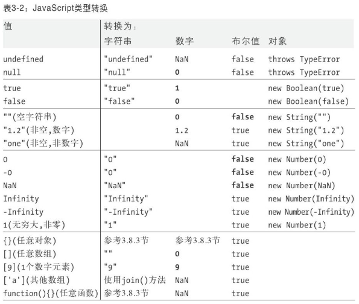

# 类型转换分类

- 显示类型转换
  - Number( )
  - String( )
  - Boolean( )
- 隐式类型转换
  - 运算
  - 判断语句
  - native调用
  - ..............




# 转换为字符串

### 1、转换为字符串场景

1. 能使用的办法

   - toString()

   - String()

2. 隐式转换（一般都是调用其toString）

   - 加号运算的时候，如果某一边出现字符串，则是字符串拼接

   - 把对象转换为数字，需要先toString()转换为字符串，再去转换为数字

   - 基于alert/confirm/prompt/document.write...这些方式输出内容，都是把内容先转换为字符串，然后再输出的

### 2、转换字符串规则

把其他类型转换为字符串，一般都是直接""包起来，只有下面几种情况比较特殊

- `{}`： 只有{}普通对象调取toString是调用的Object.prototype.toString,不是转换为字符串，而是检测数据类型，返回结果是“[object object]”,更准确的理解应该是如下

  ```
  1. 如果对象具有toString()方法，则调用这个方法。如果它返回一个原始值，JavaScript将这个值转换为字符串(如果本身不是字符串的话)，并返回这个字符串结果。需要注意的是，原始值到字符串的转换在表3-2中已经有了详尽的说明。
  
  2. 如果对象没有toString()方法，或者这个方法并不返回一个原始值，那么JavaScript会调用valueOf()方法。如果存在这个方法，则JavaScript调用它。如果返回值是原始值，JavaScript将这个值转换为字符串（如果本身不是字符串的话），并返回这个字符串结果。
  
  3. 否则，JavaScript无法从toString()或valueOf()获得一个原始值，因此这时它将抛出一个类型错误异常
  ```

- `[]`: 使用join()方法进行链接

```js
String(null)                 // 'null'
String(undefined)            // 'undefined'
String(true)                 // 'true'
String(1)                    // '1'
String(-1)                   // '-1'
String(0)                    // '0'
String(-0)                   // '0'
String(Math.pow(1000,10))    // '1e+30'
String(Infinity)             // 'Infinity'
String(-Infinity)            // '-Infinity'
String(function(){})         // "function(){}"

// 数组转换为字符串
String([])                    // ""
String(['a'])                // "a"
String([1,2])                // "1,2"
String(['a', 1])             // 'a, 1'
String([1,[2,3]])            // '1,2,3'

// 对象转换为字符串
String({})                   // '[object Object]'
String({name: 12})           //  "[object Object]"
```

# 转换为数字

### 1、转换为数字场景

1. 特定需要转换为Number的 方法

   - Number([val])

   - parseInt/parseFloat([val])

2. 隐式转换（浏览器内部默认要先转换为Number在进行计算的）

   - isNaN([val])

   - 数学运算（特殊情况：+在出现字符串的情况下不是数学运算，是字符串拼接）

   - 在==比较的时候，有些值需要转换为数字再进行比较


### 2、转换数字规则

一般隐式转换都是自动调用的Number

string -> number: 

- 如果是纯数字的字符串，则直接将其转换为数字
- 如果字符串中有非数字的内容，则转换为NaN
- 如果字符串是一个空串或者是一个全是空格的字符串，则转换为0
- 如果字符串中包含有效的十六进制格式，例如"0xf"，则将其他转换为相同大小的十进制整数值；

Object -> number:

 - ```
   // 先转换为字符串，在转换为数字
   1. 如果对象具有valueOf()方法，后者返回一个原始值，则JavaScript将这个原始值转换为数字（如果需要的话）并返回这个数字。
   2. 否则，如果对象具有toString()方法，后者返回一个原始值，则JavaScript将其转换并返回 [10] 。
   3. 否则，JavaScript抛出一个类型错误异常。
   ```

   

```js
Number('') // 0
Number('    ') // 0
Number('123') // 123
Number('12.3') // 12.3
Number('12abc') //NaN
Number('0xf')   // 15
Number(undefined) //NaN
Number(null) // 0
Number(true) // 1
Number(false) // 0

Number({}) // NaN
Number([]) // 0
Number([1]) // 1
Number([1, 2]) // NaN

parseInt('12ab3') // 12
parseInt('ab124') //NaN
parseInt(12.3) // 12

parseFloat('12ab3') // 12
parseFloat('ab124') //NaN
parseFloat(12.3) // 12.3

1+undfined // NaN
1 + null // 1
```


# 转换为布尔

1.  基于以下方式可以把其它数据类型转换为布尔

   - ! 转换为布尔值后取反

   - !! 转换为布尔类型

   - Boolean([val])

2. 隐式转换
   - 在循环或者条件判断中，条件处理的结果就是布尔类型值

规则：**只有 ‘0、NaN、null、undefined、空字符串’ 五个值会变为布尔的FALSE，其余都是TRUE**


https://blog.csdn.net/itcast_cn/article/details/82887895?utm_medium=distribute.pc_relevant_t0.none-task-blog-BlogCommendFromMachineLearnPai2-1.control&depth_1-utm_source=distribute.pc_relevant_t0.none-task-blog-BlogCommendFromMachineLearnPai2-1.control


# ==比较规则

1. null==undefined：true，但是换成===结果是false（因为类型不一致），`剩下null/undefined和其它任何数据类型值都不相等`

2. 字符串==对象 要把对象转换为字符串

3. **剩下如果==两边数据类型不一致，都是需要转换为数字再进行比较**


```js
{}=={}    // false
[]==[]    // false
NaN==NaN  // false

//ull==undefined：true,剩下null/undefined和其它任何数据类型值都不相等
undefined == null // true
undefined == ''   // false
null == ''   // false

'1' == new String(1) // true

```


# 题目推荐

```js

{}+[] // 0
({}+[]) // "[object Object]"
[]+{} // "[object Object]"

{a:0}+1 // 1
```

`{}+[] = 0`这个怎么理解呢？

现在在写代码过程中，每个项目组的规范会有所不同，有些项目组结尾加分号，有些则不加，当不加分号的时候,下面代码也不会在代码中报错，

```js
function getName(){}
+[]

// 压缩后
function getName(){}+[]
所以最后 就计算 +[] // 0
```


------


```js
![] // false ->!(Boolean([]))
+[]  // 0
 +![]  // 0
[]+[] // ""
{}+{}//"[object Object][object Object]"
[]+![] // false  => 先计算![],再把[]转换为String([])
''+{} //"[object Object]"
{}+'' //0

// 数组访问map属性
[]["map"] // ƒ map() { [native code] }
[]['map']+[] // "function map() { [native code] }"

[]==![] // true  都转换为数字都是0
```


```js
let result = 10+false+undefined+[]+'Tencent'+null+true+{}; // "NaNTencentnulltrue[object Object]"
```

解析过程

```js
》 10 + false // 10，10 + Number(false) = 10 ,10 + 0 = 10
》 10 + undefined // 10 + Number(undefined) = 10 + NaN = NaN
》 NaN + [] = NaN + String([]) = NaN + '' = 'NaN';
》 'NaN' + 'Tencent' = 'NaNTencent'
》 'NaNTencent' + null = 'NaNTencent' + String(null) = 'NaNTencent' + 'null' =       'NaNTencentnull'
》 'NaNTencentnull' + true = 'NaNTencentnull' + String(true) = 'NaNTencentnull' + 'true' ='NaNTencentnulltrue' 
》 'NaNTencentnulltrue' + String({})= 'NaNTencentnulltrue'+'[object Object]' = 'NaNTencentnulltrue[object Object]'
```


# 参考链接

[https://wangdoc.com/javascript/features/conversion.html](javascript:void(0);)

[**js类型转换的各种玩法**](https://www.imooc.com/article/279387)

