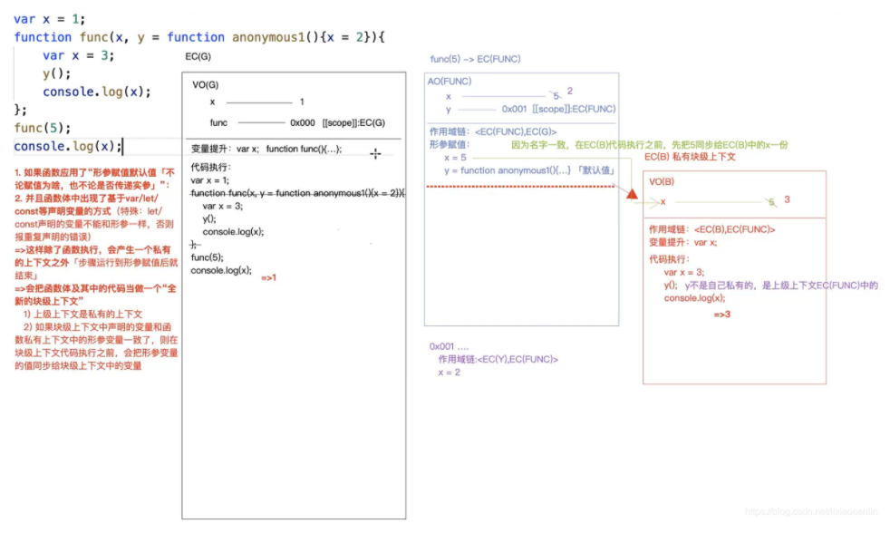
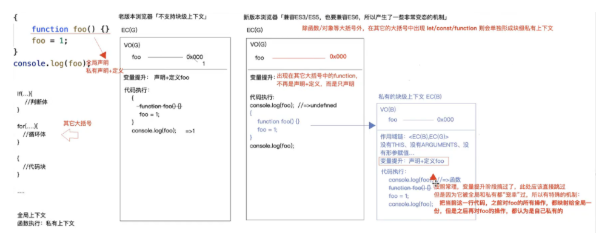

# 变量提升

会把当前上下文中所有带VAR/FUNCTION关键字的进行提前声明或者定义

### 1、变量提升 - var

```js
console.log(a) // Uncaught ReferenceError: a is not defined
```

上面代码会去找当前上下文为a的变量，找不到则根据作用域去找，知道找到最顶层，找不到就报错，下面报错是指未定义。

```js
console.log(a) // undefined
var a = 3;

// 可以隐式的理解为
var a;
console.log(a);
a = 3;
```

看上面代码 a打印出来是`undefined`,为什么不报错呢？就是这里有变量提升

再看一个简单的例子

```js
var a = 12;
function fn() {
 console.log(a); // undefined
  var a = 13;
}
fn()

// 可以隐式的理解为
var a = 12;
function fn() {
  var a
  console.log(a); // undefined
  a = 13;
}
fn()

/*
 执行fn时，会在fn里面形成执行上下文，
 console.log(a) 会在函数这个上下文找到a,这里就是undefined
*/
```


### 2、变量提升 - function

```js
a();
function a() {
	console.log('执行了')
}

// 隐式等于
function a() {
	console.log('执行了')
}
a();
```


> 问函数和变量谁的优先级高？
>
> 答: 函数的优先级高。

```js
// 例1：
var a ;
function a() {}
console.log(a) // ƒ a() {}

// 例2：
function a() {}
var a ;
console.log(a) // ƒ a() {}


// 例3：
function a() {}
var a = 3;
console.log(a) // 3

// 例4：
var a = 3;
function a() {}
console.log(a) // 3

// 例5：
var a = 3;
function a() {console.log(1)}
function a() {console.log(2)}
console.log(a) // 3
```


----

### 3、作为window属性

>基于`var`或`Function`在全局上下文中声明的变量(全局变量)会映射到GO(全局对象window)上一份，作为他的属性，接下来一个修改，另一个也会修改。

```js
var a = 12;
console.log(a);// 12 全局变量
console.log(window.a);// 12 映射到GO上的属性a

window.a = 13
console.log(a) // 13 映射机制是一个修改另一个也会修改
```


### 4、有条件的创建函数(难)

函数可以被有条件来声明，这意味着，函数声明可能出现在一个 if 语句里，但是，这种声明方式在不同的浏览器里可能有不同的效果。因此，不应该在生成环境代码中使用这种声明方式，应该使用函数表达式来代替。

```js
console.log(typeof foo);
if (false) {
  function foo(){ return 1; }
}
// 在Chrome里:
// 'foo' 变量名被提升，但是 typeof foo 为 undefined
//
// 在Firefox里:
// 'foo' 变量名被提升. 但是 typeof foo 为 undefined
//
// 在Edge里:
// 'foo' 变量名未被提升. 而且 typeof foo 为 undefined
//
// 在Safari里:
// 'foo' 变量名被提升. 而且 typeof foo 为 function

// 好像IE10以下 跟safari效果一样，我这里就统称旧版游览器
```

即使把上面代码中的 if(false) 改为 if(true)，结果也是一样的

----


##### 4.1、变态规则纪录(老版游览器（safari和ie10）)

>结论纪录:
>
>1. 在全局上下文中，除了函数/对象以外的大括号，如果在其它大括号（循环体、判断体、代码块等）中出现let/const/function，则会再单独形成一个块级私有上下文
>
>2. 如果在除函数/对象以外的其它大括号中出现function时，则变量提升只是声明不再定义

```js
console.log(foo)  // undefined
{
	function foo(){}
}

// 上面就是对函数只声明，没有定义
```


>3. 这里开始出现变态机制：变量提升过后，当代码执行到function foo(){}时，按常理在变量提升阶段已经处理过了，这里就不需要再处理了，但是为了同时兼容ES3/ES5和ES6，这里会产生一个特殊的机制：
>
>- 把当前这行代码【之前】对foo的所有操作，都映射给全局一份，但是之后再对foo操作则都认为是自己私有的了


```js
{
	function foo(){} //当执行这句时，会给全局foo赋值为当前的foo值。在之后的对foo的操作都认为是私有的
	foo = 1 
    console.log(foo) // 1
}
console.log(foo); // ƒ foo(){}


// 举一反三
{
    foo = 1
	function foo(){} // 执行到这句时，当前的foo为1，直接把这个值同步给全局
}
console.log(foo); // 1


// 举一反三
{
	function foo(){}
	foo = 1
	function foo(){}
}
console.log(foo); // 1
```


>4. 形成的块级私有上下文也会进行变量提升

```js
console.log(foo) // undefined
{
    console.log(foo) // ƒ foo(){}
	function foo(){} 
}
```


### 5、函数里的块级私有作用域产生

>满足下面条件下会在函数体中的代码形成一个 **“全新的块级上下文”**，这个块级上下文的作用域就是函数形成是私有上下文，**并且函数中的代码不再执行，而是拿到新的块级上下文中去执行**。
>
>- 如果函数中定义了形参，并且给 **形参设置了默认值**（不管值为啥，也不管是否传递了实参）
>- **并且在函数体中出现了基于let/var/const等声明的变量**（let和const声明的变量不能与形参同名，否则会报错）
>  - 如果块级上下文中声明的变量和函数私有上下文中的形参名称一致，则在块级上下文执行代码之前，会把形参变量值同步给块级上下文中的变量。


> 对上面简单总结：
>
> 在函数内部形成新的块级上下文的条件
>
> - 形参设置了默认值
> - 函数体中出现了`let/var/const/function`声明变量都会出现全新的块级上下文


```js
var x = 1;
function func(x, y = function anonmymous1(){x=2}){
	x = 3;
	y();
	console.log(x); // 2
}
func(5)
console.log(x); // 1
```

上面题正常思维解答就行，重点是看下面那道题,多加一个var，答案产生了变化,下面道题可以通过debugger来看下作用域的变化

```js
var x = 1;
function func(x, y = function anonmymous1(){x=2}){
	var x = 3;
	y();
	console.log(x); // 3
}
func(5)
console.log(x); // 1

```

>下面我们来初步分析：
>
>- 首先还是开辟栈内存（ECStack）供代码执行
>- 形成全局上下文EC(G)；变量提升，声明变量x，声明并定义函数func
>- 全局上下文中代码执行：x赋值为1，调用函数func
>- 函数func执行：形成一个私有上下文EC(FUNC)
>  - 在私有上下文中：初始化作用域链<EC(FUNC), EC(G)>
>  - 初始化this
>  - 形参赋值，x赋值为5；创建函数anonymous1（作用域为：当前上下文EC(FUNC)）
>- 该函数使命到此结束，同时形成一个新的私有块级上下文EC(B)（作用域为：当前上下文EC(FUNC)）
>- 本来函数中的代码都将会拿到新的块级上下文EC(B)中执行；在块级上下文中同样要初始化作用域链，变量提升（声明私有变量x，同时将上级上下文中x的值同步过来），然后是代码执行
>- 块级上下文中代码执行：x赋值为3，调用函数y，此时y并不是当前上下文中的变量，于是向上级上下文EC(FUNC)中查找
>- 函数y（anonymous1）执行：形成私有上下文，发现在y形成的私有上下文中并不存在变量x，同样向上级上下文EC(FUNC)中查找，并将上级上下文中的x值改为2。
>- 函数y执行结束，内存释放，重新回到块级上下文EC(B)中，执行代码“console.log(x);”，发现x就是当前上下文中的私有变量（值为3）于是直接输出结果3.
>- 函数执行结束，回到全局上下文，整个过程中全局上下文中的x并未受到影响，所以还是原来的值1




# 练习题

### 题1：难度1星

```js
console.log(a);
var a = 12; 
a = 13; 
console.log(a);
//一共输出两次，分别是undefined、 13
```

### 题2：难度1星

```js
console.log(a);//Uncaught ReferenceError: a is not defined
a = 13;
console.log(a);
```

### 题3: 难度1星

```js
console.log(a);//Uncaught ReferenceError: Cannot access 'a' before initialization   不能LET声明声明之前使用变量
let a = 12;
a = 13;
console.log(a);
```

### 题4：难度4星

**条件判断时，不论条件是否成立都要进行变量提升**

- [老版本]：VAR只声明不定义，FUNCTION声明加定义，ie10及ie10以下都是老版本
- [新版本]：VAR和FUNCTION都是只声明不定义。

```js
console.log(a, func) //undefined undefined
if(!("a" in window)){
var a = 1;
function func(){};
}
console.log(a);//"undefined"
```

所以这里的a和func都进行了提升，这道题由于对a进行了变量提升，相当于给window加了一个a属性，所以

`!("a" in window)` => false


### 题5：难度1星

```js
fn(); // 5
function fn(){console.log(1);};
fn(); // 5
function fn(){console.log(2);};
fn(); // 5
var fn = function fn(){console.log(3);}
fn(); // 3
function fn(){console.log(4);};
fn(); // 3
function fn(){console.log(5);};
f(); // 3
```

```
分析：变量提升
function fn() {console.log(5)}
fn()
fn()
fn()
fn = function fn(){console.log(3);}
fn()
fn()
fn()
```

### 题6：难度1星

```js
var foo = 1;
function bar(){
    if(!foo){
        var foo = 10;
    }
    console.log(foo);
};
bar(); // 10
```


### 题7： 难度2星

```js
let a = 0,
	b = 0;
function A(a) {
  A = function(b) {
    console.log(a + b++)
  }
  console.log(a++)
}
A(1) // 1
A(2) // 4

/*
执行A(1)
   a = 0
   A = function(b) {console.log(a + b++)}
   console.log(a++) 打印1， 全局a = 2
   
执行A(2)
  当前A: function(b) {console.log(a + b++)}
  a = 2
  b = 2
  console.log(a + b++) // 4
*/
```


### 题8：难度2星

```js
console.log(a,b,c); // undefined undefined undefined
var a = 12,
    b = 13,
    c = 14;
function fn(a) {
    console.log(a,b,c); // 10,13,14
    a = 100;
    c = 200;
    console.log(a,b,c);//100,13,200
}
b = fn(10);
console.log(a,b,c) //12,undefined,200
```


### 题9：难度1星

```js
var a = 1;
var obj = {
  name: 'tom'
}
function fn() {
  var a2 = a;
  obj2 = obj;
  a2 = a;
  obj2.name='jack'
}
fn();
console.log(a); // 1
console.log(obj) // {name: 'jack'}
```


### 题10：难度3星

> 在函数里面步骤：
>
> - 先形参赋值
> - 在变量提升

```js
var a = 1;
function fn(a) {
  console.log(a); // function a(){}
  var a= 2;
  function a(){}
  console.log(a) // 2
}
fn(a)
console.log(a) // 1
```

>步骤：
>
>​    形参赋值： a = 1
>
>​    变量提升：
>
>​            var a；这步忽略，
>
>​           a = function a(){}
>
>   代码执行：
>
>​		console.log(a); // function a(){}


---

### 题11：难度5星

```
{
	function foo(){}
	foo = 1
}
console.log(foo);
```

> 上面这段代码在老版本浏览器（IE10以下）和在新版本浏览器中运行出来的结果是完全不同。先不管最终运行结果是什么，我们先来分析一下在新老版本中的运行步骤
>
> - 老版本浏览器：
>   - 首先还是开辟一块栈内存（ECStack）供代码执行
>   - 接下来形成一个全局上下文EC(G)，然后变量提升，声明并定义一个函数foo
>   - 代码执行，因为老版本浏览器不存在块级上下文，所以这里代码块中的代码也是直接在全局上下文中执行。第一句代码在变量提升时已经处理过，直接跳过执行第二句代码“foo=1”，这里foo由函数被变更为值1
>   - 执行console.log(foo) 输出值1
> - 新版本浏览器：
>   - 第一步也是先开辟栈内存（ECStack）供代码执行
>   - 第二步形成全局上下文EC(G)，然后变量提升，这里就开始出现不同了。这里有这么一套运行机制：
>     - ***在全局上下文中，除了函数/对象以外的大括号，如果在其它大括号（循环体、判断体、代码块等）中出现let/const/function，则会再单独形成一个块级私有上下文***
>     - ***如果在除函数/对象以外的其它大括号中出现function时，则变量提升只是声明不再定义***
>   - 第三步变量提升：依照上面的第二条规则，代码块中出现了function，所以在全局上下文中只声明一个foo，并不定义
>   - 第四步代码执行：依照第二步第一条规则，代码块中出现了function，所以这里会单独再形成一个私有块级上下文，而该块级上下文的上级上下文就是全局上下文。
>   - 私有上下文中代码执行：在新形成的块级上下文中同样也有变量提升，于是在私有上下文中函数foo又被提升了一次，并且这次是声明+定义。
>   - 这里开始出现变态机制：变量提升过后，当代码执行到function foo(){}时，按常理在变量提升阶段已经处理过了，这里就不需要再处理了，但是为了同时兼容ES3/ES5和ES6，这里会产生一个特殊的机制：
>     - ***把当前这行代码【之前】对foo的所有操作，都映射给全局一份，但是之后再对foo操作则都认为是自己私有的了***
>   - 在全局变量提升时foo仅仅声明没有定义，依照上面的规则：代码执行到function foo(){}之前是在块级上下文中变量提=》声明定义了foo，所以这里定义的foo会再给全局一份，此时全局的foo也就被定义了。
>   - 继续执行：在私有上下文中foo被赋值为1，这时则认为是操作的是私有的foo，跟全局就没有关系了。
>   - 而最终全局中的foo依然是一个函数。打印输出f foo(){}




> 将上面的代码简单改造一下，结果又会不一样了，如下我们在foo=1后面又加了一句 “function foo(){}”，而最终的运行结果就变为1了。
> 这是因为：无论在全局上下文还是在私有块级上下文中都会进行两次变量提升，执行步骤与上面的基本一致，但是当代码执行到第二个“function foo(){}”时，依然会遵照上面的规则：“**把当前这行代码【之前】对foo的所有操作，都映射给全局一份**”，而当前这行代码之前则是给foo赋值为1，所以全局中的foo值也被映射为1了


### 题12：难度5星

```
var x = 1;
function func(x, y = function anonmymous1(){x=2}){
	x = 3;
	y();
	console.log(x); // // 2
}
func(x)
console.log(x); // 1
```


```js
var x = 1;
function func(x, y = function anonmymous1(){x=2}){
    var x = 3;
	y();
	console.log(x); // 3
}
func(x) 
console.log(x); // 1
```


# 参考链接

[web前端高级 - 两道变态到吐血的关于变量提升的大厂面试题](https://blog.csdn.net/lixiaosenlin/article/details/109512313)

[[js变量提升练习题](https://www.cnblogs.com/loveliang/p/13649662.html)](https://www.cnblogs.com/loveliang/p/13649662.html)

