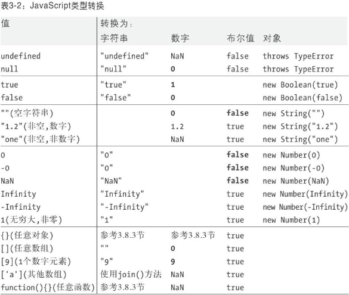

[TOC]


# 基本类型

### 有哪些基本类型，哪些是引用类型

```
基本数据类型有这五种:Undefined、Null、String、Number、Boolean,Symbol。
引用类型有这几种：object、Array、RegExp、Date、Function、特殊的基本包装类型(String、Number、Boolean)以及单体内置对象(Global、Math)。
```

### [类型检测以及判断数组对象是否相等](类型检测以及判断数组对象是否相等.md)

- ✔typeof
- ✔instanceof
- ✔Object.prototype.toString.call()
- ✔如何判断数组相等
- ✘判断对象相等
- ✘深拷贝
- ✘浅拷贝

### ✘String

### ✘Boolean

### ✘Number

### ✘Math

### ✘Date

# 类型转换

### 1、类型转换表



### 2、对象转换为字符串的过程

简单来说：对象转换为字符串，会首先找toString方法，如果返回

```
1. 如果对象具有toString()方法，则调用这个方法。如果它返回一个原始值，JavaScript将这个值转换为字符串(如果本身不是字符串的话)，并返回这个字符串结果。需要注意的是，原始值到字符串的转换在表3-2中已经有了详尽的说明。

2. 如果对象没有toString()方法，或者这个方法并不返回一个原始值，那么JavaScript会调用valueOf()方法。如果存在这个方法，则JavaScript调用它。如果返回值是原始值，JavaScript将这个值转换为字符串（如果本身不是字符串的话），并返回这个字符串结果。

3. 否则，JavaScript无法从toString()或valueOf()获得一个原始值，因此这时它将抛出一个类型错误异常
```

### 3、对象转换为数字的过程

```
1. 如果对象具有valueOf()方法，后者返回一个原始值，则JavaScript将这个原始值转换为数字（如果需要的话）并返回这个数字。
2. 否则，如果对象具有toString()方法，后者返回一个原始值，则JavaScript将其转换并返回 [10] 。
3. 否则，JavaScript抛出一个类型错误异常。
```

例如：

```javascript
cosole.log(1-[]) // 1
/*
1. []类型转换为数字，会调用valueOf方法，返回的是[],不是一个原始值，所以调用toString 方法
2. 调用toString 方法得到值为 "" 是原始值
3. ""转换为数字为0，所以结果为1
*/
```

### 4、思考？

```
(1) 1.a
(2) (1).a
(3) var num = 1; num.a;
```

为什么第一个会报错，第二三个不会报错？是因为包装对象？

# Function

### *`Function.prototype.call()`*

> **注意：**该方法的语法和作用与 [`apply()`](https://developer.mozilla.org/zh-CN/docs/Web/JavaScript/Reference/Global_Objects/Function/apply) 方法类似，只有一个区别，就是 `call()` 方法接受的是**一个参数列表**，而 `apply()` 方法接受的是**一个包含多个参数的数组**。

##### 手写实现call

>基本实现原理：
>
>1. 将函数设为对象的属性（第一个参数传进来的对象，如果不传就是window）
>2. 执行这个函数(在call2函数里面的this就是这个函数)
>3. 删除这个函数（严格说是删除属性 delete context.fn）
>
>

```js
//es5版本
Function.prototype.call2 = function (context) {
    var context = context || window;
    //这个this,就是谁调用的这个函数 this就是谁,一般就是函数本身，不然怎么执行
    context.fn = this;

    var args = [];
    for(var i = 1, len = arguments.length; i < len; i++) {
        args.push('arguments[' + i + ']');
    }

    var result = eval('context.fn(' + args +')');

    delete context.fn
    return result;
}

//es6版本
Function.prototype.call2 = function(context) {
    var context = context || window
    context.fn = this // this 也就是调用call的函数
    var args = [...arguments].slice(1)
    var result = context.fn(...args)
    delete context.fn
    return result
}
```

[call手写视频教程](https://www.bilibili.com/video/BV1zE411K7gd)

[运江大神手写系列](https://github.com/heyunjiang/Blog/blob/master/es/深入js-一些功能模拟实现.md)

[使用模拟实现的方式探究call 和 apply 的原理](https://www.jianshu.com/p/92b48caee4b2)

# Array


# Object

### 1、Object.defineProperty

##### 1.1、是否可枚举

1. propertyIsEnumerable(..) 会检查给定的属性名是否直接存在于对象中（而不是在原型链
   上）并且满足enumerable:true。

2. Object.getOwnPropertyNames(..)会返回一个数组，包含所有属性，无论它们是否可枚举。
3. Object.keys(..) 会返回一个数组，包含所有可枚举属性
4. in 和hasOwnProperty(..) 的区别在于是否查找[[Prototype]] 链

然而，Object.keys(..)
和Object.getOwnPropertyNames(..) 都只会查找对象直接包含的属性。

```js
var myObject = { };
Object.defineProperty(
myObject,
"a",
// 让a 像普通属性一样可以枚举
{ enumerable: true, value: 2 }
);
Object.defineProperty(
myObject,
"b",
// 让b 不可枚举
{ enumerable: false, value: 3 }
);
myObject.b; // 3
("b" in myObject); // true
myObject.hasOwnProperty( "b" ); // true
// .......
for (var k in myObject) {
console.log( k, myObject[k] );
}
// "a" 2
```


```js
var myObject = { };
Object.defineProperty(
myObject,
"a",
// 让a 像普通属性一样可以枚举
{ enumerable: true, value: 2 }
);
Object.defineProperty(
对象 ｜ 121
myObject,
"b",
// 让b 不可枚举
{ enumerable: false, value: 3 }
);
myObject.propertyIsEnumerable( "a" ); // true
myObject.propertyIsEnumerable( "b" ); // false
Object.keys( myObject ); // ["a"]
Object.getOwnPropertyNames( myObject ); // ["a", "b"]
```

### 2、遍历

> 遍历数组下标时采用的是数字顺序（for 循环或者其他迭代器），但是遍历对
> 象属性时的顺序是不确定的，在不同的JavaScript 引擎中可能不一样。因此，
> 在不同的环境中需要保证一致性时，一定不要相信任何观察到的顺序，它们
> 是不可靠的。

1. forEach(..) 会遍历数组中的所有值并忽略回调函数的返回值
2. every(..) 会一直运行直到回调函数返回false（或者“假”值）
3. some(..) 会一直运行直到回调函数返回true（或者“真”值）。


# 参考链接

[后盾人js学习文档](http://houdunren.gitee.io/note/js/1%20%E5%9F%BA%E7%A1%80%E7%9F%A5%E8%AF%86.html)

[阮一峰ES6教程](https://es6.ruanyifeng.com/)