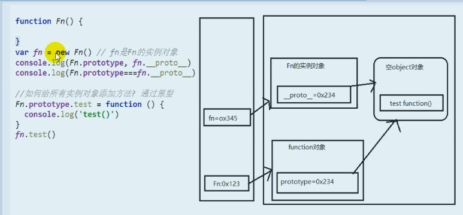
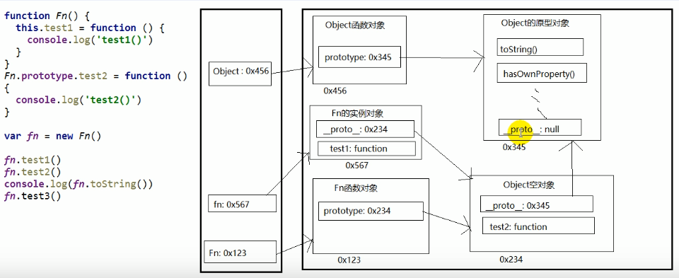
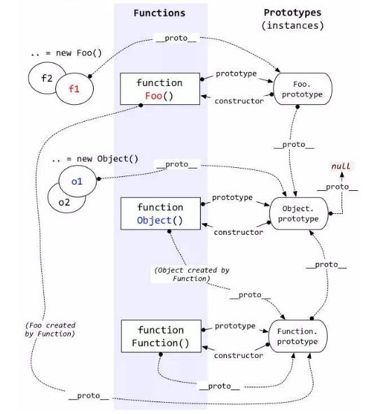
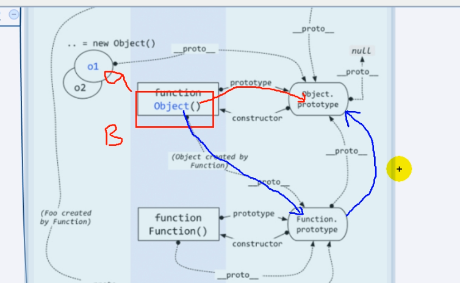
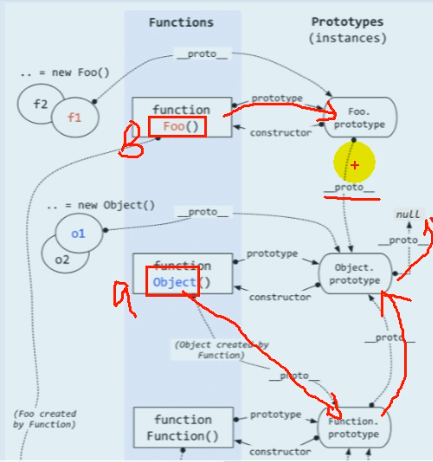
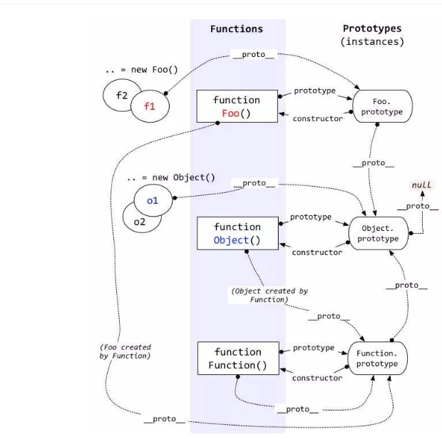
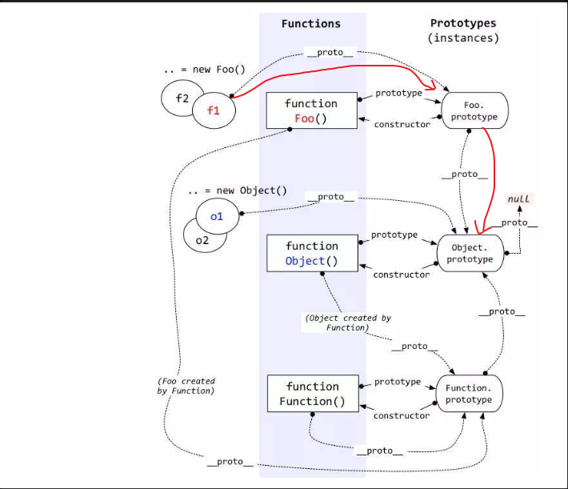
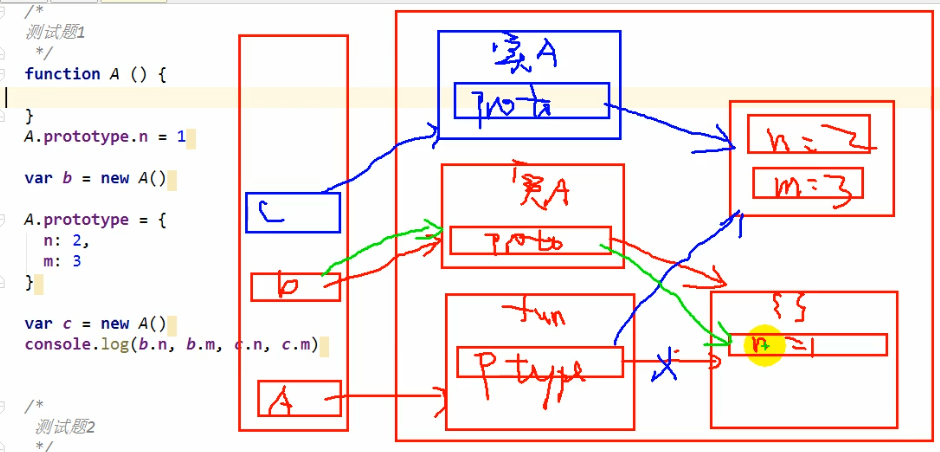
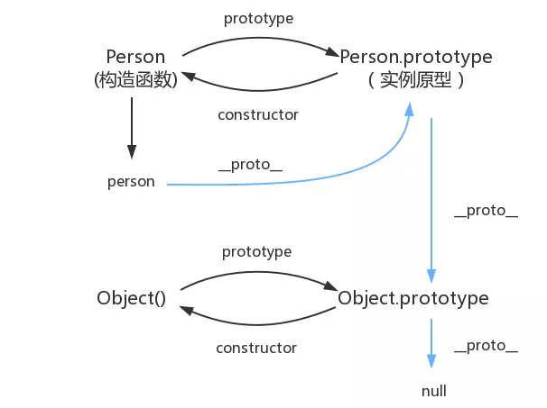

# 1、函数的prototype

函数的prototype属性

- 每个函数都有一个prototype属性，它默认指向一个Object空对象（即原型对象）

  - Object空对象：空对象值的是没有我们自定定义的方法和属性
  - Object空对象：是Obejct的实例对象

- 原型对象中有个属性constructor,它指向函数对象

  ```js
  function fn() {}
  console.log(fn.prototype) //默认指向Object空对象
  
  // 原型对象中有个属性constructor,它指向函数对象
  console.log(fn.prototype.constructor === fn)
  ```

  

给原型添加属性（一般都是方法）

 - 作用：函数的所有实例对象自动拥有原型中的属性（方法）

   ```js
   function Fn() {}
   Fn.prototype.test = function() {
     console.log('test()')
   }
   //创建实例
   let fn = new Fn();
   fn.test();
   
   ```

   

> 1. 每个函数function都有一个prototype,即显式原型（只有函数有）
> 2. 每个实例对象都有一个`__proto__`,即隐式原型

```js

function Fn() {}
//每个函数function都有一个prototype,即显式原型，默认指向一个空的Object对象
console.log(Fn.prototype);
let fn = new Fn();
// 对象的隐式原型的值为其对应构造函数显式原型的值
console.log(fn.__proto__ === Fn.prototype) //true

```

> 每个函数function都有一个prototype,即显式原型，默认指向一个空的Object对象，那隐式原型指向什么呢？

```
答：fn.__proto__和Fn.prototype指向的是同一个地址，所以相等
```

> Fn.prototype的prototype属性是什么时候加上去的？

```js
答：创建函数对象时
function Fn() {
  this.prototype = {} //内部语句
}
```

> n.`__proto__`的`__proto__`属性是什么时候加上去的？

```js
答：
let fn = new Fn(); //实例化的时候
this.__proto__ = Fn.prototype;//内部语句
```



# 2、原型链

访问一个对象属性时过程

	- 现在自身属性中查找，找到返回
	- 如果没有，再沿着`__proto__`这条链向上查找，找到返回
	- 如果最终没有找到，返回undefined

```js
function Fn() {
  this.test1 = function () {
  	console.log('test1()')
  }
}
Fn.prototype.test2 = function () {
  	console.log('test1()')
}

let fn = new Fn();
fn.test1();
fn.test2();
console.log(fn.toString())
```




> 总结

```js
1、所有函数的__proto__都是一样的，var fn =new Function()
2、函数的显式原型指向的对象：默认是空Object实例对象(但Object不满足)
    function Fn() {}
    console.log(Fn.prototype instanceof Object) //true ,Fn的原型对象默认是Obejct的实例对象
    console.log(Function.prototype instanceof Object) //true
    console.log(Object.prototype instanceof Object) //fasle Object是例外
 3、所有函数都是Function的实例（包括Function本身）
 	Number.__proto__ === Function.prototype  // true
    Boolean.__proto__ === Function.prototype // true
    String.__proto__ === Function.prototype  // true
    Object.__proto__ === Function.prototype  // true
    Function.__proto__ === Function.prototype // true
    Array.__proto__ === Function.prototype   // true
    RegExp.__proto__ === Function.prototype  // true
    Error.__proto__ === Function.prototype   // true
    Date.__proto__ === Function.prototype    // true
4、Object的原型对象是原型链的尽头
	console.log(Object.prototype.__proto__) //null
```

# 3、instanceof

这张图记牢，所有的题都不是难点



a instanceof b

如果B函数的显式原型对象在A 对象的原型链上，返回true,否则返回false

a找隐式 - a.`__proto__`

b找显式->b.prototype或以上的

```js
function Foo() {}
let f1 = new Foo();
console.log(f1 instanceof Foo); //true
console.log(f1 instanceof Object) //true
```


```js
console.log(Object instanceof Function) //true
console.log(Object instanceof Object) //true
console.log(Function instanceof Function) //true
console.log(Function instanceof Object) // true

funciton Foo() {};
console.log(Object instanceof Foo) //false
```

分析 console.log(Object instanceof Function) //true



funciton Foo() {};
console.log(Object instanceof Foo) //false




# 4、面试题



#### 问题1：

```js
var F = function () {}
Object.prototype.a = function () {}
Function.prototype.b = function () {}
var f = new F()
// 请问f有方法a  方法b吗

```



分析方法一

根据上面的图的原型链一步一步去找就可以了  
f.`__proto__ `->Foo.prototype -> Object.prototype->null
所有f拥有Foo和Object原型上面的方法，而没有Function上的方法

验证方法二：


### 问题2：

```js
 var F = function(){}
    Object.prototype.a = function(){
      console.log('a()')
    }
    Function.prototype.b = function(){
      console.log('b()')
    }
    var f = new F()
 	f.a() //a()
    f.b() //f.b is not function
    F.a() //a()
    F.b() //b()
   
https://blog.csdn.net/qq_27682041/article/details/76736925
```

#### 问题3：

```js
let A = function() {};
A.prototype.n = 1;
let b = new A(); 
A.prototype = {
 n: 2,
 m: 3
}
let c = new A();
console.log(b.n, b.m, c.n, c.m) //1,undefined,2,3

分析：
let A = function() {}; 
A.prototype.n = 1; 
let b = new A(); //隐式操作 b.__proto__ = A.prototype = {n:1}
A.prototype = {  // 现在A.prototype指向了新的地方  A.prototype  = {n:2, m:3},但是b.__proto__指向还是没变
 n: 2,
 m: 3
}
let c = new A();  b.__proto__ = A.prototype  = {n:2, m:3}
```




#### 


# 5、总结




每个函数function都有一个prototype，即显式原型

每个实例对象(对象和函数)都有一个`__proto__,`即隐式原型，`__proto__`=构造函数.prototype

## prototype和`_proto_`

只有Function是一个例外，typeof Function.prototype === 'function'

```js
console.log(typeof Function.prototype) // function
console.log(typeof Object.prototype)   // object
console.log(typeof Number.prototype)   // object
console.log(typeof Boolean.prototype)  // object
console.log(typeof String.prototype)   // object
console.log(typeof Array.prototype)    // object
console.log(typeof RegExp.prototype)   // object
console.log(typeof Error.prototype)    // object
console.log(typeof Date.prototype)     // object
console.log(typeof Object.prototype)   // object
```

每个实例对象(对象和函数)都有一个`__proto__,`即隐式原型，`__proto__`=构造函数.prototype

```js
Number.__proto__ === Function.prototype  // true
Boolean.__proto__ === Function.prototype // true
String.__proto__ === Function.prototype  // true
Object.__proto__ === Function.prototype  // true
Function.__proto__ === Function.prototype // true
Array.__proto__ === Function.prototype   // true
RegExp.__proto__ === Function.prototype  // true
Error.__proto__ === Function.prototype   // true
Date.__proto__ === Function.prototype    // true

var a = {}
a.__proto__ === Object.prototype //true

function Fn() {}
var fn = new Fn();
fn.__proto__ === Object.prototype //true
```


```
Object.prototype.__proto__ === null  // true
console.log(Function.prototype.__proto__ === Object.prototype) // true
```


## constructor

**所有构造器/函数(包括自定义的函数)的__proto__都指向Function.prototype，它是一个空函数（Empty function）**

#### 构造函数为Function

```js

Number.constructor === Function //true
Boolean.constructor=== Function // true
String.constructor === Function // true
Object.constructor=== Function // true
Function.constructor=== Function// true
Array.constructor=== Function   // true
RegExp.constructor === Function  // true
Error.constructor=== Function  // true
Date.constructor=== Function   // true

function a() {}
a.constructor === Function //true

var b = function() {}
b.constructor === Function //true
```

#### 构造函数为Object

```js
Math.constructor=== Object // true
JSON.constructor=== Object// true

var a = {}
a.constructor === Object // true
```

这说明什么呢？

所有的构造器都来自于Function.prototype，甚至包括根构造器Object及Function自身。所有构造器都继承了Function.prototype的属性及方法。如length、call、apply、bind（ES5）。

#### 实例的构造函数

```js
function Fn() {}
let fn = new Fn()
console.dir(fn)  //构造函数是Fn
/*
Fn
 __proto__:
    constructor: ƒ Fn()
    __proto__: Object
*/
```

constructor是原型对象(prototype)的一个属性


小测试来检验一下你理解的怎么样：

1. `person1.__proto__` 是什么？
2. `Person.__proto__` 是什么？
3. `Person.prototype.__proto__` 是什么？
4. `Object.__proto__` 是什么？
5. `Object.prototype__proto__` 是什么？

答案：
 第一题：
 因为 `person1.__proto__ === person1 的构造函数.prototype`
 因为 `person1的构造函数 === Person`
 所以 `person1.__proto__ === Person.prototype`

第二题：
 因为 `Person.__proto__ === Person的构造函数.prototype`
 因为 `Person的构造函数 === Function`
 所以 `Person.__proto__ === Function.prototype`

第三题：
 `Person.prototype` 是一个普通对象，我们无需关注它有哪些属性，只要记住它是一个普通对象。
 因为一个普通对象的构造函数 === Object
 所以 `Person.prototype.__proto__ === Object.prototype`

第四题，参照第二题，因为 Person 和 Object 一样都是构造函数

第五题：
 `Object.prototype` 对象也有**proto**属性，但它比较特殊，为 null 。因为 null 处于原型链的顶端，这个只能记住。
 `Object.prototype.__proto__ === null`


# 6、经典图


# 参考链接：

https://www.jianshu.com/p/652991a67186