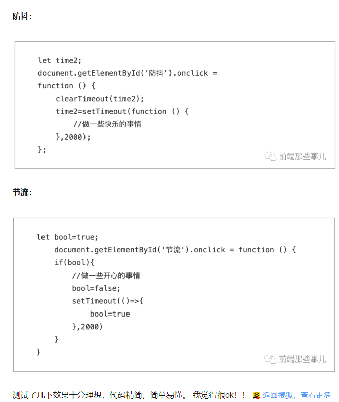

# 1、事件防抖

在前端开发中，有时会为页面绑定resize事件，或者为一个页面元素绑定拖拽事件（mousemove），这种事件有一个特点，在一个正常的操作中，有可能在一个短的时间内触发非常多次事件绑定程序。
DOM操作时很消耗性能的，如果你为这些事件绑定一些操作DOM节点的操作的话，那就会引发大量的计算，在用户看来，页面可能就一时间没有响应，这个页面一下子变卡了变慢了。在IE下，如果你绑定的resize事件进行较多DOM操作可能直接就崩溃了。

这个你轻轻一拖，就会执行几十次，这对性能不友好的。


> 输入完成后统一发送请求，最后一个人说了算，只认最后一次

如果用户每次输入都发送请求，冗余过多，用户停止输入字符350毫秒后，在发送请求

```js
 window.onscroll=function() {
     console.log("滚动")
 }
```

```js
function debounce(fn, delay) {
  var timer = null;
  return function () {
    var context = this, args = arguments;
    clearTimeout(timer);
    timer = setTimeout(function () {
      fn.apply(context, args);
    }, delay);
  };
}
```

使用,会发现次数明显的降低了

```js
  window.onscroll = debounce(function () {
            console.log("啊哈哈")
  }, 100)
```

**应用场景**

- search搜索联想，用户在不断输入值时，用防抖来节约请求资源。
- window触发resize的时候，不断的调整浏览器窗口大小会不断的触发这个事件，用防抖来让其只触发一次

# 2、函数节流

 节流：游戏里面的技能冷却功能。 

>  某一段时间只执行一次,比如说350ms固定发送请求

```js
function throttle(fn, threshhold, scope) {
  threshhold || (threshhold = 250);
  var last,
      deferTimer;
  return function () {
    var context = scope || this;

    var now = +new Date,
        args = arguments;
    if (last && now < last + threshhold) {
      // hold on to it
      clearTimeout(deferTimer);
      deferTimer = setTimeout(function () {
        last = now;
        fn.apply(context, args);
      }, threshhold);
    } else {
      last = now;
      fn.apply(context, args);
    }
  };
}


$('body').on('mousemove', throttle(function (event) {
  console.log('tick');
}, 1000));
```

**应用场景**

- 鼠标不断点击触发，mousedown(单位时间内只触发一次)
- 监听滚动事件，比如是否滑到底部自动加载更多，用throttle来判断


网上有这段话

---

 什么玩意儿？？？这么麻烦的吗？防抖还好，大部分都能达到理想的效果，可是节流就没那么理想了。节流是技能冷却啊！就是要点一下立马触发，进入冷却，等冷却，结束继续能点。然而大多版本都是：点击等一会儿才触发，进入冷却。前面多了莫名的等待时间，不是立马触发的....... 



# 3、参考链接

[关于Js debounce 函数小结](https://www.cnblogs.com/songyz/p/10310491.html)

[函数节流外国的一篇文章](https://remysharp.com/2010/07/21/throttling-function-calls)

[7分钟理解JS的节流、防抖及使用场景 ](https://blog.csdn.net/sinat_17775997/article/details/83831064)

[最精简的节流和防抖](https://www.sohu.com/a/348019580_500651?spm=smpc.author.fd-d.4.15743857907624a1X2Zj)

