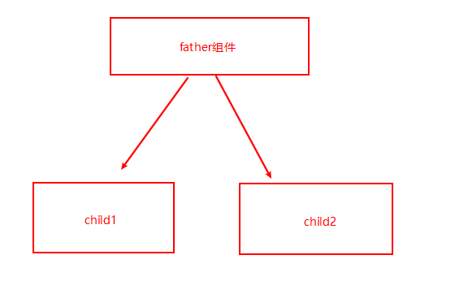
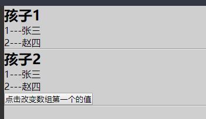
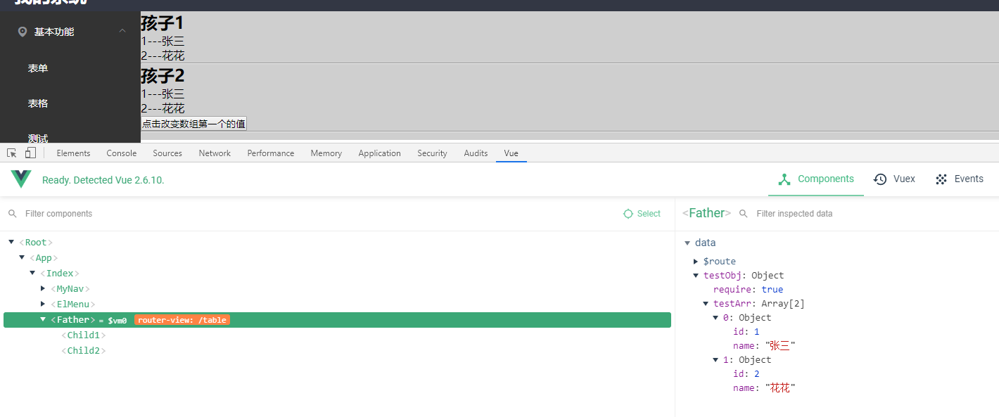

## 1. 传递引用类型引发的问题

 vue开发中，我们向子组件传递一个引用类数据[Array/Object]作为子组件的初始值 ，

现在我的结构是这样的 父组件（father）下面有两个子组件child1,child2

在通过props把数组类型同一个值传递给child1,child2,当我们通过child2来更改props的值时（原则上子组件不可以改变父组件传递过来的props值，如果时基本类型会报错），更改后父组件也会相应变化，父组件变化了相应的子组件也发生了变化，所以当点击child2修改值时，把father组件的值更改了，从而也改变了child1的值，下面会讲到如何来解决这个问题？



#### **父组件father**

```vue
<template>
   <div>
      <h2>孩子1</h2>
      <child1 :testArr="testObj.testArr"></child1>
      <hr>
      <h2>孩子2</h2>
      <child2 :testArr="testObj.testArr"></child2>

      <hr>

   </div>
</template>

<script>
import Child1 from './demo/Child1'
import Child2 from './demo/Child2'

export default {
  data(){
    return {
      testObj:{
        require:true,
        testArr:[
          {
            id:1,
            name:"张三"
          },
           {
            id:2,
            name:"赵四"
          }
        ]
      }
    }
  },
  components:{
    Child1,
    Child2
  }
}
</script>

<style>

</style>
```

#### **子组件Child1**

```vue
<template>
   <div class="child1">
       <div v-for="(item,index) in testArr" :key="index">{{item.id}}---{{item.name}}</div>
   </div>
</template>

<script>
export default {
  props:{
      testArr:Array
  }
}
</script>

<style>

</style>
```


#### 子组件**child2**

```vue
<template>
   <div class="child2">
       <div v-for="(item,index) in testArr" :key="index">{{item.id}}---{{item.name}}</div>
       <button @click="changeName">点击改变数组第一个的值</button>
   </div>
</template>

<script>
export default {
  props:{
      testArr:Array
  },
  methods:{
      changeName() {
          this.testArr[1].name="花花";
      }
  }
}
</script>

<style>

</style>
```

渲染效果



当点击child2修改值时，把father组件的值更改了，从而也改变了child1的值




#### 怎么解决这个问题？

可以把props传过来的数据保存在data里面，注意要深拷贝

**错误写法**

```
 data(){
      return {
          testData:this.testArr
      }
  }
```

**深拷贝代码参考**

```
// 递归实现一个深拷贝
function deepClone(source) {
  if (!source || typeof source !== 'object') {
    throw new Error('error arguments', 'shallowClone');
  }
  var targetObj = source.constructor === Array ? [] : {};
  for (var keys in source) {
    if (source.hasOwnProperty(keys)) {
      if (source[keys] && typeof source[keys] === 'object') {
        targetObj[keys] = source[keys].constructor === Array ? [] : {};
        targetObj[keys] = deepClone(source[keys]);
      } else {
        targetObj[keys] = source[keys];
      }
    }
  }
  return targetObj;
}
　　
```

 但是这种情况下父组件改变参数时，子组件无法更新参数，需要时可以通过watch或者computed来实现实时更新 

先来一种不是深拷贝的赋值，**错误写法**

> 注意：用watch监听时，第一次时不会执行的，后面值改变了才会执行，所以要换一种写法

```vue
  data() {
    return {
        testData:[]
    }
  },

  watch:{
      testArr(newValue){
          this.testData=newValue
      } 
  }
```


不是深拷贝的赋值，**正确写法**

```js
watch: {
    testArr: {
      handler(newValue, lodValue) {
        this.testData = newValue;
      },
      immediate: true  //代表在watch生命了testArr这个方法之后会立即去执行handler方法，自己理解，初次改变会执行这个方法
    }
  }
```

上面的这种写法  还是会出现更改了child2从而改变child1的值，刚说的用深拷贝就不会出现这种问题了

**深拷贝错误写法**

> 报错：vue.runtime.esm.js?2b0e:1888 ReferenceError: deepClone is not defined
>
> 当watch监听到testArr变化时，可能method里面的方法我们还访问不到，所以不要写在method方法里面，我们可以在外面定义一个文件，然后在里面引入

```js
  watch: {
    testArr: {
      handler(newValue, lodValue) {
        this.testData = this.deepClone(newValue);
      },
      immediate: true  //代表在watch生命了testArr这个方法之后会立即去执行handler方法，自己理解，初次改变会执行这个方法
    }
  },
  methods: {
    changeName() {
      this.testData[1].name = "花花";
    },
    // 递归实现一个深拷贝
    deepClone(source) {
      if (!source || typeof source !== "object") {
        throw new Error("error arguments", "shallowClone");
      }
      var targetObj = source.constructor === Array ? [] : {};
      for (var keys in source) {
        if (source.hasOwnProperty(keys)) {
          if (source[keys] && typeof source[keys] === "object") {
            targetObj[keys] = source[keys].constructor === Array ? [] : {};
            targetObj[keys] = deepClone(source[keys]);
          } else {
            targetObj[keys] = source[keys];
          }
        }
      }
      return targetObj;
    }
  }
```


**正确写法**

utils.js文件

```
export function  deepClone(source) {
    if (!source || typeof source !== "object") {
      throw new Error("error arguments", "shallowClone");
    }
    var targetObj = source.constructor === Array ? [] : {};
    for (var keys in source) {
      if (source.hasOwnProperty(keys)) {
        if (source[keys] && typeof source[keys] === "object") {
          targetObj[keys] = source[keys].constructor === Array ? [] : {};
          targetObj[keys] = deepClone(source[keys]);
        } else {
          targetObj[keys] = source[keys];
        }
      }
    }
    return targetObj;
  }
```

在需要用到函数的地方引入,然后直接用就可以了

```
import {deepClone} from './demo/utils.js'
```

#### child2最后代码

```
<template>
  <div class="child2">
    <div v-for="(item,index) in testData" :key="index">{{item.id}}---{{item.name}}</div>
    <button @click="changeName">点击改变数组第一个的值</button>
  </div>
</template>

<script>
import { deepClone } from "./utils.js";
export default {
  props: {
    testArr: Array
  },
  data() {
    return {
      testData: []
    };
  },

  watch: {
    testArr: {
      handler(newValue, lodValue) {
        this.testData = deepClone(newValue);
      },
      immediate: true  //代表在watch生命了testArr这个方法之后会立即去执行handler方法，自己理解，初次改变会执行这个方法
    }
  },
  methods: {
    changeName() {
      this.testData[1].name = "花花";
    }
    // 递归实现一个深拷贝
 
  }
};
</script>

<style>
</style>
```

现在点击child2里面的按钮，更改数据，就不会改到child1的数据了