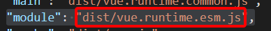

# 1、flow

[Flow](https://flow.org/en/docs/getting-started/) 是 facebook 出品的 JavaScript 静态类型检查工具。Vue.js 的源码利用了 Flow 做了静态类型检查，所以了解 Flow 有助于我们阅读源码。

### 使用flow

**安装**

```js
npm install -g flow-bin
```

**初始化**

```js
//.flowconfig文件
```


### 类型注释

> `/*@flow*/`这个表示需要flow去检查,如果没有就不去检查

##### 数字

number表示传进来的值为整数

括号后面的number表示：返回值为数字类型

```js

/*@flow*/

function add(x: number, y: number): number {
  return x + y
}

add('Hello', 11)
```

##### 数组

数组类型注释的格式是 `Array`，`T` 表示数组中每项的数据类型。在上述代码中，arr 是每项均为数字的数组。如果我们给这个数组添加了一个字符串，Flow 能检查出错误

```js
/*@flow*/
var arr: Array<number> = [1, 2, 3]
```

##### 类和对象

```js
/*@flow*/

class Bar {
  x: string;           // x 是字符串
  y: string | number | void;  // y 可以是字符串或者数字或者空值
  z: boolean;

  constructor(x: string, y: string | number | void) {
    this.x = x
    this.y = y
    this.z = false
  }
}

var bar: Bar = new Bar('hello', 4)

var obj: { a: string, b: number, c: Array<string>, d: Bar } = {
  a: 'hello',
  b: 11,
  c: ['hello', 'world'],
  d: new Bar('hello', 3)
}

```

#####  Null

若想任意类型 T 可以为 null 或者 undefined，只需类似如下写成 ?T 的格式即可。

```js
/*@flow*/
var foo: ?string = null
```


# 2、调试方法

新建一个vue项目，找到node_modules->package.json->"module": "dist/vue.runtime.esm.js",

在这个文件去打断点




# 参考文档

[vue.js技术揭秘](https://ustbhuangyi.github.io/vue-analysis/v2/prepare/)

[flow官网](https://flow.org/en/docs/getting-started/)