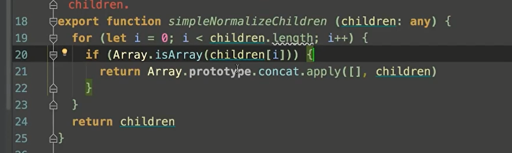

# 1、flow

[Flow](https://flow.org/en/docs/getting-started/) 是 facebook 出品的 JavaScript 静态类型检查工具。Vue.js 的源码利用了 Flow 做了静态类型检查，所以了解 Flow 有助于我们阅读源码。

### 使用flow

**安装**

```js
npm install -g flow-bin
```

**初始化**

```js
//.flowconfig文件
```


### 类型注释

> `/*@flow*/`这个表示需要flow去检查,如果没有就不去检查

##### 数字

number表示传进来的值为整数

括号后面的number表示：返回值为数字类型

```js

/*@flow*/

function add(x: number, y: number): number {
  return x + y
}

add('Hello', 11)
```

##### 数组

数组类型注释的格式是 `Array`，`T` 表示数组中每项的数据类型。在上述代码中，arr 是每项均为数字的数组。如果我们给这个数组添加了一个字符串，Flow 能检查出错误

```js
/*@flow*/
var arr: Array<number> = [1, 2, 3]
```

##### 类和对象

```js
/*@flow*/

class Bar {
  x: string;           // x 是字符串
  y: string | number | void;  // y 可以是字符串或者数字或者空值
  z: boolean;

  constructor(x: string, y: string | number | void) {
    this.x = x
    this.y = y
    this.z = false
  }
}

var bar: Bar = new Bar('hello', 4)

var obj: { a: string, b: number, c: Array<string>, d: Bar } = {
  a: 'hello',
  b: 11,
  c: ['hello', 'world'],
  d: new Bar('hello', 3)
}

```

#####  Null

若想任意类型 T 可以为 null 或者 undefined，只需类似如下写成 ?T 的格式即可。

```js
/*@flow*/
var foo: ?string = null
```


# 2、调试方法

新建一个vue项目，找到node_modules->package.json->"module": "dist/vue.runtime.esm.js",

在这个文件去打断点


# 3、打草稿


### 3.1、{{msg}}怎么渲染到页面的

##### 构造函数vue

```js
//src\core\instance\index.js
function Vue (options) {
  if (process.env.NODE_ENV !== 'production' &&
    !(this instanceof Vue)
  ) {
    warn('Vue is a constructor and should be called with the `new` keyword')
  }
  this._init(options)
}
```

**_init**:定义uid，合并options到`$options`上（可以通过`$options.el`访问到el，`$options.data`访问到data）,初始生命周期，事件等一堆的初始化

##### 初始化data,props，methods

```js
//src\core\instance\state.js
function initData (vm: Component) {
  let data = vm.$options.data
  data = vm._data = typeof data === 'function'
    ? getData(data, vm)
    : data || {}
  if (!isPlainObject(data)) {
    data = {}
    process.env.NODE_ENV !== 'production' && warn(
      'data functions should return an object:\n' +
      'https://vuejs.org/v2/guide/components.html#data-Must-Be-a-Function',
      vm
    )
  }
  // proxy data on instance
  const keys = Object.keys(data)
  const props = vm.$options.props
  const methods = vm.$options.methods
  let i = keys.length
  while (i--) {
    const key = keys[i]
    if (process.env.NODE_ENV !== 'production') {
      if (methods && hasOwn(methods, key)) {
        warn(
          `Method "${key}" has already been defined as a data property.`,
          vm
        )
      }
    }
    if (props && hasOwn(props, key)) {
      process.env.NODE_ENV !== 'production' && warn(
        `The data property "${key}" is already declared as a prop. ` +
        `Use prop default value instead.`,
        vm
      )
    } else if (!isReserved(key)) {
      proxy(vm, `_data`, key)
    }
  }
  // observe data
  observe(data, true /* asRootData */)
}

export function proxy (target: Object, sourceKey: string, key: string) {
  sharedPropertyDefinition.get = function proxyGetter () {
    return this[sourceKey][key]
  }
  sharedPropertyDefinition.set = function proxySetter (val) {
    this[sourceKey][key] = val
  }
  Object.defineProperty(target, key, sharedPropertyDefinition)
}
```

**proxy**：代理 比如访问this.msg 其实是代理到this._data.msg,注意不要访问this_data,一般下划线就是私有的

### 挂载vm.$mount

```js
//src\platforms\web\entry-runtime-with-compiler.js

const mount = Vue.prototype.$mount
Vue.prototype.$mount = function (
  el?: string | Element,
  hydrating?: boolean
): Component {
  el = el && query(el)

 ...
 ...
  return mount.call(this, el, hydrating)
}

```

`const mount = Vue.prototype.$mount`: 在这里定义的 `import Vue from './runtime/index'`




# 参考文档

[vue.js技术揭秘](https://ustbhuangyi.github.io/vue-analysis/v2/prepare/)

[flow官网](https://flow.org/en/docs/getting-started/)