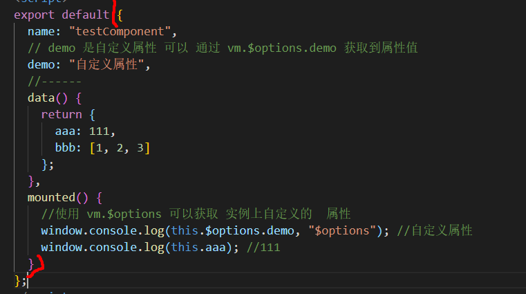

#`vm.$attrs` 和 vm.`$listeners`

1. 有时间在深入研究下 当传递属性 type="text"会覆盖的问题

2. 深入研究下，当父传递给子时，有剩余参数会显示在子的标签上的问题

## 1、使用用途

 vue中的属性绑定只能是父组件传递给子组件。当你有这样的需求：你想向嵌套层级比较深的组件传递数据的时候，只能由父组件传递给子组件，子组件再传递给孙子组件 

- 通过vuex通信（vuex有点重了）
- 通过inheritAttrs，以及实例属性$attrs


## 2、简单使用（爷子孙三代）

#### $attrs（除了props里面的）

　　包含了父作用域中不作为 prop 被识别 (且获取) 的特性绑定 (`class` 和 `style` 除外)。当一个组件没有声明任何 prop 时，这里会包含所有父作用域的绑定 (`class`和 `style` 除外)，并且可以通过 `v-bind="$attrs"` 传入内部组件——在创建高级别的组件时非常有用。

#### $listener（所有的都会往下传）

　包含了父作用域中的 (不含 `.native` 修饰器的) `v-on` 事件监听器。它可以通过 `v-on="$listeners"` 传入内部组件——在创建更高层次的组件时非常有用。

> 简单来说下面的列子：
>
> 爷爷组件传递了两个值child1Info，child2Info
>
> 爸爸组件child1Info，在props里只接收了一个，child1Info通过$attr把爷爷组件剩余的属性传递给child2Info
>
> 孙子组件child2Info，通过props接收爷爷剩余的组件
>
> 

```vue
在父组件当中，最外层组件

<template>
    <div>
        <Child1 :child1Info="child1" :child2Info="child2" v-on:test1="onTest1" v-on:test2="onTest2">
        </Child1>
    </div>
</template>
<script>
import Child1 from './child1';
export default {
    data() {
        return {
            child1:"hahha",
            child2:"asdsdasd"
        };
    },
    components: { Child1 },
    methods: {
        onTest1(msg) {
            console.log('test1 running...',msg);
        },
        onTest2(msg) {
            console.log('test2 running',msg);
        }
    }
};
</script>
```

```vue
//在子组件中

<template>
    <div class="child-1">
        <p>在子组件当中:</p>
        <p>props-child1Info: {{child1Info}}</p>
        <p>$attrs: {{$attrs}}</p>
        <hr>
        <!-- Child2组件中能直接触发test的原因在于 B组件调用C组件时 使用 v-on 绑定了$listeners 属性 -->
        <!-- 通过v-bind 绑定$attrs属性，Child2组件可以直接获取到A组件中传递下来的props（除了child1组件中props声明的） -->
        <Child2 v-bind="$attrs" v-on="$listeners"></Child2>
    </div>
</template>
<script>
import Child2 from './child2';
export default {
    props: ['child1Info'],
    data() {
        return {};
    },
    components: { Child2 },
    mounted() {
        this.$emit('test1','嘻嘻');
    }
};
</script>
```

```vue
//在孙子组件当中：


<template>
    <div class="child-2">
        <p>在最里层组件当中child2:</p>
        <p>props-child2Info: {{child2Info}}</p>
        <p> $attrs 的值: {{$attrs}}</p>
        <hr>
    </div>
</template>
<script>
export default {
    props: ['child2Info'],
    data() {
        return {};
    },
    mounted() {
        this.$emit('test2','哈哈');
        this.$emit("test1", "里面触发的");
    }
};
</script>
```


## `$attrs`和`$listeners`参考链接

[vue官网]( https://cn.vuejs.org/v2/api/#vm-attrs )

 http://www.freesion.com/article/5903201041/ 

 https://www.cnblogs.com/lsboom/p/11365293.html 


# vm.$options

用于当前 Vue 实例的初始化选项。需要在选项中包含自定义属性时会有用处：

```vue
<template>
  <div class="demo"></div>
</template>

<script>
export default {
  name: "testComponent",
  // demo 是自定义属性 可以 通过 vm.$options.demo 获取到属性值
  demo: "自定义属性",
  //------
  data() {
    return {
      aaa: 111,
      bbb: [1, 2, 3]
    };
  },
  mounted() {
    //使用 vm.$options 可以获取 实例上自定义的  属性
    window.console.log(this.$options.demo, "$options"); //自定义属性
    window.console.log(this.aaa); //111
  }
};
</script>

<style scoped>
</style>
```

这个花括号里面的属性都能拿到，比如name,data都能拿到，一般是那自定义属性和方法



# `vm.$parent`和`vm.$children`和`vm.$root`

## `vm.$parent`

vm.$parent`没有父组件获取的为本身实例,有父组件获取的是父组件实例

```
<template>
  <div id="app">
    <router-view />
  </div>
</template>
<script>
export default {
  mounted() {
    window.console.log(this.$parent.$el) //他没有父组件,获取到的this.$parent为本身
  }
```

常用技巧（不建议，实在逼不得已做）

```
this.$parent.$refs 对父组件的元素进行操作
this.$parent.$parent...可以向上获取很多层
可以调用父组件的方法,修改data 
```

## `vm.$root`

当前组件树的根 Vue 实例。如果当前实例没有父实例，此实例将会是其自己。

**大白话解释**

得到最顶层的组件（一般是App.vue）

如果在App.vue里面获取是本身

## `vm.$children`

在父组件中可以使用`this.$refs`.组件的标记 访问子组件，或者`this.$children[i]`.属性，，访问子组件的

获取子组件实例

```js
<firstchild ref="one"></firstchild>
this.$refs.one  //获取子组件实例
```


#  `vm.$slots`(插槽slot 2.6版本详解)

 slot的出现是为了父组件可以堂而皇之地在子组件中加入内容 

## 1、插槽内容

### 1.1、一个插槽

默认情况下，在子组件里面插入内容是不会显示出来的，下面Son里面h1是没有显示出来的

- 父组件

```

<div class="father">
     <Son>
         <h1>在子组件插入内容</h1>
     </Son>
   </div>
```

- 子组件

```
<div class="son">dd</div>
```

怎么才能显示出来呢？这时候看到最开始那句话  **slot的出现是为了父组件可以堂而皇之地在子组件中加入内容** ，这时候就要用到slot，子组件做如下更改：

- 子组件更改

  > 用了slot，你在父组件里面加的任何标签，都会显示在子组件里面。

```
<div class="son">
    dd
    <slot></slot>
</div>
```


#### 1.2、多个插槽（具名插槽）

 具名插槽也很简单，比如有多个插槽，我作为父组件，肯定想区别子组件中的几个插槽，那就要用slot标签的name属性来标识了 

这里偷懒下，借鉴官方文档，其实也就是在子组件里面写了多个slot，你怎么知道你写的内容是哪个slot的，默认你不命名，每个slot都会把你写在子组件的内容拷贝一份。

- 子组件（没有命名的，其实有个默认的名字叫default）

```
<div class="container">
  <header>
    <slot name="header"></slot>
  </header>
  <main>
    <slot></slot>
  </main>
  <footer>
    <slot name="footer"></slot>
  </footer>
</div>
```

- 父组件

  > 这里很明显了，父组件往子组件对应的位置填充内容时，用v-slot:名字
  >
  > 现在 ` 元素中的所有内容都将会被传入相应的插槽。任何没有被包裹在带有 `v-slot` 的 ` 中的内容都会被视为默认插槽的内容。 

  ```
  <base-layout>
    <template v-slot:header>
      <h1>Here might be a page title</h1>
    </template>
  
    <p>A paragraph for the main content.</p>
    <p>And another one.</p>
  
    <template v-slot:footer>
      <p>Here's some contact info</p>
    </template>
  </base-layout>
  ```

## 2、作用域插槽（2.6）

 通常情况下普通的插槽是父组件使用插槽过程中传入东西决定了插槽的内容。但有时我们需要获取到子组件提供的一些数据，那么作用域插槽就排上用场了。 

### 2.1、使用

- 子组件

```
<slot :data="data"></slot>

 data () {
 return {
 data: { // 内部状态
 username: 'oli'
 }
 }
 }
```

- 父组件

  > 1、user你随意写名字，不重要
  >
  > 2、 也可以不书写 default 关键字，默认就是假定对应默认插槽 

```vue
<template v-slot:default="user">{{user.data.username}}</template>
```

 使用 v-slot 绑定一个命名空间 user，这样就可以通过 user 对象引用到子组件中传入的数据了 ，可以传多个数据，都在user这个对象里面可以引用到

### 2.2、解构插槽

 作用域插槽的内部工作原理是将你的插槽内容包括在一个传入单个参数的函数里 

 这意味着 `v-slot` 的值实际上可以是任何能够作为函数定义中的参数的 JavaScript 表达式。所以在支持的环境下 ([单文件组件](https://cn.vuejs.org/v2/guide/single-file-components.html)或[现代浏览器](https://developer.mozilla.org/zh-CN/docs/Web/JavaScript/Reference/Operators/Destructuring_assignment#浏览器兼容))，你也可以使用 [ES2015 解构](https://developer.mozilla.org/zh-CN/docs/Web/JavaScript/Reference/Operators/Destructuring_assignment#解构对象)来传入具体的插槽 prop，如下： 

- 父组件改造

  ```
  <template v-slot:default="{data}">{{data.username}}</template>
  ```

### 2.3、具名插槽的缩写

注意是具名插槽，这里把官网的搬过来

 跟 `v-on` 和 `v-bind` 一样，`v-slot` 也有缩写，即把参数之前的所有内容 (`v-slot:`) 替换为字符 `#`。例如 `v-slot:header` 可以被重写为 `#header`： 

```vue
<base-layout>
  <template #header>
    <h1>Here might be a page title</h1>
  </template>

  <p>A paragraph for the main content.</p>
  <p>And another one.</p>

  <template #footer>
    <p>Here's some contact info</p>
  </template>
</base-layout>
```

然而，和其它指令一样，该缩写只在其有参数的时候才可用。这意味着以下语法是无效的：

```vue
<!-- 这样会触发一个警告 -->
<current-user #="{ user }">
  {{ user.firstName }}
</current-user>
```

如果你希望使用缩写的话，你必须始终以明确插槽名取而代之：

```vue
<current-user #default="{ user }">
  {{ user.firstName }}
</current-user>
```

## 3、$slot使用

```vue
//chidren
<template>
   <div>
      <slot></slot>
      <slot name="footer"></slot>
   </div>
</template>
<script>
export default {
  mounted() {
    window.console.log(this.$slots) //获取全部的slot,必须调用的父组件要写内容,不然为{}
    window.console.log(this.$slots.default) //获取默认的， 必须调用的父组件要写内容,不然为undefined
    window.console.log(this.$slots.footer)  //获取具名插槽,不然为undefined
    }
}
</script>
```


```js
//父组件
<child ref="child"></child>
window.console.log(this.$slots) //{}
window.console.log(this.$slots.default) //undefined
window.console.log(this.$slots.footer)  //undefined
```


```js
//父组件
<child ref="child"></child>
window.console.log(this.$slots) //{default:[VNODE]}
window.console.log(this.$slots.default) //[Vnode]
window.console.log(this.$slots.footer)  //undefined
```


## vm.$slot参考链接

[vue作用域插槽，你真的懂了吗？](https://www.jianshu.com/p/e10baeff888d)

[官方链接](https://cn.vuejs.org/v2/guide/components-slots.html)

[详解Vue 匿名、具名和作用域插槽的使用方法](https://www.jb51.net/article/160043.htm)