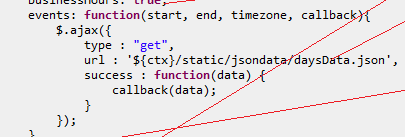
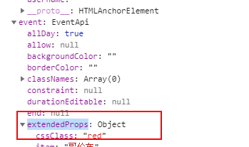
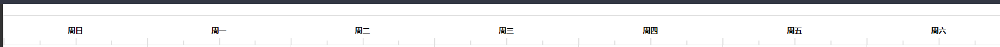

# calendar学习

## 1、基本使用

```
 npm install --save @fullcalendar/vue @fullcalendar/core @fullcalendar/daygrid
```

- 引用、注册FullCalendar组件，得到一个月视图的日历。
```

<script>
import FullCalendar from '@fullcalendar/vue'
import dayGridPlugin from '@fullcalendar/daygrid'

export default {
  components: {
    FullCalendar
  },
  data() {
    return {
      calendarPlugins: [ dayGridPlugin ]
    }
  }
}

</script>
```

```
<template>
  <FullCalendar defaultView="dayGridMonth" :plugins="calendarPlugins" />
</template>
```

```
<style lang='less'>
    //用什么插件必须引入相应的样式表，否则不能正常显示
    @import '~@fullcalendar/core/main.css';
    @import '~@fullcalendar/daygrid/main.css';
</style>

```

- 设置为中文
```
<FullCalendar locale="zh-cn" />
```

- 选项配置


## 2、选项配置相关

配置项太多写在html开始标签上不美观可以这样写，刚试了不行，后面研究

#### 2.1、设置中文

```
<FullCalendar locale="zh-cn" />
```

#### 2.2、设置头

右面始终没出来，也不知道什么原因，每次就显示了一个

> 这个写错了，timeGridWeek的插件应该是没有下载

```js
 header:{
        left: 'prev,next today',
        center: 'title',
        right: 'dayGridMonth,timeGridWeek,timeGridDay,listWeek'
      }
```

> 正常显示

```
header: {
        left: "dayGridMonth,dayGridWeek,dayGridDay custom1",
        center: "title",
        right: "prev,next today"
      }
```


#### 2.3、buttonText给按钮加文字

```
buttonText: {
        today: '今天',
        month: '月',
        week: '周',
        day: '天'
      }
```


#### 2.4、自定义按钮

```
 
 customButtons: {
        custom1: {
          text: "custom 1",
          click: function() {
            alert("clicked custom button 1!");
          }
  }
  
  header: {
        left: "dayGridMonth,dayGridWeek,dayGridDay custom1",
        center: "title",
        right: "prev,next today"
      }
      
     //在header中使用就可以了
   <full-calendar
      :header="header"
      :customButtons="customButtons"
    />
```


#### 2.4、selectable选中

可以点击选择，点击某一日有背景颜色，为true可以触发事件select，为false则不触发

```
selectable：true
```

里面有很多参数，其中有开始事件以及结束时间

```
  <full-calendar 
      :selectable="true"
      @select="selectHandle"
      />
      
  selectHandle(info) {
      console.log(info)
    }
```


## 3、渲染数据到日历表中

> 第一种方法

```
  monthData: [
        {
          title: "eeeeeeeee", // 事件内容
          start: "2019-10-05", // 事件开始时间
          end: "2019-10-11", // 事件结束时间
          textColor:"#f00",   //文字颜色
          backgroundColor:"yellow", //背景颜色
          color:"#ff0"，  //边框颜色
          classNames:"test"  //类名，接受数组
        },
        {
          title: "sssss",
          start: "2019-10-05", // 事件开始时间
          end: "2019-10-11", // 事件结束时间
          cssClass: "blue"
        }
      ]
  
```

```
  <full-calendar
      :events="monthData"
    />
```


> 第二种可以定义背景颜色以及文字颜色

```vue
 <full-calendar
      :eventSources="eventSources"
    />
```


```js
  eventSources: [

    // your event source
    {
      events: [ // put the array in the `events` property
        {
          title  : 'event1',
          start  : '2010-01-01'
        },
        {
          title  : 'event2',
          start  : '2010-01-05',
          end    : '2010-01-07'
        },
        {
          title  : 'event3',
          start  : '2010-01-09T12:30:00',
        }
      ],
      color: 'black',     // an option!
      textColor: 'yellow' // an option!
    }

    // any other event sources...

  ]
```

> 第三种



| id               | String. A unique identifier of an event. Useful for [getEventById](https://fullcalendar.io/docs/Calendar-getEventById). |
| ---------------- | ------------------------------------------------------------ |
| groupId          | String. Events that share a `groupId` will be dragged and resized together automatically. |
| allDay           | Boolean (`true` or `false`). Determines if the event is shown in the “all-day” section of relevant views. In addition, if `true` the time text is not displayed with the event. |
| start            | [Date object](https://fullcalendar.io/docs/date-object) that obeys the current [timeZone](https://fullcalendar.io/docs/timeZone). When an event begins. |
| end              | [Date object](https://fullcalendar.io/docs/date-object) that obeys the current [timeZone](https://fullcalendar.io/docs/timeZone). When an event ends. It could be `null` if an end wasn’t specified.**Note: This value is exclusive**. For example, an event with the `end` of `2018-09-03` will appear to span through `2018-09-02` but end before the start of `2018-09-03`. See how events are [are parsed from a plain object](https://fullcalendar.io/docs/event-parsing) for further details. |
| title            | String. The text that will appear on an event.               |
| url              | String. A URL that will be visited when this event is clicked by the user. For more information on controlling this behavior, see the [eventClick](https://fullcalendar.io/docs/eventClick) callback. |
| classNames       | An array of strings like `[ 'myclass1', myclass2' ]`. Determines which HTML classNames will be attached to the rendered event. |
| editable         | Boolean (`true` or `false`) or `null`. The value overriding the [editable](https://fullcalendar.io/docs/editable) setting for this specific event. |
| startEditable    | Boolean (`true` or `false`) or `null`. The value overriding the [eventStartEditable](https://fullcalendar.io/docs/eventStartEditable) setting for this specific event. |
| durationEditable | Boolean (`true` or `false`) or `null`. The value overriding the [eventDurationEditable](https://fullcalendar.io/docs/eventDurationEditable) setting for this specific event. |
| resourceEditable | Boolean (`true` or `false`) or `null`. The value overriding the [eventResourceEditable](https://fullcalendar.io/docs/eventResourceEditable) setting for this specific event. |
| rendering        | The rendering type of this event. Can be empty (normal rendering), `"background"`, or `"inverse-background"` |
| overlap          | The value overriding the [eventOverlap](https://fullcalendar.io/docs/eventOverlap) setting for this specific event. If `false`, prevents this event from being dragged/resized over other events. Also prevents other events from being dragged/resized over this event. Does not accept a function. |
| constraint       | The [eventConstraint](https://fullcalendar.io/docs/eventConstraint) override for this specific event. |
| backgroundColor  | The [eventBackgroundColor](https://fullcalendar.io/docs/eventBackgroundColor) override for this specific event. |
| borderColor      | The [eventBorderColor](https://fullcalendar.io/docs/eventBorderColor) override for this specific event. |
| textColor        | The [eventTextColor](https://fullcalendar.io/docs/eventTextColor) override for this specific event. |
| extendedProps    | A plain object holding miscellaneous other properties specified during parsing. Receives properties in the explicitly given `extendedProps` hash as well as other non-standard properties. |
| source           | A reference to the [Event Source](https://fullcalendar.io/docs/event-source-object) this event came from. If the event was added dynamically via [addEvent](https://fullcalendar.io/docs/Calendar-addEvent), and the `source` parameter was not specified, this value will be `null`. |

[事件数据参数](https://fullcalendar.io/docs/event-object)

[有events函数的用法以及有些详细的属性用法](https://blog.csdn.net/qq827245563/article/details/86656115)

[参数列表](https://fullcalendar.io/docs/event-source-object#options)

[events使用函数来获取的形式](https://fullcalendar.io/docs/events-function)

## 4、拖到位置

> 就引入这个插件，以及加一个 editable: true就可以拖动了

```
 eventLimit: true   //不确定，好像是超过了就显示 +4more
```

```js
import { Calendar } from '@fullcalendar/core';
import interactionPlugin from '@fullcalendar/interaction';
...
let calendar = new Calendar(calendarEl, {
  plugins: [ interactionPlugin ],
  editable: true
})

 <full-calendar
      :plugins="calendarPlugins"
      :editable="true"
    />
```

- 事件触发

  ```
   //开始拖拽触发
    @eventDragStart="eventDragStart"
    //拖拽结束触发
    @eventDragStop="eventDragStop"
    //当拖动停止并且事件已移至其他日期/时间时触发。
    @eventDrop="eventDrop"
  ```

  [eventDrop](https://fullcalendar.io/docs/eventDrop)
  
   [拖动例子]( https://fullcalendar.io/docs/editable)

## 5、事件移入移出

 https://fullcalendar.io/docs/eventMouseEnter 



## 6、点击日历清单

```
@dateClick="dateClick"  //点击天的空白处会触发
@eventClick="eventClick" //点击工作项会触发

//dayClick 还未发现是什么时候触发
```


## 7、基本配置配置项初始化数据

- 后面好像不这样用，这是jquery的用法，用了也可以实现，应该是不建议的

```
    
     var calendarEl = document.getElementById('calendar');
      this.calendar = new Calendar(calendarEl, {
       defaultView:"dayGridWeek",
       timeZone: 'local',
       plugins: [ dayGridPlugin ],
       defaultDate: new Date(2019, 9, 1) // 没生效
})
```


## 8、跳转到指定的日期

```
 在日历组件加ref
 
 let calendarApi = this.$refs.fullCalendar.getApi()
 calendarApi.gotoDate( date )
```

## 9、改变当前的视图

```
 calendarApi.changeView("dayGridWeek")
```

## 10、超过5项，折叠

有可能有不同的多个视图，比如在月视图中需要折叠，在日，周视图不需要折叠，可以单独设置

> eventLimit可以为数字也可以为boolean值

```
eventLimit:5,
views:{
  dayGridWeek:{
     eventLimit:true
  }
}
```


# 案例

### 1、实现刻度




```
  // 创建刻度线
    function createHeaderLine() {
      let calendarHeader = document.getElementsByClassName("fc-day-header");
      for (let j = 0; j < calendarHeader.length; j++) {
        let lineNode;
        for (let i = 0; i < 4; i++) {
          lineNode = document.createElement("div");
          lineNode.classList.add("line", "line" + (i + 1));
          calendarHeader[j].appendChild(lineNode);
        }
        if (j == calendarHeader.length - 1) {
          lineNode = document.createElement("div");
          lineNode.classList.add("line", "line5");
          calendarHeader[j].appendChild(lineNode);
        }
      }
    }
    
  
  
.fc-day-header {
  padding: 20px 0px !important;
  position: relative !important;
  border: none !important;
}
.line {
  position: absolute;
  bottom: 0;
  height: 9px;
  background: #cccccc;
  width: 2px;
  transform: scale(0.5, 1);
}
.line1 {
  left: 0px;
  height: 14px;
}
.line2 {
  left: 25%;
}
.line3 {
  left: 50%;
  height: 14px;
}
.line4 {
  left: 75%;
}
.line5 {
  right: 0px;
  height: 14px;
}
```


# 参考链接：

#### 博客相关链接

<a href="https://segmentfault.com/a/1190000019962644">https://segmentfault.com/a/1190000019962644</a>
<a href="https://www.cnblogs.com/bllx/p/9850577.html ">很多配置项有注释</a> 
<a href="https://www.jianshu.com/p/3e652dc44633">怎么在里面插入数据</a>
<a href="https://blog.csdn.net/supingemail/article/details/48371927">FullCalendar日历插件说明文档</a>

[fullCalendar日历插件说明文档2 ](https://blog.csdn.net/qq827245563/article/details/86656115)

[结束时间](https://www.cnblogs.com/yunqing/p/7374075.html)

#### 官网相关链接

[插件列表](https://fullcalendar.io/docs/plugin-index)

[文档大全](https://fullcalendar.io/docs#toc)

[vue实例官方github地址](https://github.com/fullcalendar/fullcalendar-example-projects/blob/master/vue/src/DemoApp.vue)

[vue插件用法官网文档](https://fullcalendar.io/docs/vue)

[events对象可用的参数](https://fullcalendar.io/docs/event-parsing)

[鼠标hover工具](https://fullcalendar.io/docs/eventRender)

[tooltips.js使用](https://popper.js.org/tooltip-documentation.html)

[popper.js博客详解](https://blog.csdn.net/jhzhahuaiyu/article/details/90213582)

[tooltip博客详解2](https://blog.csdn.net/shijue98/article/details/85227549)

[eventLimitClick例子](https://codepen.io/anon/pen/xWLKeK?editors=0110)