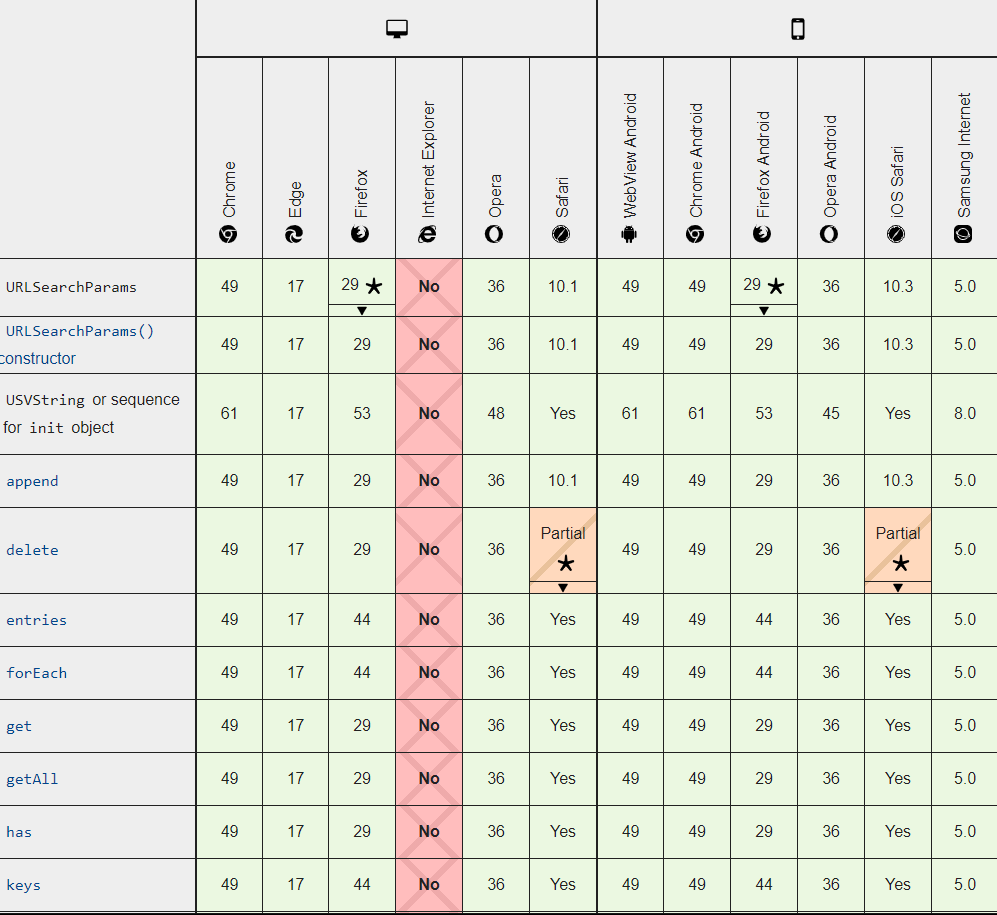

# 让URLSearchParams帮你生成和解析参数字符串

### 使用场景

在开发中，我们都免不了像下面这样手工拼 URL 搜索字符串

```js
let url = 'http://www.baidu.com';
const params = {
  age: 12,
  name: 'adadad',
  keyword: '沉沉的成都市的&爱的=按时吃'
}
url = `${ url }/age=${params.age}&name=${params.name}&keyword=${encodeURIComponent(params.keyword)}`
console.log(url)
```

如果你逐行阅读上面的代码，不难发现这段程序并**不是很严谨**，而且虽然只有两个参数，但是却需要考虑参数为 null 或 undefined，此外还需通过 [en](https://link.zhihu.com/?target=https%3A//developer.mozilla.org/zh-CN/docs/Web/JavaScript/Reference/Global_Objects/encodeURIComponent)[codeURIComponent()](https://link.zhihu.com/?target=https%3A//developer.mozilla.org/zh-CN/docs/Web/JavaScript/Reference/Global_Objects/encodeURIComponent) 函数来处理 UTF-8 编码问题。


### URLSearchParams

[MDN URLSearchParams](https://developer.mozilla.org/zh-CN/docs/Web/API/URLSearchParams)



##### **浏览器代码**

```js
// 如果需要支持较低版本的 PC 浏览器，需要额外安装和引用 polyfill：
// $ npm install --save url-search-params
// import URLSearchParams from 'url-search-params';

const urlSearchParams = new URLSearchParams();
```

##### **Node.js 代码**

```js
const { URLSearchParams } = require('url');
const urlSearchParams = new URLSearchParams();
```

##### **生成搜索字符串**

```js
const params = new URLSearchParams();
params.set('k', '关键字');       // 设置参数
params.set('p', 1);             // 支持 Boolean、Number 等丰富类型
console.log(params.toString()); // k=%E5%85%B3%E9%94%AE%E5%AD%97&p=1
```

##### **解析搜索字符串**

```js
const params = new URLSearchParams('k=%E5%85%B3%E9%94%AE%E5%AD%97&p=1');
console.log(params.get('k'));   // 返回字符串“关键字”，支持自动 UTF-8 解码
console.log(params.get('p'));   // 返回字符串“1”
console.log(params.get('xxx')); // 如果没有 xxx 这个键，则返回 null
console.log(params.has('xxx')); // 当然也可以通过 has() 方法查询是否存在指定的键
console.log(params.keys());     // 返回一个 ES6 Iterator，内含 ['k', 'p']
console.log(params.values());   // 返一个 ES6 Iterator，内含 ['关键字', '1']
console.log(params.entries());  // 与 Map.prototype.entries() 类似
```

### **URL 搜索参数列表**

相信不少同学都有过不知该如何在 HTTP GET 参数中传递数组的经历，我看到过不少人使用的这种方式：

```
http://example.com/search?brands=bmw,audi,mercedes
```

事实上，上面这种方式是不够标准的，并且需要处理原本字符串中就包含“,”的情况，而在业界广为**推荐的范式**是这样的：

```
http://example.com/search?brands=bmw&brands=audi&brands=mercedes
```

在 Node.js 中，以 express 为例，可以通过下面的方法获得上面 brands 参数的值：

```js
app.get('/search', (req, res) => {
  console.log(req.query.brands); // 直接返回一个数组 ['bmw', 'audi', 'mercedes']
  ...
});
```

那么我们应该如何通过 URLSearchParams 来生成及解析这种标准参数形式呢？使用 append() 和 getAll() 方法就行：

```js
let params = new URLSearchParams();
// 通过 append() 方法添加所有的选项值
params.append('brands', 'bmw');
params.append('brands', 'audi');
params.append('brands', 'mercedes');
const searchString = params.toString();

// 解析也同样简单
params = new URLSearchParams(searchString);
console.log(params.getAll('brands')); // 返回一个数组 ['bmw', 'audi', 'mercedes']
```

# 参考链接

https://zhuanlan.zhihu.com/p/29581070