# 1、初始webpack

### 为什么需要构建工具

- 转换ES6语法
- 转换JSX
- CSS前缀补全/预处理器（less/sass）
- 压缩混淆
- 图片压缩


### 前端构建演变之路

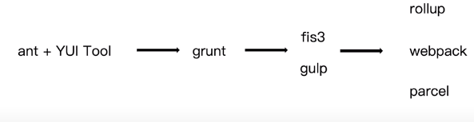


### 为什么选择webpack

- 社区⽣生态丰富
- 配置灵活和插件化扩展
- 官⽅方更更新迭代速度快


### 初始webpack:配置文件名称

webpack 默认配置⽂文件：`webpack.config.js`

可以通过`webpack --config` 指定配置文件


### 初识webpack：webpack 配置组成

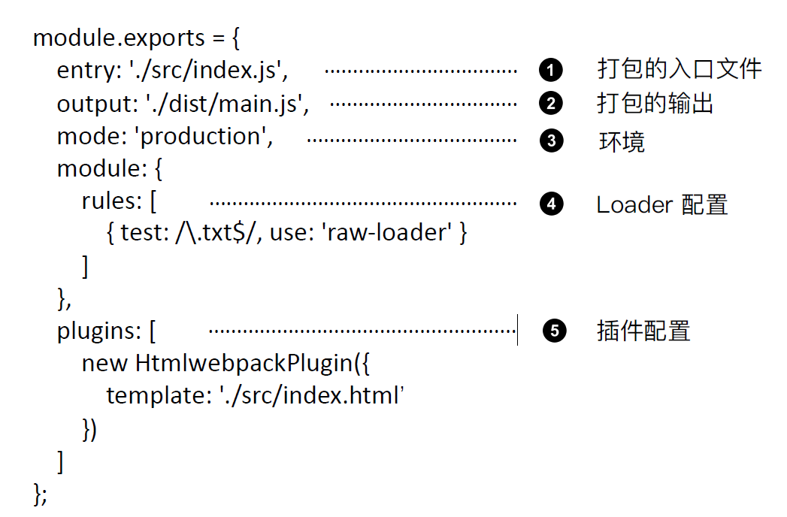

### 零配置webpack 包含哪些内容？

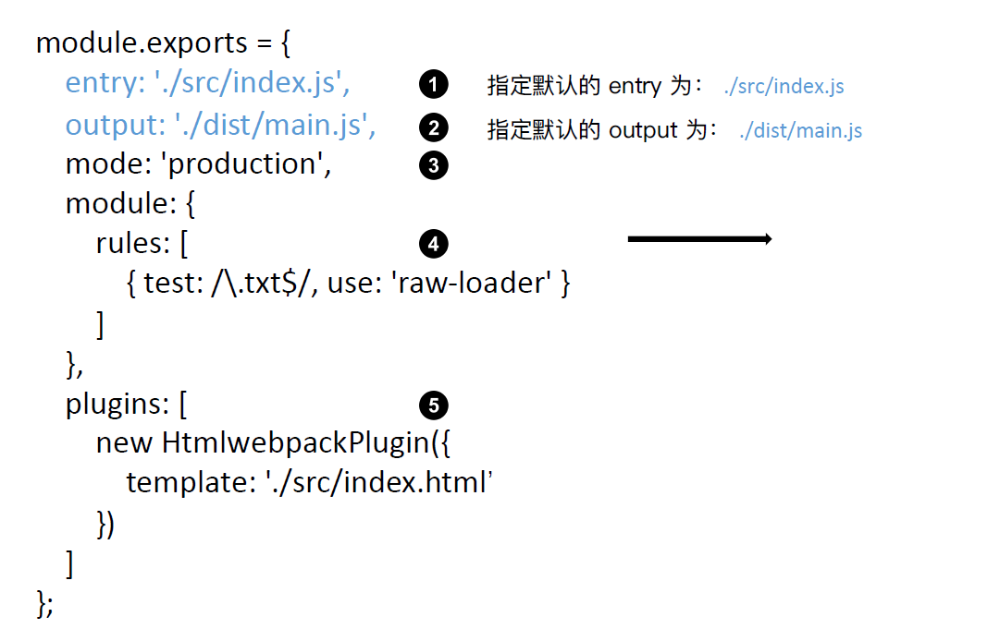


### 环境搭建：

##### 1、安装Node.js 和NPM

##### 2、创建package.json

```
npm init
npm init -y 快速创建
```

##### 3、安装webpack 和webpack-cli

```
npm install webpack webpack-cli --save-dev
```


### 通过npm script 运⾏行行webpack

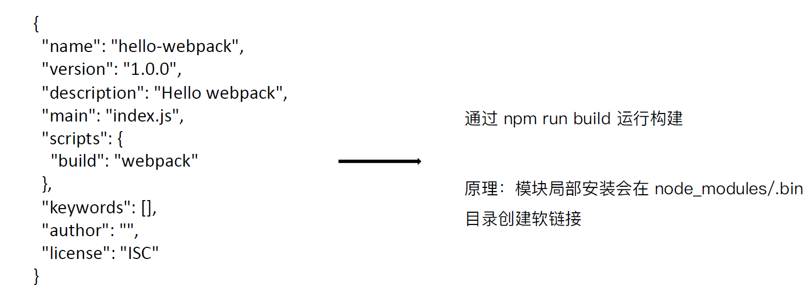


# 2、webpack基础用法

### 2.1、webpack核心概念之entry

`entry`是配置模块的入口，可抽象成输入，Webpack 执行构建的第一步将从入口开始搜寻及递归解析出所有入口依赖的模块。

有多入口和单入口两种：

- 单入口 :后面为字符串

- 多入口：entry为{}

  ```js
  //输出还是只有一个
  module.exports = {
      entry: {
          app: './src/app.js',
          search: './src/search.js'
      },
      output: {
          filename: '[name].js',
          path: __dirname + '/dist'
      }
  };
  ```

  

[webpack核心概念之entry](http://www.xbhub.com/wiki/webpack/2配置/2-1Entry.html)

### 2.2、webpack核心概念之output

打包文件输出的目录，比如目录为dist,打包文件名为bundle.js

```js
const path = require('path');

module.exports = {
    entry: './src/index.js',
    output: {
        path: path.join(__dirname, 'dist'),
        filename: 'bundle.js'
    }
};
```

### 2.3、webpack核心概念之loaders

webpack 开箱即用只支持JS 和JSON 两种文件类型，通过Loaders 去支持其它文件类型并且把它们转化成有效的模块，并且可以添加到依赖图中。本身是一个函数，接受源文件作为参数，返回转换的结果。

##### 语法

- `test` 属性，指定匹配规则
- `use` 属性，表示进行转换时，应该使用哪个 loader。

```js
const path = require('path');

const config = {
  output: {
    filename: 'my-first-webpack.bundle.js'
  },
  module: {
    rules: [
      { test: /\.txt$/, use: 'raw-loader' }
    ]
  }
};

module.exports = config;
```

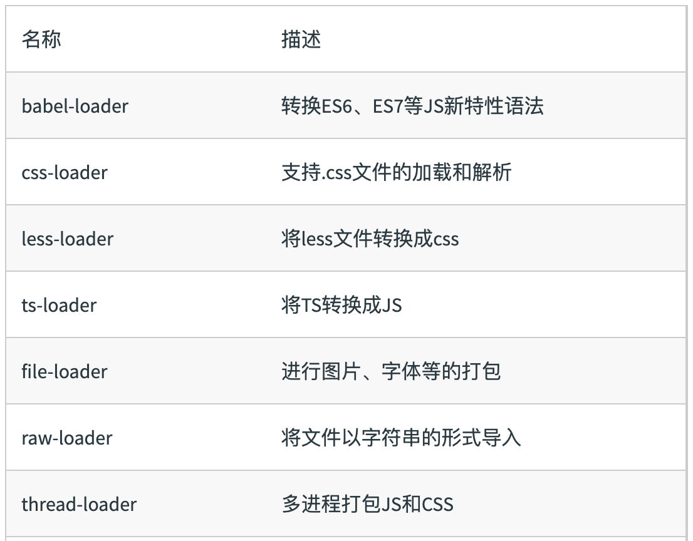

### 2.4、webpack核心概念之plugins

增强webpack功能，插件用于bundle文件的优化，资源管理和环境变量注入，

作用于整个构建过程


##### 常用的plugins

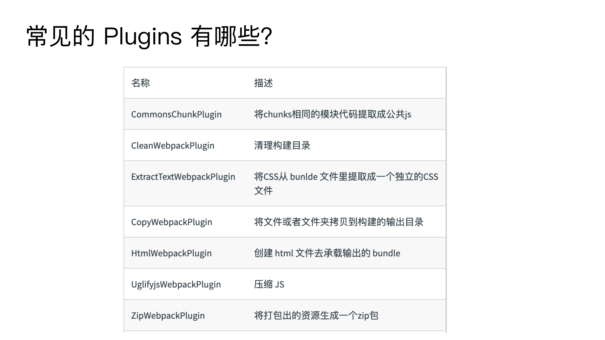

```
extract-text-webpackplugin 已经替换成mini-css-extract-plugin，
commonsChunkPlugin 替换成了 splitchunksplugin
```

### 2.5、webpack核心概念之mode

Mode ⽤用来指定当前的构建环境是：production、development 还是none
设置mode 可以使⽤用webpack 内置的函数，默认值为production

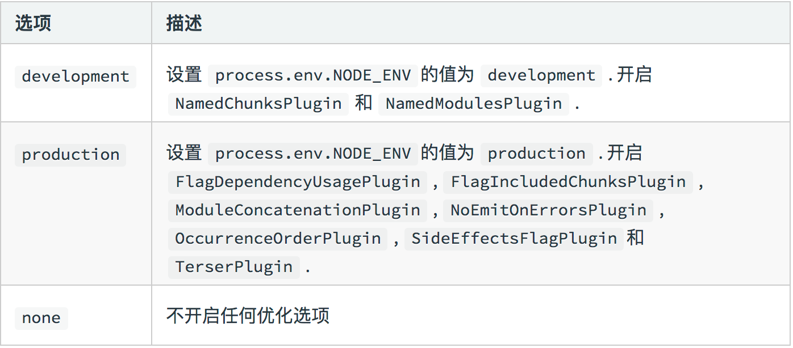


### 2.6、解析ECMAScript 6+（loader）

##### 解析es6+

- `babel-loader`: 虽然webpack本身就能够处理`.js文件`，但无法对ES2015+的语法进行转换，babel-loader的作用正是实现对使用了ES2015+语法的`.js`文件进行处理。
- `babel-core`的作用在于提供一系列api,这便是说，当webpack使用babel-loader处理文件时，babel-loader实际上调用了babel-core的api，因此也必须安装babel-core
- `babel-preset-env`的作用是告诉babel使用哪种转码规则进行文件处理

```
npm i @babel/core @babel/preset-env babel-loader -D
```

```js
//webpack.config.js
module.exports = {
    module:{  
        rules:[   
            {
                test:/\.js$/,   //匹配JS文件  
                use:'babel-loader',
                exclude:/node_modules/   //排除node_modules目录
            }
        ]
    }
}
```

```js
//.babelrc
{
   "presets": ["@babel/preset-env"]
}
```

### 2.7、React JSX（loader）

```
npm i react react-dom @babel/preset-react -D
```


```
//.babelrc
{
   "presets": [
     "@babel/preset-env",
     "@babel/preset-react"
    ]
}
```


### 2.8、解析css,less（loader）

##### 解析css

```
npm i style-loader css-loader -S
```

- css-loader ⽤用于加载.css ⽂文件，并且转换成commonjs 对象
- style-loader 将样式通过<style> 标签插⼊入到head 中

> 注意：style-loader,css-loader的顺序，他是从数组的从右到左的开始解析，顺序不能错，先执行css-loader,在执行style-loader

```js
module: {
    rules: [
        {
         test: /\.css$/,
         use: [
          'style-loader',
          'css-loader'
         ]
        }
    ]
 }
```

[webpack面试题](https://www.cnblogs.com/gaoht/p/11310365.html)

##### 解析less

在前面基础上增加一个 less-loader

```js
npm i style-loader css-loader -S
npm i less less-loader -S
```

```js
module: {
    rules: [
        {
         test: /\.css$/,
         use: [
          'style-loader',
          'css-loader',
          'less-loader'
         ]
        }
    ]
 }
```

### 2.9、解析图片(loader)

##### file-loader ⽤用于处理理⽂文件

```
npm install file-loader --save-dev
```

```js
module.exports = {
  module: {
    rules: [
      {
        test: /\.(png|jpe?g|gif)$/i,
        use: [
          {
            loader: 'file-loader',
          },
        ],
      },
    ],
  },
};
```

出来图片名字是哈希码，像重命名看下面一个方法

https://webpack.js.org/loaders/file-loader/#root

##### url-loader

更file-loader 的区别：

- url-loader会自动把小图片转换为base64，其实内部也是用的file-loader

```js
//小于10kb转换为base64位
{
        test: /\.(png|jpg|gif)$/i,
        use: [
          {
            loader: 'url-loader',
            options: {
              limit: 8192,
            },
          },
        ],
      },
```

https://webpack.js.org/loaders/url-loader/#root

##### 疑问点

看了这个file-loader，貌似实际开发时并不是所有图片都会由js引入，有好几种情况：
1、比如在html里用img的src引用图片，那么这个图片没有被js依赖到，按理就不会去打包输出这个图片。
2、比如在css中使用背景图去引用图片，而这个css是直接link在html内的，同样也不会去打包输出这个图片。
唯独只有js内引用了css文件，才会去打包输出css，顺带把里面背景图引用到的图片输出而已。

```
作者回复: webpack 目前的打包入口只能是以 js 为入口的，暂时还不支持以 html 为入口进行打包，也就是 webpack 默认是不会分析 html 文件里面的依赖(比如 src=xxx 或者 外部 css 中的语法)。可以看下这个 issue 的讨论：（https://github.com/webpack/webpack/issues/536）

针对你说的这两个问题的处理办法是：
1. 比如在html里用img的src引用图片。
解决办法：可以增加 html-loader 去处理 html，这样的话可以识别的了 img:src 这个属性。html-loader 提供了解析 html 里面的图片引入的能力

2. 通过 link 去引入的css里面的图片处理。
解决办法：思路和 html-loader 比较像，可以去编写一个 loader 用于解析 html 的 link 语法，如果发现引入的是 css，那么对这个 css 的语法和里面的图片依赖进行解析，并且打包出一份新的 css 文件放到 dist 目录。

```


### 2.10、解析字体图标(loader)

```js
{
     test: /\.(woff|woff2|eot|ttf|otf)$/,
     use: [
        'file-loader'
     ]
}
```

### 2.11、webpack中的文件监听

文件监听是在发现源码发⽣生变化时，⾃自动重新构建出新的输出⽂文件。

webpack 开启监听模式，有两种⽅方式：

- 启动webpack 命令时，带上--watch 参数
- 在配置webpack.config.js 中设置watch: true

```json
{
    "name": "hello-webpack",
    "version": "1.0.0",
    "description": "Hello webpack",
    "main": "index.js",
    "scripts": {
    "build": "webpack ",
    + "watch": "webpack --watch"
    },
    "keywords": [],
    "author": "",
    "license": "ISC"
}
唯⼀一缺陷：每次需要⼿手动刷新浏览器器
```

我们只需要执行 `npm run watch`,有文件变化会自动构建，

缺点，

- 每次需要⼿手动刷新浏览器器
- 资源多时，打包慢

##### 文件监听的原理分析

轮询判断⽂文件的最后编辑时间是否变化
某个⽂文件发⽣生了了变化，并不不会⽴立刻告诉监听者，⽽而是先缓存起来，等aggregateTimeout

```js
module.export = {
    //默认false，也就是不不开启
    watch: true,
    //只有开启监听模式时，watchOptions才有意义
    wathcOptions: {
    //默认为空，不监听的文件或者文件夹，支持正则匹配，对于某些系统，监听大量文件系统会导致大量的 CPU 或内存占用。这个选项可以排除一些巨大的文件夹，例如 node_modules：
    ignored: /node_modules/,
    //监听到变化发生后会等300ms再去执行，默认300ms
    aggregateTimeout: 300,
    //判断文件是否发生变化是通过不停询问系统指定文件有没有变化实现的，每秒检查一次变动
    poll: 1000
    }
}
```

https://www.webpackjs.com/configuration/watch/#watch


### 2.12、webpack热更新以及原理

webpack构建的文件是放在内存里，不是放在本地磁盘，所以速度相比较有个很大的提升

```
npm i webpack-dev-server -S
```

[https://webpack.docschina.org/guides/development/#%E4%BD%BF%E7%94%A8-webpack-dev-server](https://webpack.docschina.org/guides/development/#使用-webpack-dev-server)


##### 热更新原理

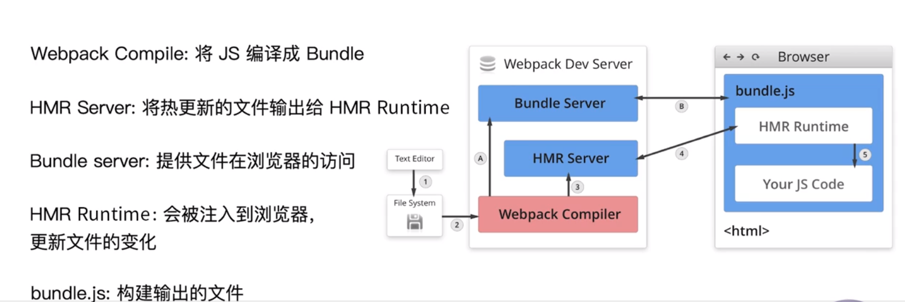


### 2.13、文件指纹策略：chunkhash、contenthash和hash

##### 什么是文件指纹策略

细心观察各大网站会发现后缀命名,

打包后输出的文件名后缀，用于做版本管理

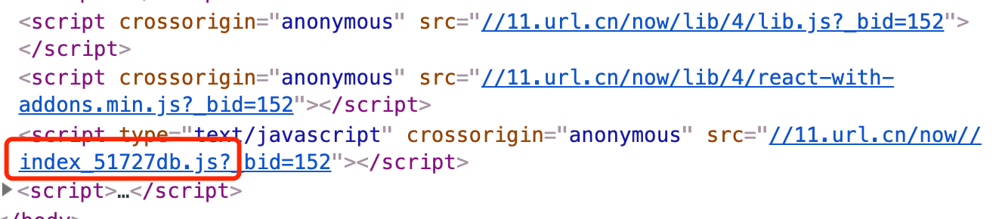


##### 文件指纹如何⽣生成

- Hash：和整个项⽬目的构建相关，只要项⽬目⽂文件有修改，整个项⽬目构建的hash 值就会更更改
- Chunkhash：和webpack 打包的chunk 有关，不不同的entry 会⽣生成不不同的chunkhash 值
- Contenthash：根据⽂文件内容来定义hash ，⽂文件内容不不变，则contenthash 不不变（通常css和图片以及字体图标采用）

##### js文件指纹设置

设置output 的filename，使⽤用[chunkhash]

```js
module.exports = {
    entry: {
    app: './src/app.js',
    search: './src/search.js'
    },
    output: {
    + filename: '[name][chunkhash:8].js',
    path: __dirname + '/dist'
    }
};
```

##### CSS 的⽂文件指纹设置

设置MiniCssExtractPlugin 的filename，使⽤用[contenthash]

```js
module.exports = {
    entry: {
    app: './src/app.js',
    search: './src/search.js'
    },
    output: {
    filename: '[name][chunkhash:8].js',
    path: __dirname + '/dist'
    },
    plugins: [
    + new MiniCssExtractPlugin({
    + filename: `[name][contenthash:8].css
    + });
    ]
};
```

##### 图⽚片的⽂文件指纹设置

设置file-loader 的name，使⽤用[hash]

```js
const path = require('path');
module.exports = {
entry: './src/index.js',
output: {
filename: 'bundle.js',
path: path.resolve(__dirname, 'dist')
},
module: {
rules: [
{
test: /\.(png|svg|jpg|gif)$/,
use: [{
loader: 'file-loader’,
+ options: {
+ name: 'img/[name][hash:8].[ext] '
+ }
}]
}
]
}
};
```

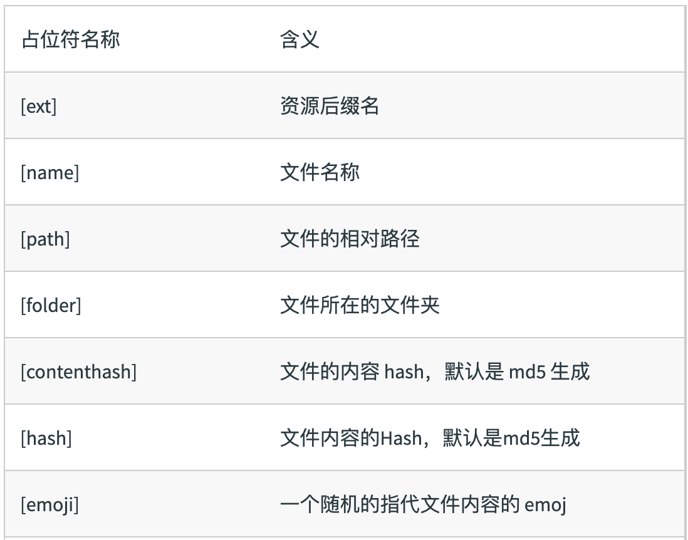

博客参考链接： https://www.jianshu.com/p/e3760398f7fa

### 2.14、代码压缩(html,css,js)

##### js文件压缩

内置了了uglifyjs-webpack-plugin

##### css文件压缩

使⽤用optimize-css-assets-webpack-plugin, 同时使⽤用cssnano

```
module.exports = {
entry: {
app: './src/app.js',
search: './src/search.js'
},
output: {
filename: '[name][chunkhash:8].js',
path: __dirname + '/dist'
},
plugins: [
+ new OptimizeCSSAssetsPlugin({
+ assetNameRegExp: /\.css$/g,
+ cssProcessor: require('cssnano’)
+ })
]
};
```


##### HTML文件压缩

修改html-webpack-plugin，设置压缩参数

```JS
module.exports = {
entry: {
app: './src/app.js',
search: './src/search.js'
},
output: {
filename: '[name][chunkhash:8].js',
path: __dirname + '/dist'
},
plugins: [
+ new HtmlWebpackPlugin({
+ template: path.join(__dirname, 'src/search.html’),
+ filename: 'search.html’,
+ chunks: ['search’],
+ inject: true,
+ minify: {
+ html5: true,
+ collapseWhitespace: true,
+ preserveLineBreaks: false,
+ minifyCSS: true,
+ minifyJS: true,
+ removeComments: false
+ }
+ })
]
};
```

# 3、webpack进阶用法

### 3.1、自动清理构建目录产物

每次构建的时候不不会清理理⽬目录，造成构建的输出⽬目录output ⽂文件越来越多

##### 方法1： 通过npm scripts 清理理构建⽬目录

不优雅

```
rm -rf ./dist && webpack
rimraf ./dist && webpack
```

##### 方法2： 自动清理理构建⽬目录

避免构建前每次都需要⼿手动删除dist    使⽤用`clean-webpack-plugin`
默认会删除output 指定的输出⽬目录

```
const { CleanWebpackPlugin } = require('clean-webpack-plugin');
module.exports = {
entry: {
app: './src/app.js',
search: './src/search.js'
},
output: {
filename: '[name][chunkhash:8].js',
path: __dirname + '/dist'
},
plugins: [
+ new CleanWebpackPlugin()
};
```

##### 提问环节：

*/1、为什么要清楚构建目录产物**

```
1、本地开发阶段：想看看代码打包出来的体积大小，比如一个页面打包出发发现有 1M 的 js，这个显然是不合理需要优化的。打包出来的图片资源太大(500k)、太小(3k)等等，这些都需要优化相关资源后再次打包看效果。
2、机器部署资源到 cdn，每次机器部署也是会进行 npm run build 这个命令去打包代码，打包后进行资源同步的操作(ssh，rsync等)。每次 push 代码到 Git 等平台会重新触发构建。如果构建前不清理构建目录，那么需要部署的文件夹会越来越大，项目一多，机器磁盘都打爆了。
3、线上代码发现错误，本地可以进行 npm run build 去代理线上脚本，修改完错误后也需要重新 build 看看结果

```


### 3.2、postcss插件autoprefixer自动补齐css3前缀

我们在用css3时，老版本兼容性不是很好，需要加前缀，每一个都手动加的话，工作量太大

使⽤用autoprefixer 插件

根据Can I Use 规则（ https://caniuse.com/ ）

```
.box {
-moz-border-radius: 10px;
-webkit-border-radius: 10px;
-o-border-radius: 10px;
border-radius: 10px;
}
```

```
npm i postcss-loader autoprefixer -D
```

```js
module.exports = {
module: {
rules: [
{
test: /\.less$/,
use: [
'style-loader',
'css-loader',
'less-loader',
+ {
+ loader: 'postcss-loader',
+ options: {
+ plugins: () => [
+ require('autoprefixer')({
+ browsers: ["last 2 version", "> 1%", "iOS 7"] //兼用游览器的版本 
+ })
+ ]
+ }
+ }
]
}
]
}
};
```

##### 提问环节

**1、顺序问题**

> 有单行注释代码的时候，需要把less loader放到后面，不然会报错的

```
作者回复: postcss-loader 执行顺序必须保证在 css-loader 之前，建议还是放在 less或者 sass 等预处理器之后更好。即 loader 顺序：
less-loader -> postcss-loader -> css-loader -> style-loader 或者 MiniCssExtractPlugin.loader

其实 postcss-loader 放在 less-loader 之前问题也不大，平时使用的 less 里面的语法基本不会和 autoprefixer 处理产生冲突的。
```


### 3.3、移动端css px转换为rem

使⽤用px2rem-loader

⻚页⾯面渲染时计算根元素的font-size 值

- 可以使⽤用⼿手淘的lib-flexible库
- https://github.com/amfe/lib-flexible

```
module.exports = {
module: {
rules: [
{
test: /\.less$/,
use: [
'style-loader',
'css-loader',
'less-loader',
+ {
+ loader: "px2rem-loader",
+ options: {
+ remUnit: 75, //1rem = 75
+ remPrecision: 8 //px转换为rem的小数点位数
+ }
+ }
]
}
]
}
};
```

##### 提问环节

**问题1：现在不是不推荐使用rem了么，现在项目里面用vw用的更多一些** 

```
作者回复: 主要是兼容性方面的考虑，rem兼容性更好。
```

**问题2：这个最大的缺点就是会把第三方ui库的px也给转了**

```
作者回复: 这个px2rem-loader 也是可以设置 exclude 的，可以把 node_modules 里面的模块 exclude 掉。

另外如果不设置 exclude，那么也可以使用 /*no*/的语法去设置某一行样式不进行 px2rem 的转换操作。


.page {
  font-size: 12px; /*no*/
  width: 375px; /*no*/
  height: 40px;
}

后面有 /*no*/这种注释语法会不进行 rem 的转换
```

**问题3：html根节点的大小计算，可以使用html:{font-size:calc(100vw/固定分辨率)}，这样可以不用引入⽤用⼿手淘的lib-flexible库，也能动态计算大小**

```
作者回复: 手淘的这个库有个好处，它会比较方便的解决手机端的1px问题。
```

**有个人提出的看法**

```
感觉现在rem这种适配方案应该逐渐过时了吧（大屏手机，不是为了看到更大的字，而是为了看到更多的内容），可以用 vw，vh方案，加上PostCSS 中的 postcss-px-to-viewport 再结合 flex布局。
```


### 3.4、静态资源内联（html内联使用raw-loader）

**代码层⾯面：**

- 页⾯面框架的初始化脚本
- 上报相关打点
- css 内联避免⻚页⾯面闪动

**请求层⾯面：减少HTTP ⽹网络请求数**

- 小图⽚片或者字体内联(url-loader)

```
npm i raw-loader@0.5.1 -D 
//高版本好像不行
raw-loader 内联html
<script>${require(' raw-loader!babel-loader!. /meta.html')}</script>
raw-loader 内联JS
<script>${require('raw-loader!babel-loader!../node_modules/lib-flexible')}</script>
```

方案⼀：借助style-loader

```
module.exports = {
module: {
rules: [
{
test: /\.scss$/,
use: [
{
loader: 'style-loader',
options: {
insertAt: 'top', // 样式插入到<head>
singleton: true, //将所有的style标签合并成一个
}
},
"css-loader",
"sass-loader"
],
},
]
},
};
```

方案⼆：html-inline-css-webpack-plugin

##### 提问环节

**问题1：资源内联的用法感觉就像是公共模板一样，如果是vue这样的组件开发 应该是用不到。感觉就跟ejs一样一样的，只不过ejs需要配合node服务端才能使用，这个内联webpack直接把模板引入打包好**

```
作者回复: 这个资源内联还是很常见的，以前端监控脚本为例，如果不内联到html里面去而是以请求的方式价值，那假设这个前端监控的脚本请求加载失败的场景是无法监控的到的。
```

**问题2：raw loader 0.5.1的版本有点老了，在releases上都找不到了。最新版的应该没有问题吧(还没试)**
**https://github.com/webpack-contrib/raw-loader/releases**

```
作者回复: 不能使用最新的 raw-loader 版本哈，它最新的 3.x 版本导出模块直接使用了 export default 的写法，html 里面的模块这么写的话webpack解析不了，需要是 cjs 的写法才行。
```

**有个人提的想法**

```
raw-loader的用法变了，但是可以用html-loader代替
内联html:
<%= require('html-loader!./meta.html') %>
内联js:
<script><%= require('html-loader!babel-loader!./test.js') %></script>
```


### 3.5、多页面应用打包通用方案

每一次页⾯面跳转的时候，后台服务器器都会给返回一个新的html ⽂文档，这种类型的⽹网站也就是多页⽹站，也叫做多页应用。

每个⻚页⾯面对应一个entry，一个html-webpack-plugin

缺点：每次新增或删除页⾯面需要改webpack 配置

```
module.exports = {
entry: {
index: './src/index.js',
search: './src/search.js ‘
}
};
```

动态获取entry 和设置html-webpack-plugin 数量量

```
module.exports = {
    entry: {
    index: './src/index/index.js',
    search: './src/search/index.js ‘
    }
}
```

利用glob.sync

```
entry: glob.sync(path.join(__dirname, './src/*/index.js')),
```


### 3.6、source-map

作⽤用：通过source map 定位到源代码

- source map科普⽂文：http://www.ruanyifeng.com/blog/2013/01/javascript_source_map.html

开发环境开启，线上环境关闭

- 线上排查问题的时候可以将sourcemap 上传到错误监控系统


### 3.7、提取页面公共资源

基础库分离

**思路**：将react、react-dom 基础包通过cdn 引⼊，不不打入bundle 中

##### **方法**1：使⽤用html-webpackexternals-plugin

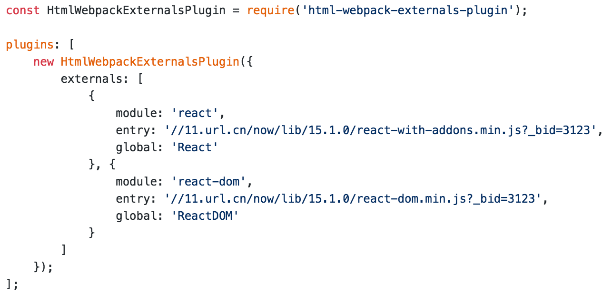

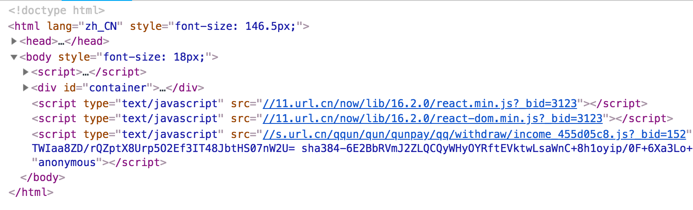

##### **方法2：利用SplitChunksPlugin 进⾏行行公共脚本分离**

Webpack4 内置的，替代CommonsChunkPlugin插件

chunks 参数说明：

- async 异步引⼊入的库进⾏行行分离(默认)
- initial 同步引⼊入的库进⾏行行分离
- all 所有引⼊入的库进⾏行行分离(推荐)

```js
module.exports = {
    optimization: {
        splitChunks: {
            chunks: 'async',
            minSize: 30000, //抽离包最小的大小
            maxSize: 0,
            minChunks: 1,
            maxAsyncRequests: 5,
            maxInitialRequests: 3,
            automaticNameDelimiter: '~',
            name: true,
            cacheGroups: {
                vendors: {
                test: /[\\/]node_modules[\\/]/,
                priority: -10
                }
            }
       }
    }
};
```

利利⽤用SplitChunksPlugin 分离基础包

```js
module.exports = {
    optimization: {
        splitChunks: {
            cacheGroups: {
                commons: {
                test: /(react|react-dom)/,
                name: 'vendors',
                chunks: 'all'
                }
            }
        }
    }
};
```

利利⽤用SplitChunksPlugin 分离⻚页⾯面公共⽂文件

```js
//minChunks: 设置最⼩小引⽤用次数为2次
//minuSize: 分离的包体积的⼤大⼩小
module.exports = {
    optimization: {
        splitChunks: {
            minSize: 0,
            cacheGroups: {
                commons: {
                name: 'commons',
                chunks: 'all',
                minChunks: 2
                }
               }
            }
        }
    }
};
```

### 3.8、tree shaking（摇数优化）

**概念**：1 个模块可能有多个⽅方法，只要其中的某个⽅方法使⽤用到了了，则整个⽂文件都会被打到
bundle ⾥面去，tree shaking 就是只把⽤用到的⽅方法打⼊bundle ，没⽤用到的⽅方法会在
uglify 阶段被擦除掉。

**使⽤**：webpack 默认⽀支持，在.babelrc ⾥设置modules: false 即可

- production mode的情况下默认开启

**要求**：必须是ES6 的语法，CJS 的方式不支持

**DCE (Dead code elimination)**

- 代码不不会被执⾏行行，不不可到达
- 代码执⾏行行的结果不不会被⽤用到
- 代码只会影响死变量量（只写不不读）

```
if (false) {
console.log('这段代码永远不会执行’);
}
```

##### Tree-shaking 原理理

利利⽤用ES6 模块的特点:

- 只能作为模块顶层的语句句出现
- import 的模块名只能是字符串串常量量
- import binding 是immutable的

代码擦除： uglify 阶段删除⽆无⽤用代码

**现象**：构建后的代码存在⼤大量量闭包代码

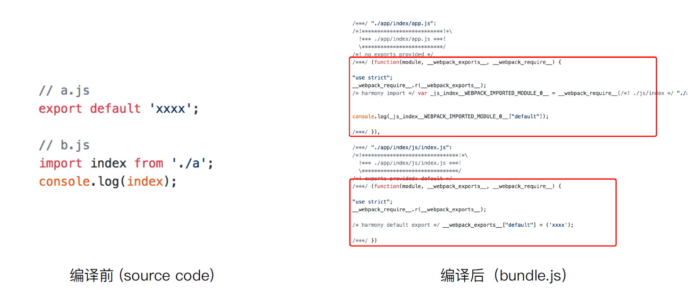

##### 会导致什什么问题？

⼤量作⽤用域包裹代码，导致体积增大（模块越多越明显），运⾏行行代码时创建的函数作⽤用域变多，内存开销变⼤

##### 模块转换分析

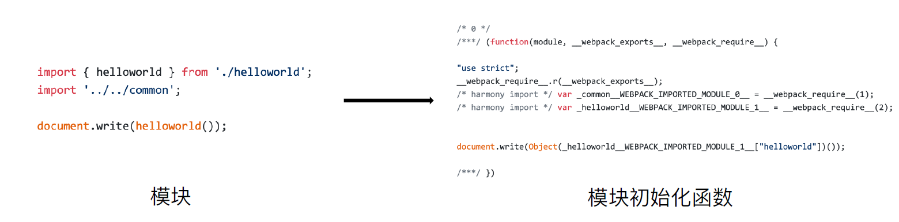

##### 结论：

- 被webpack 转换后的模块会带上⼀一层包裹
- import 会被转换成__webpack_require

##### 进⼀一步分析webpack 的模块机制

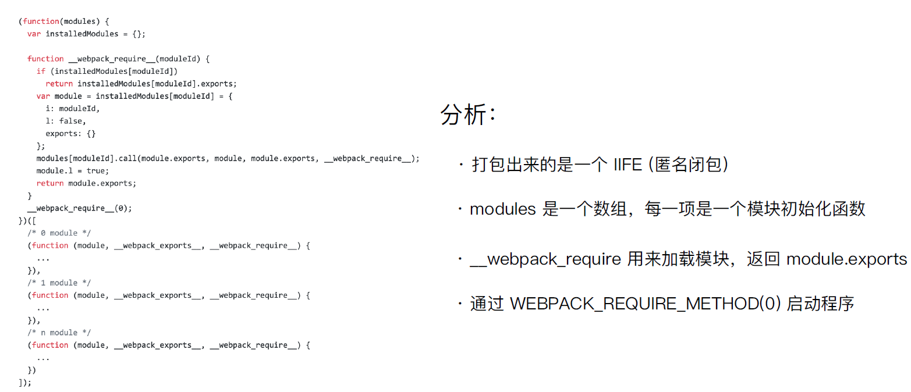

# 参考文档

[极客视频](https://time.geekbang.org/course/detail/100028901-98394)

