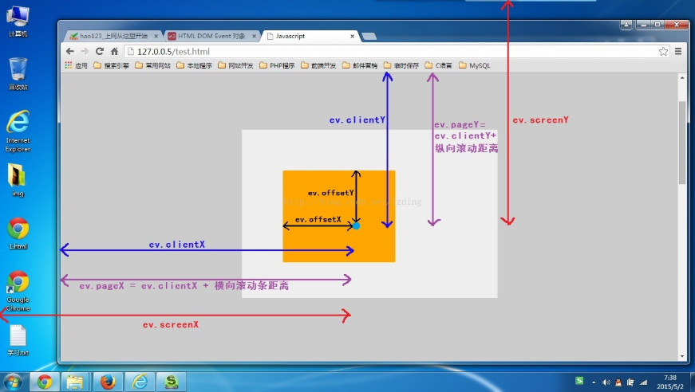

## 注册事件（绑定事件）

#### **传统的注册方式**

特点

- 利用on开头的事件onclick

- 注册事件的**唯一性**

- 同一个元素同一个事件著能设置一个处理函数，最后注册的处理函数将会覆盖前面注册的处理函数

  ```js
  btn.onclick = function () {}
  ```

#### 监听注册方式

- W3C标准推荐方式

- addEventListener() 它是一个方法

- IE9之前的IE浏览器不支持此方法，可使用attachEvent()代替

- 特点: 同一个元素同一个事件可以注册多个监听器

  ```js
  //使用语法
  eventTarget.addEventListener(type, listener[, useCapture])
  /*
  该方法接收三个参数：
  type : 事件类型字符串，比如click、mouseover，注意这里不要带on，是字符串，带引号
  listener ： 事件处理函数，事件发生时，会调用该监听函数
  useCapture : 可选函数，是一个布尔值，默认是false 。学完DOM事件流之后，再进一步学习
  */
  ```

  ​

#### attachEvent

- 该特性非标准，请尽量不要在生产环境中使用它

  ```js
  //语法
  eventTarget.attackEvent(eventNameWithon, callback)

  //ventNameWithon ： 事件类型字符串，比如onclick，onmouseover， 这里要带on
  //callback : 事件处理函数，当目标触发事件时回调函数将被调用
  ```

#### 注册事件的兼容性解决方案

```js
 <button>点击我</button>
<script>
    var btn = document.querySelector('button');
    function alertWarn () {
        alert ('warning');
    }
    function addEventListener(element, eventName, fn) {
        //判断浏览器是否支持addEventListener方法
        if (element.addEventListener) {
            element.addEventListener (eventName, fn);   //第三个参数，默认是false
        } else if (element.attachEvent) {
            element.attachEvent ('on' + eventName, fn);
        } else {
            //相当于element.onclick = fn;
            element['on' + eventName] = fn;
        }
    }
    addEventListener(btn, 'click', alertWarn);
</script>
```


## 删除事件

#### 传统注册方式

```
eventTarget.onclick = null;
```

#### 方法监听注册方式

```js
function alertWarn () {
    alert('warning');
}
//添加监听
element.addEventListener('click', alertWarn);
//移除监听
element.removeEventListener('click', alertWarn);
```

#### attach 方式

```js
function alertWarn1 () {
    alert('warning');
}
//添加监听
divs[2].attachEvent('onclick', alertWarn1);
//移除监听
divs[1].detachEvent('click', alertWarn1);
```

兼容性方案 参考上面的注册事件的兼容性方式。

## DOM事件流

####  特点

- JS代码只能执行捕获或者冒泡其中的一个阶段

- onclick 和 attachEvent 只能得到冒泡阶段

- addEventListener (type, listener[, useCapture]) 第三个参数如果是true，表示在事件捕获阶段调用事件处理程序；如果是false（不写默认就是false），表示在事件冒泡阶段电泳事件处理程序。

- 在实际开发中，我们很少使用事件捕获，我们更关注事件冒泡

- 有些事件是没有冒泡的，比如onblur、onfocus、onmouseover、onmouseleave

  ​

## 事件对象

事件对象也有兼容性问题。 IE 6、7、8通过 window.event 实现

```js
//兼容性写法
event = event || windoe.event;
```

- 常用的属性
  - 谁触发了事件对象
    - `e.target`:ie9以上，常用
    - `e.srcElement`：，ie6,7,8 
  - 绑定事件的元素
    - `this`：常用
    - `currentTarget` ie9以上
  - `e.type`:返回事件的类型，比如：click mouseover,不带on
  - `e.returnValue`:阻止默认行为,ie6,7,8
- 常用的方法
  - `e.preventDefault()`:阻止默认行为，ie9以上,兼容低版本，e.returnValue
  - `event.stopPropagation()`：阻止冒泡

## 阻止冒泡

- event.stopPropagation(); // 一般浏览器停止冒泡,w3c推荐

- event.cancelBubble; // 属性，IE 6 7 8 的停止冒泡

  ```js
  //兼容性写法
  if(e && e.stopPropagation) {
      event.stopPropagation();
  }else {
      window.event.cancelBubble = true; //兼容ie6,7,8
  }
  ```

  ​

## 阻止默认

> javascript的return false只会阻止默认行为，而是用[jQuery](http://caibaojian.com/jquery/)的话则既阻止默认行为又防止对象冒泡。

- e.preventDefaule(); 是一个方法，适合普通浏览器
- e.returnValue;是一个属性，适用于 IE 6 7 8
- return false; 没有兼容性问题，只适用于传统的onclick,不适用于addEventListener

```js
//假定有链接<a href="http://caibaojian.com/" id="testA" >caibaojian.com</a>
var a = document.getElementById("testA");
function preventDefaultUtils(e) {
  if(e.preventDefault) {
    e.preventDefault();
  }else {
    window.event.returnValue == false;
  }
  function eventHandle(e) {
    preventDefaultUtils(e)
  }
 a.addEventListener('click',eventHandle)
```


## 事件委托

事件委托的原理：不给每个子节点单独设置事件监听器，而是设置在其父节点上，然后利用冒泡原理设置每个子节点。

**例如：**给 ul 注册点击事件，然后利用事件对象的 target 来找到当前点击的 li ，然后事件冒泡到 ul 上， ul 有注册事件，就会触发事件监听器。

## 常用的事件

- 禁止鼠标右键菜单

  ```js
  //阻止打开右键菜单
  document.addEventListener('contextmenu', function(e) {
      e.preventDefault();
  })
  ```

- 禁止鼠标选中（selectstart 开始选中）

  ```js
  document.addEventListener('selectstart', function(e) {
      e.preventDefault();
  })
  ```
#### 键盘事件

> keyup和keydown不区分大小写，用的更多
>
> keypress区分大小写

| 键盘事件   | 触发条件                                                     |
| ---------- | ------------------------------------------------------------ |
| onkeyup    | 某个键盘按键被松开时触发（松开的时候触发）                   |
| onkeydown  | 某个键盘按键被按下时触发（按下之后一直触发）                 |
| onkeypress | 某个键盘按键被按下时触发（按下之后一直触发），但是它不能识别功能键，比如 ctrl、shift 等 |

键盘事件对象

e.keyCode:得到
  ​

## 鼠标事件对象（坐标属性）

| 鼠标事件对象 | 说明                                                         |
| ------------ | ------------------------------------------------------------ |
| e.clientX    | 返回鼠标相对于浏览器窗口**可视区域**的X坐标，距离左上角， 不随滚动条变化而变化，可以参照fixed |
| e.clientY    | 返回鼠标相对于浏览器窗口**可视区域**的Y坐标，距离左上角， 不随滚动条变化而变化，可以参照fixed |
| e.pageX      | 返回鼠标相对于文档页面的X坐标 IE9+ 支持，用的较多，pageX = clientX + ScrollLeft(滚动条滚过的水平距离) |
| e.pageY      | 返回鼠标相对于文档页面的Y坐标 IE9+ 支持，，用的较多，pageY = clientY + ScrollTop(滚动条滚过的垂直距离) |
| e.screenX    | 返回鼠标相对于电脑屏幕的X坐标                                |
| e.screenY    | 返回鼠标相对于电脑屏幕的Y坐标                                |
| e.offsetX    | 鼠标相对于事件源左上角X轴的坐标,与定位无关，点击的那个元素，就是距离哪个元素左上角的距离 |
| e.offsetY    | 鼠标相对于事件源左上角Y轴的坐标                              |




## 盒子模型

- offsetParent:定位父级。与当前元素最近的经过定位(position不等于static)的父级元素

  - fixed定位：为null，有兼容性，在火狐上为body节点
  - absolute/relative定位：为最近的祖先元素，如果最近的祖先元素没有，就为body
  - 自身无定位：
    - 祖先元素有定位，则offsetParent的结果为离自身元素最近的经过定位的父级元素
    - 祖先元素无定位，则offsetParent的结果为<body>

- offsetWidth：本身宽度+边框线+左右内边距，不包括外边距，width+pading+border

- offsetHeight：本身高度[104]+边框线[3+3]+上下内边距[4+4]=118；不包括外边距

- offsetTop：相对有定位属性的父节点（距离offsetParent元素的位置）上偏移量,；

  - offsetTop和top的区别
    - offsetTop没有单位
    - style.top:如果没有在行内样式或者js中指定过top，为空字符串

- offsetLeft：相对有定位属性的父节点（距离offsetParent元素的位置）左偏移量；

- clientWidth：本身的宽度[103]+左右内边距[5+5]=96;width+pading

- clientHeight：本身的高度[104]+上下内边距[4+4]=95；height+pading

- clientTop：上边框线的宽度；----border-top

- clientLeft：左边框线的宽度；----border-left

- scrollWidth：盒子的实际宽度(包括不可见部分，不包括边线) 

  - 个人理解：当自身盒子比子元素大，盒子的宽度+padding
  - 当子元素大于了自身盒子，要加上子元素超出的部分

- scrollHeight：盒子的实际高度(包括不可见部分，不包括边线)

- scrollTop：滚动条向下滚动的距离；

- scrollLeft：滚动条向右滚动的距离；

- window.innerHeight：浏览器窗口可见区域高度，(不包含工具条与滚动条)

- window.innerWidth：浏览器窗口可见区域宽度，(不包含工具条与滚动条)

  ​