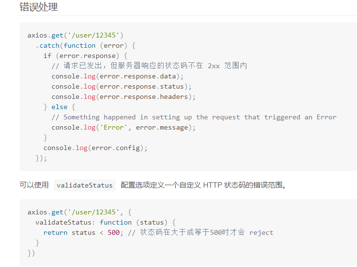

>  务必注意】这里的error输出的不是一个对象【error.response】才是一个对象

当你接收到400 这里失败请求的时候，其实已经成功访问服务器了，可能你发送的post数据在服务器那边校验失败了，如果你的服务器返回的是json格式的话，在前端接收到的也是json格式，如果你使用axios发送请求的话，在catch的时候，返回的error并不是一个对象，而是这样的字符串：


```

Error: Request failed with status code 400
    at createError (createError.js?2d83:16)
    at settle (settle.js?467f:18)
    at XMLHttpRequest.handleLoad (xhr.js?b50d:77) 
```

### 

axios参考文档：https://www.kancloud.cn/yunye/axios/234845



 【务必注意】这里的error输出的不是一个对象【error.response】才是一个对象

