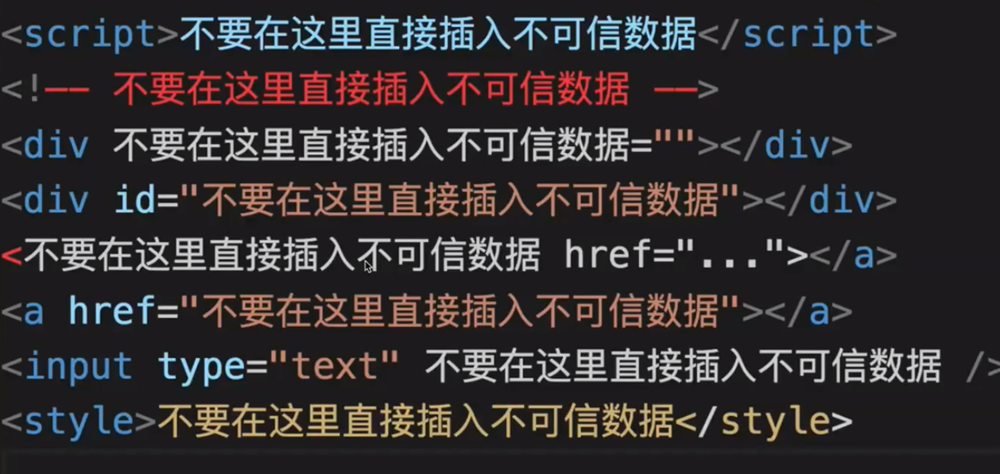
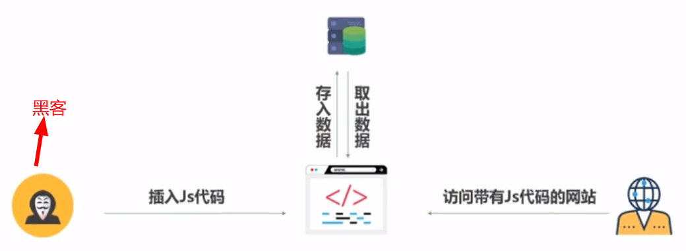
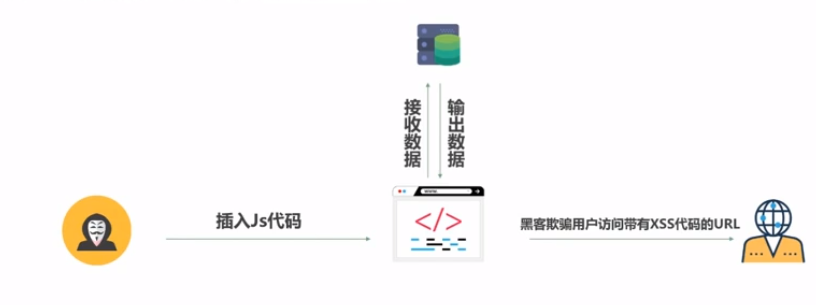
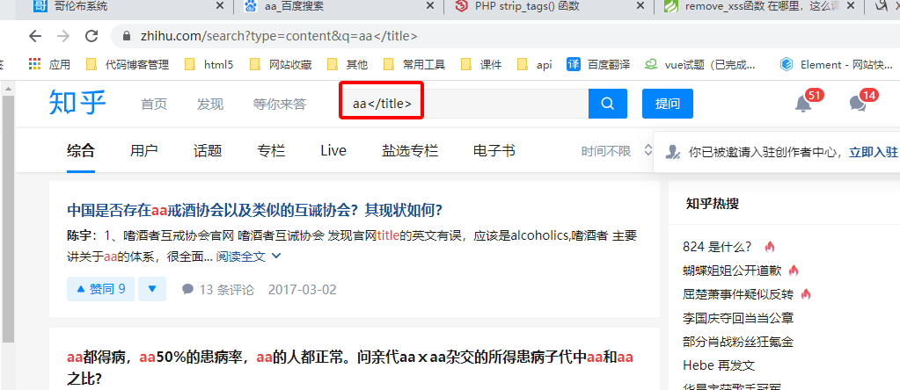
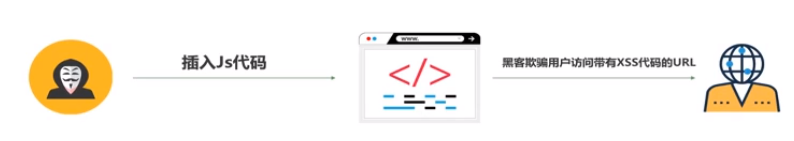

# xss简介

### xss简介

XSS攻击通常指的是通过利用网页开发时留下的漏洞，通过巧妙的方法注入恶意指令代码到网页，使用户加载并执行攻击者恶意制造的网页程序。这些恶意网页程序通常是JavaScript，但实际上也可以包括Java、 VBScript、ActiveX、 Flash 或者甚至是普通的HTML。攻击成功后，攻击者可能得到包括但不限于更高的权限（如执行一些操作）、私密网页内容、会话和cookie等各种内容。

### xss原理

利用我们所知道的各种黑魔法，向web页面插入js代码，让js代码可以被游览器执行，访问该页面的用户则被攻击


### xss分类

##### 1.反射型：

一般来说这种类型的XSS，需要攻击者提前构造一个恶意链接，来诱使客户点击，比如这样的一段链接：www.abc.com/?params=<script>alert(/xss/)</script>。

##### 2.存储型：

这种类型的XSS，危害比前一种大得多。比如一个攻击者在论坛的楼层中包含了一段JavaScript代码，并且服务器没有正确进行过滤输出，那就会造成浏览这个页面的用户执行这段JavaScript代码。

##### 3.DOMXSS：

这种类型则是利用非法输入来闭合对应的html标签。
比如，有这样的一个a标签：<a href='$var'></a>
乍看问题不大，可是当$var的内容变为 ’ οnclick=’alert(/xss/) //，这段代码就会被执行

### xss漏洞修复方法

- HTML实体编码

- 使用白名单过滤掉用户输入的恶意字符

  ```js
  /**
  标签 我就只让用src title属性等
  
  */
  ```

  

- 根据业务场景对症下药

<<<<<<< HEAD
# 常见代码攻击

### 避免xss攻击

```html
<input onfocus="alert(1)" autofocus />

<svg onload="alert(1)" />
<script>alert(1)</script>
<a href="javascript:alert(1)">clickme</a>
```


=======

>>>>>>> 0274e5548c22541f66545f232d76d97d017cd63c

# 存储型XSS

### 存储型XSS的原理

攻击者在页面上插入xss代码，服务端将数据存入数据库，当用户访问到存在xss漏洞的页面时，服务器从数据库中取出数据展示到页面上，导致XSS代码执行，达到攻击效果




### 实战详解

> 划重点：能输入的地方能展示出来，点击展示出来的
>
> 1. 一定有一个地方输入，比如编辑器，input框等
> 2. 存入数据库
> 3. 从数据库取出来

在能输入的地方输入这个，在点击显示的地方，看有没有触发

```

```


# 反射型XSS

### 反射型XSS的原理

攻击者在URL中插入XSS代码，服务端将url中的xss代码输出到页面上，攻击者将带有xss代码的url发送给用户，用户打开后收到xss攻击。



### 实战详解

这里通过GET方式传过去name参数，并且对传过去的参数没有做任何过滤，我们的输入会在页面进行显示。现在我们输入恶意代码`alert('chenie')`XSS弹出弹框

比如打开知乎 搜索内容，会在url上，发送给后端这个就是反射性Xss

```js
//后面script标签可以获取cookie等
adad</title><script>alert(11)</script>
adad</input><script>alert(11)</script>
ad">
```



# DOMXSS

### DOMXSS原理

> 跟反射性的区别：反射性是要发送给服务器

攻击者在url中插入xss代码,前端页面直接从url中获取xss代码并且输出到页面，导致xss代码的执行，攻击者将带有xss代码的url发送给用户，用户打开后受到xss攻击



<<<<<<< HEAD


# 参考链接

[web安全之 XSS攻击与防御视频教程](https://www.bilibili.com/video/BV1R4411u7Rk?from=search&seid=6438445546823214585)

[美团xss博客](https://www.freebuf.com/articles/web/185654.html)

[xss刷题](https://xss.haozi.me/#/0x00)

https://github.com/haozi/xss-demo

[xss库](https://www.npmjs.com/package/sanitize-html)

推荐安全书籍：**白帽子讲web安全**，**XSS跨站脚本攻击剖析与防御**,web前端黑客技术解密

[360公司前端博客，很多http相关博文](https://imququ.com/)

=======
>>>>>>> 0274e5548c22541f66545f232d76d97d017cd63c
