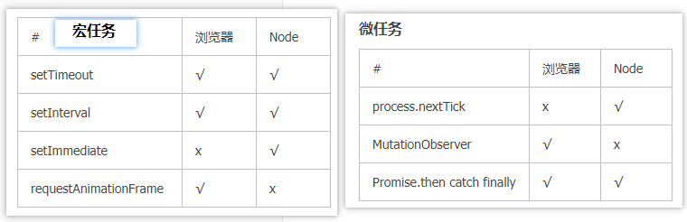

# 首页

[TOC]


# html

# css

# js

# node

### 1、为什么js是单线程

```
JavaScript语言的一大特点就是单线程，也就是说，同一个时间只能做一件事。那么，为什么JavaScript不能有多个线程呢？这样能提高效率啊。

JavaScript的单线程，与它的用途有关。作为浏览器脚本语言，JavaScript的主要用途是与用户互动，以及操作DOM。这决定了它只能是单线程，否则会带来很复杂的同步问题。比如，假定JavaScript同时有两个线程，一个线程在某个DOM节点上添加内容，另一个线程删除了这个节点，这时浏览器应该以哪个线程为准？

所以，为了避免复杂性，从一诞生，JavaScript就是单线程，这已经成了这门语言的核心特征，将来也不会改变。
```

[回到顶部](#首页)

### 2、请说下你对事件轮询，事件循环，微任务以及宏任务的理解

```
宏任务： 宿主环境提供的叫宏任务，目前我们常见的两种宿主环境有浏览器和node

微任务： 由语言标准提供的叫微任务(比如ES6提供的promise。)

```



```js
console.log('script start');

setTimeout(function() {

    console.log('setTimeout');

}, 0);

Promise.resolve().then(function() {    

console.log('promise1');

}).then(function() {    

console.log('promise2');});

console.log('script end');

//script start,script end,promise1,promise2,setTimeout
```

**事件轮询**

```
事件轮询：单线程就意味着，所有任务需要排队，前一个任务结束，才会执行后一个任务。如果前一个任务耗时很长，后一个任务就不得不一直等着。

如果排队是因为计算量大，CPU忙不过来，倒也算了，但是很多时候CPU是闲着的，因为IO设备（输入输出设备）很慢（比如Ajax操作从网络读取数据），不得不等着结果出来，再往下执行。

JavaScript语言的设计者意识到，这时主线程完全可以不管IO设备，挂起处于等待中的任务，先运行排在后面的任务。等到IO设备返回了结果，再回过头，把挂起的任务继续执行下去。

于是，所有任务可以分成两种，一种是同步任务（synchronous），另一种是异步任务（asynchronous）。同步任务指的是，在主线程上排队执行的任务，只有前一个任务执行完毕，才能执行后一个任务；异步任务指的是，不进入主线程、而进入"任务队列"（task queue）的任务，只有"任务队列"通知主线程，某个异步任务可以执行了，该任务才会进入主线程执行。

具体来说，异步执行的运行机制如下。（同步执行也是如此，因为它可以被视为没有异步任务的异步执行。）
（1）所有同步任务都在主线程上执行，形成一个执行栈（execution context stack）。
（2）主线程之外，还存在一个"任务队列"（task queue）。只要异步任务有了运行结果，就在"任务队列"之中放置一个事件(io事件，鼠标点击，页面滚动等事件)。
（3）一旦"执行栈"中的所有同步任务执行完毕，系统就会读取"任务队列"，看看里面有哪些事件。那些对应的异步任务，于是结束等待状态，进入执行栈，开始执行。
（4）主线程不断重复上面的第三步。

主线程从"任务队列"中读取事件，这个过程是循环不断的，所以整个的这种运行机制又称为Event Loop（事件循环）。
面试时看下下面的参考链接即可理解。
```

[阮一峰-JavaScript 运行机制详解：再谈Event Loop](http://www.ruanyifeng.com/blog/2014/10/event-loop.html)

[回到顶部](#首页)

# vue

### 1、说一下$nextTick是干什么的

```
  简单来说，因为Vue的异步更新队列，$nextTick是用来知道什么时候DOM更新完成的。
  Vue 在修改数据后，视图不会立刻更新(DOM还没有更新)，而是等同一事件循环中的所有数据变化完成之后，再统一进行视图更新。
  如果你想基于更新后的 DOM 状态来做点什么，可以在数据变化之后立即使用 Vue.nextTick(callback)
```

[总结了一下 Vue.nextTick() 的原理和用途](https://www.cnblogs.com/lguow/p/12247304.html)

[vue官网-异步更新队列](https://cn.vuejs.org/v2/guide/reactivity.html#异步更新队列)

[回到顶部](#首页)

### 2、说一下$nextTick和setTimeOut(()=>{}, 0)的执行顺序

```
$nextTick先执行，setTimeOut(()=> {}, 0)后执行
$nextTick是微任务，setTimeOut为宏任务 微任务比宏任务先执行，
```

请参考[请说下你对事件轮询，事件循环，微任务以及宏任务的理解](#2、请说下你对事件轮询，事件循环，微任务以及宏任务的理解)

[回到顶部](#首页)

### 3、v-for与v-if为什么不能一起用？

> 简单来说就是：`v-for`的优先级比`v-if`更高

当它们处于同一节点，`v-for`的优先级比`v-if`更高，这意味着 `v-if`将分别重复运行于每个 `v-for`循环中。当你想为仅有的一些项渲染节点时，这种优先级的机制会十分有用，如下：

```vue
<li v-for="todo in todos" v-if="!todo.isComplete">
  {{ todo }}
</li>
```

上面的代码只传递了未完成的 todos。
而如果你的目的是有条件地跳过循环的执行，那么可以将 v-if 置于外层元素 (或 `)上。如：

```vue
<ul v-if="todos.length">
  <li v-for="todo in todos">
    {{ todo }}
  </li>
</ul>
<p v-else>No todos left!</p>
```

简单举个例子帮助理解

```vue
 <ul>
    <li v-for="value in testData">
       <div id="test" v-if="Array.isArray(value)" v-for="item in value">{{item}}</div>
       <div id="test1" v-else>{{value}}</div>
    </li>
  </ul>
  testData:  {
    name: 'TESTOBJECT', 
    id: 10,
    data: [1.67, 1.33, 0.98, 2.21]
  }

//结果：打印了10遍TESTOBJECT，10遍10，列出数组内容：1.67 1.33 0.98 2.21
```

**为什么会有10个TESTOBJECT呢**？尝试多加两个字母’TESTOBEJECTss‘，此时输出12个TESTOBEJECTss，10个10数字

原因分析：

```
v-for优先级高于v-if，因此上面的html文本中两行div的执行大致是以下顺序：
this.value.map(function(item){
     if(Array.isArray(value)){
        return item; // T E S T O B J E C T
     }else{
        return value; // TESTOBJECT
     }
  })
遍历object的所有value（即li中的v-for），当拿到testData的第一个元素TESTOBJECT时，执行div中的v-for，此时的item对应T E S T O B J E C T这10个元素，于是循环10次，每一次都判断当前元素是否是array，很显然每次判断都是object，于是便打印出10个TESTOBJECT。
```

[回到顶部](#首页)

# 参考链接

[前端面试题大集合：来自真实大厂的532道面试题(只有题，没有答案)](https://segmentfault.com/a/1190000016481101)

[看云前端面试题](https://www.kancloud.cn/hanxuming/vue-iq/776216)