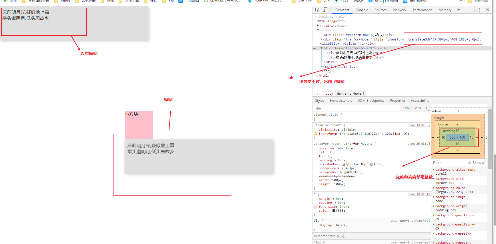
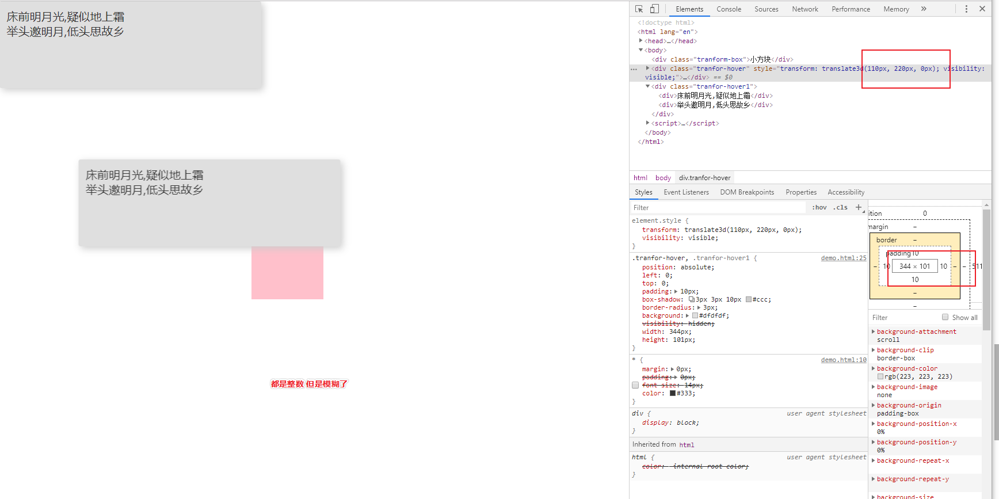

## 1、问题

在做日历组件时，遇到这样一个问题，鼠标移动上去时，出来的弹窗文字不是很清晰，有时候很清晰，有时候不清晰

- 不清晰


- 清晰

  

## 2、原因

经过多方位的排查原因，最后找到了一个属性transform，我在游览器把transform去掉，不模糊了

现在我们来聊一下transform


## 3、transform

在网上看到很多教程，但是说法都不统一，看的也很懵逼。去跟着他们测试发现也不会触发，可能还会有其他触发条件吧。

##### 3.1、transform的变形跟宽高一定有关系吗

网上很多教程说跟弹窗的宽度高度有关，我这里也测试了，其实跟高度宽度是不一定有关系的，只有一种情况下有关系，那就是你里面用的百分比。这里举个例子

```
width:50px;
height:50px;
transform:translate(50%,50%) //这个百分比是相对与自身宽高的，这种情况下就有关系
transform:translate(100px,100px) //这种情况下就与宽高没关系
```

> 其实transform里面字体变形的直接关系，应该就是最后计算出来的值translate(a,b)这个a,b是不是整数决定的

为什么那么多人觉得跟宽高有关系，是因为他们用的百分比。


##### 3.2、怎么触发

这个点我试过很多，也是自己不能确定的点，到底什么时候触发，有点蒙圈，以下内容欢迎大神纠正。

- 静态的能触发吗？

  > 不会模糊

  ```html
   .tranfor-hover1{
            position: absolute;
            left:0;
             top:0;
             padding: 10px;
             box-shadow: 3px 3px 10px #ccc;
             border-radius: 3px;
             background: #dfdfdf;
             visibility: hidden;
             width: 495.2px;
             height: 100px;
             visibility: visible;
             transform: translate3d('110.22px','120.11px',0);
  
         }
   <div class="tranfor-hover1">
                  <div>床前明月光,疑似地上霜</div>
                  <div>举头邀明月,低头思故乡</div>
    </div>
  ```

- hover时动态计算translate里面的值。数据不变
	
	> 注意：
	>
	> 1、这里有translate不能触发，这里用translate3d可以触发
	
	```css
	{
	   margin:0px;
	   padding: 0px;
	   font-size: 14px;
	   color:#333;
	}
	.tranform-box {
	    width: 100px;
	    height: 100px;
	    background: pink;
	    margin: 100px auto;
	}
	.tranfor-hover,.tranfor-hover1 {
	    position: fixed;
	    left:0;
	    top:0;
	    padding: 10px;
	    box-shadow: 3px 3px 10px #ccc;
	    border-radius: 3px;
	    visibility: hidden;
	}
	​```html
	   <div class="tranform-box">小方块</div>
	        <div class="tranfor-hover">
	            <div>床前明月光,疑似地上霜</div>
	            <div>举头邀明月,低头思故乡</div>
	        </div>
	        <div class="tranfor-hover1">
	           <div>床前明月光</div>
	           <div>疑似地上霜</div>
	           <div>举头邀明月</div>
	           <div>低头思故乡</div>
	       </div>
	   
	   <script>
	            let trans=document.querySelector('.tranform-box');
	            let trans_hover=document.querySelector('.tranfor-hover');
	            trans.addEventListener('mouseover',function(){
	               let eleft=this.getBoundingClientRect().left;
	               let etop=this.getBoundingClientRect().top;
	               let ewidth=this.getBoundingClientRect().width;
	               let eheight=this.getBoundingClientRect().height;
	   
	               trans_hover.style.transform=`translate3d(${eleft}px,${etop+eheight}px,0)`
	               trans_hover.style.visibility=`visible`
	            })
	            trans.addEventListener('mouseout',function(){
	               trans_hover.style.visibility=`hidden`
	   
	            })
	    </script>
	```



可能截图看不清楚，这里验证了上面的跟宽高没有直接关系

##### 3.3、无缘无故的模糊

没找到原因

```html
<!DOCTYPE html>
<html lang="en">

<head>
    <meta charset="UTF-8">
    <meta name="viewport" content="width=device-width, initial-scale=1.0">
    <meta http-equiv="X-UA-Compatible" content="ie=edge">
    <title>Document</title>
    <style>
        * {
            margin:0px;
            padding: 0px;
            /* font-size: 14px; */
            color:#333;
        }
       .tranform-box {
           width: 100px;
           height: 100px;
           background: pink;
           margin: 100px auto;
           position: absolute;
           top:30%;
           left: 40%;
       }
       .tranfor-hover,.tranfor-hover1 {
           position: absolute;
           left:0;
           top:0;
           padding: 10px;
           box-shadow: 3px 3px 10px #ccc;
           border-radius: 3px;
           background: #dfdfdf;
           visibility: hidden;
           width: 344px;
           height: 101px;
       }
       .tranfor-hover1{
        visibility: visible;
        transform: translate3d('110.22px','120.11px',0);

       }
    </style>
</head>

<body>
        <div class="tranform-box">小方块</div>
        <div class="tranfor-hover">
            <div>床前明月光,疑似地上霜</div>
            <div>举头邀明月,低头思故乡</div>
        </div>
        <div class="tranfor-hover1">
                <div>床前明月光,疑似地上霜</div>
                <div>举头邀明月,低头思故乡</div>
       </div>
   
   <script>
            let trans=document.querySelector('.tranform-box');
            let trans_hover=document.querySelector('.tranfor-hover');
            trans.addEventListener('mouseover',function(){
               let eleft=this.getBoundingClientRect().left;
               let etop=this.getBoundingClientRect().top;
               let ewidth=this.getBoundingClientRect().width;
               let eheight=this.getBoundingClientRect().height;
   
            trans_hover.style.transform=`translate3d(110px,220px,0)`;
              
               trans_hover.style.visibility=`visible`;
            })
            trans.addEventListener('mouseout',function(){
            //    trans_hover.style.visibility=`hidden`
   
            })
    </script>
</body>

</html>
```




都是整数，但是模糊了，这个有点懵逼

[关于CSS will-change 属性你需要知道的事](https://segmentfault.com/a/1190000020926189)

[css设置元素的宽高为整数，为什么有的浏览器解析出来的宽高是小数？]( https://www.zhihu.com/question/48624427 )

# [Blurry text on transform:rotate in Chrome](https://stackoverflow.com/questions/20326220/blurry-text-on-transformrotate-in-chrome)

 popperOptions 

var box = document.querySelector('.box'),
    popper = document.querySelector('.popper'),
    pIntance = new Popper(box,popper,{
        placement: 'top',
        modifiers: {
            computeStyle: {
                gpuAcceleration: false,
                x: 'bottom',
                y: 'left'
            }
        }
    })
————————————————
版权声明：本文为CSDN博主「站在原型链顶端的男人」的原创文章，遵循 CC 4.0 BY-SA 版权协议，转载请附上原文出处链接及本声明。
原文链接：https://blog.csdn.net/jhzhahuaiyu/article/details/90213582